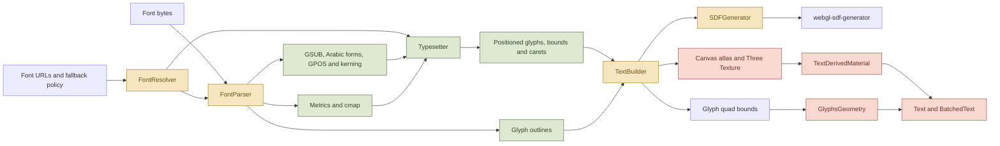
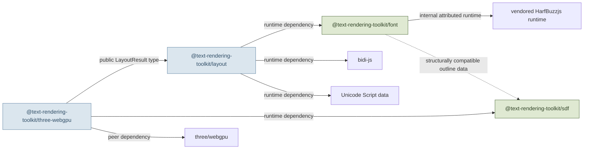
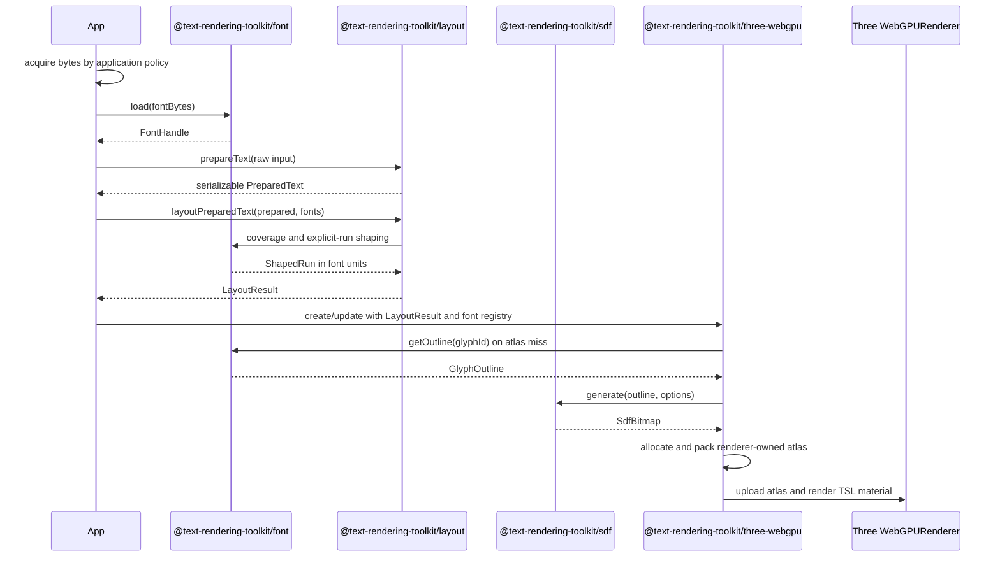
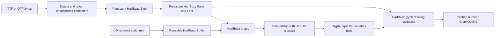
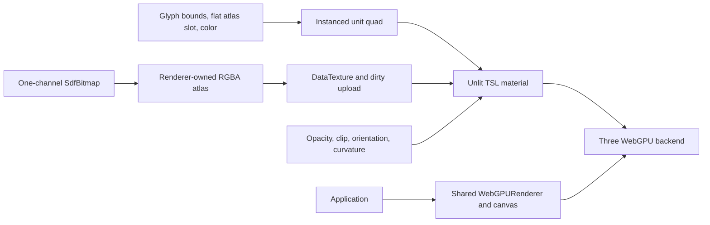
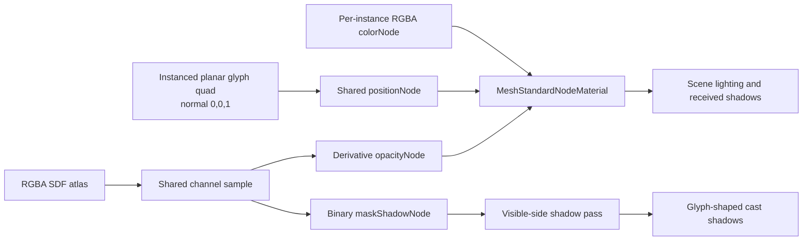
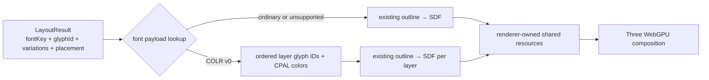
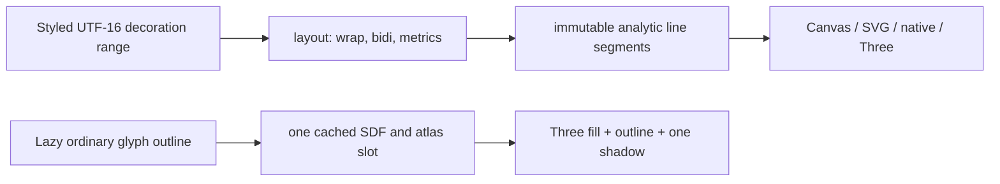

# Architecture — composable text pipeline

> Proposed greenfield architecture. Package names are placeholders until the npm scope and project name are chosen.

The project should be a small workspace of independently publishable packages, not one indivisible renderer package. A consumer must be able to parse a font without installing Three.js, lay out text without generating an SDF, generate an SDF without using a font parser, or use the complete Three.js WebGPU renderer.

## Executive summary

The preserved `troika-three-text` source already contains several conceptual products, but its file boundaries do not cleanly match those products:

- `FontParser.js` parses font bytes **and** performs font-specific shaping and positioning.
- `FontResolver.js` loads, caches, and selects fallback fonts.
- `Typesetter.js` performs line layout, wrapping, bidirectional ordering, alignment, bounds, and caret generation.
- `SDFGenerator.js` chooses between WebGL and worker-based generation, then writes results into a WebGL canvas.
- `TextBuilder.js` couples typesetting, SDF generation, atlas allocation, canvas growth, Three textures, and render-quad construction.
- `GlyphsGeometry.js`, `TextDerivedMaterial.js`, `Text.js`, and `BatchedText.js` form the Three/WebGL presentation layer.

The greenfield split therefore cuts through `FontParser`, `SDFGenerator`, and especially `TextBuilder`; simply moving each old file into a new package would preserve the existing coupling.

The most important deliberate departure is font shaping. Troika’s custom Typr-based path is retained as evidence and fixture material, but the production font engine will use [HarfBuzzjs](https://github.com/harfbuzz/harfbuzzjs). This avoids carrying a project-owned subset of OpenType shaping into a compatibility-free codebase.

## Implementation status

The greenfield pnpm/Turborepo/Biome/Vitest baseline and all four first
production cores are implemented and validated: `@text-rendering-toolkit/font`, resolved
`@text-rendering-toolkit/layout`, CPU `@text-rendering-toolkit/sdf`, and layout-result
`@text-rendering-toolkit/three-webgpu`. The renderer consumes completed renderer-neutral layout,
caller-owned structural font handles,
lazy numeric outlines, deterministic SDFs, private convenience resources or
an explicitly shared growing RGBA atlas,
instanced geometry, and shared TSL nodes bound to either the default unlit or
construction-fixed planar standard material through an atomic `Text.sync()`
lifecycle.

Automatic script/direction itemization, default Unicode 13 line-break
opportunities, exact line-fragment reshaping, and explicit caller-font fallback
are now production `@text-rendering-toolkit/layout` operations through `prepareText()`,
`layoutPreparedText()`, and `layoutText()`. CSS/locale tailoring, dictionary
segmentation, hyphenation, newer line-break data, bidi caret affinity, workers, atlas eviction,
curved or configurable physical materials, and batching remain separate
follow-ups. The production standard
variant now promotes the validated front-facing planar seam with glyph-shaped
cast and received shadows through ordinary Three.js scene flags. Font-byte
acquisition is caller-owned today: byte/handle input is the primary path, and no
shipped core operation requires network fetching. A URL convenience may be added
later, but never as the main or only path. The layout package turns raw text or fully
resolved runs into `LayoutResult`; the first renderer accepts only that completed
handoff rather than implementing a partial raw-text policy.

COLR v0 color glyphs are now a production capability. The font handle lazily
reads validated palette-zero COLR/CPAL layers from its owned byte copy and
returns ordered outline glyphs with RGBA or current-foreground paint. Three
expands those layers only during resource planning, reuses ordinary SDF atlas
slots, and carries paint as normalized instance RGBA. `PreparedText`,
`LayoutResult`, line/caret/selection data, and caller font ordering remain
unchanged. COLR v1 paint graphs, embedded bitmaps, SVG documents, and implicit
browser-style emoji font reordering remain unsupported.

Renderer-neutral text decorations are now public layout behavior. Font handles
expose bounded default-instance underline/strikethrough facts; the font-aware
layout path scales those facts once, and `LayoutResult` retains only compact
source ranges plus a default. `deriveTextDecorations()` maps independent styled
UTF-16 ranges through wrapping, bidi placement, stable per-span automatic or
numeric metrics, clipping, and optional bounds-only skip ink into immutable
analytic segments. SVG, Canvas, native, or Three consumers can render those
numbers without font access or reshaping, and a renderer that already owns
outlines or SDF coverage may refine automatic skip ink against exact glyph ink.
Ordinary-glyph outline and one visual drop shadow are now public Three-only
appearance. They decode the existing nonlinear SDF and stable atlas slot in
both material variants, use independent colors and layout-unit distances, and
commit atomically with directional bounds and clipping. Fixed em-based
`sdfPadding` reserves physical effect room independently from `sdfSize`
resolution. COLR composed-silhouette outline and shadow remain deferred, and
shadow softness is SDF falloff rather than Gaussian blur.

## Current responsibility map



### What each preserved module actually owns

| Preserved module | Actual responsibility | Important coupling to remove |
|---|---|---|
| `FontParser.js` | TTF/OTF parsing through Typr, WOFF conversion, font metrics, code-point coverage, GSUB substitutions, Arabic joining forms, GPOS adjustments, kerning, glyph outline extraction and caching | Parsing and shaping are hidden behind one `forEachGlyph` callback API |
| `FontResolver.js` | Fetching, parsing cache, user-font selection, Unicode fallback lookup, style/weight matching | Network I/O and fallback policy are tied to callback and worker factories |
| `Typesetter.js` | Font-run calculation, size/style runs, wrapping, line metrics, alignment, bidi reordering, positioned glyph arrays, bounds, colors, and carets | It receives font objects with shaping callbacks instead of a typed shaping contract |
| `selectionUtils.js` | Caret hit testing and selection rectangles derived only from layout output | None of its behavior requires Three.js or SDF data |
| `SDFGenerator.js` | Scheduling and backend selection around the external `webgl-sdf-generator` package | The module is not the core algorithm; it writes results into a WebGL canvas and manages custom workers |
| `TextBuilder.js` | Argument normalization, worker invocation, global configuration, atlas ownership, glyph cache, SDF requests, texture growth, quad calculation, and final render-info assembly | This is the main cross-layer coupling point and must be decomposed rather than ported intact |
| `GlyphsGeometry.js` | Instanced quad attributes, glyph bounds, atlas indices, colors, and aggregate bounds | Three-specific, but not intrinsically WebGL-specific |
| `TextDerivedMaterial.js` | GLSL injection, SDF decoding, antialiasing, fill/stroke/outline, clipping, orientation, and curved placement | Relies on classic materials, shader rewriting, and WebGL GLSL |
| `Text.js` | Public mutable object, async synchronization, geometry updates, material state, raycasting, clipping, and disposal | Combines consumer API and Three renderer lifecycle |
| `BatchedText.js` | Multi-text packing and batched material/attribute indirection | Renderer optimization; not part of font, layout, or SDF concerns |

## Proposed package graph



The arrows are deliberately one-way. In particular:

- `font` knows nothing about layout, workers, SDFs, browsers, or Three.js.
- `text-layout` knows nothing about SDFs, atlases, GPU textures, or Three.js.
- `sdf` knows nothing about fonts, text, layout, browsers, or Three.js.
- `three-webgpu` is the only package that depends on Three.js or owns GPU resources.
- No separate shared-types package is introduced. The tiny outline bridge is structural TypeScript data, avoiding a fifth package whose only job is to break dependency cycles.

## Naming direction

The recommended descriptive naming scheme is:

- Project and repository: **Text Rendering Toolkit** / `text-rendering-toolkit`
- npm scope: `@text-rendering-toolkit`
- Packages: `@text-rendering-toolkit/font`, `@text-rendering-toolkit/layout`, `@text-rendering-toolkit/sdf`, and `@text-rendering-toolkit/three-webgpu`

The shorter package names work because the scope supplies the context. The umbrella name mentions WebGPU even though the lower packages are renderer-neutral; it describes the project that publishes them, not their runtime requirements. Registry checks found no currently published packages at those exact four names, but npm scope ownership still needs to be confirmed before treating the names as available.

Two reasonable alternatives are `@glyph-pipeline/*`, which is technically descriptive but less memorable, and a personal or existing organization scope, which is easiest to claim but less project-specific. A coined brand such as `@glyphstack/*` is more distinctive but explains less at first glance.

## Package responsibilities

### `@text-rendering-toolkit/font`

**Purpose:** turn font bytes and Unicode text runs into reusable font facts, shaped glyphs, and outlines.

**Owns:**

- Font-format detection before HarfBuzz receives the bytes. V1 accepts normalized TTF and CFF/OTF bytes and explicitly rejects WOFF/WOFF2 pending a separate decoder evaluation.
- Persistent HarfBuzz blob, face, font, and reusable shaping-buffer lifetime behind project-owned handles.
- Normalized metrics and code-point coverage.
- HarfBuzz-backed font-specific shaping: cmap lookup, OpenType/AAT substitutions and positioning, script/language features, variation coordinates, clusters, advances, and offsets.
- Glyph IDs, advance/offset values, and outline extraction.
- Lazy numeric outline extraction and in-memory caches scoped to an explicit font instance.
- Lazy bounded COLR v0/CPAL palette-zero layer resolution from the handle's owned byte copy.

**Inputs:** `ArrayBuffer` or `Uint8Array`, plus shaping text/options.

**Outputs:** an opaque `FontHandle` plus `ShapedRun`, `GlyphOutline`, and optional immutable `ColorGlyphLayer` values made only from JavaScript objects and typed arrays.

**Does not own:** URL fetching, fallback-font policy, line wrapping, bidi paragraph layout, SDF encoding, workers, DOM APIs, or Three.js.

The important correction from the old naming is that “font loading,” “font shaping,” and “outline access” are distinct public operations even though one internal HarfBuzz face supports all three. `FontHandle` is an operational handle, not a promise to expose HarfBuzz or a mutable JavaScript object graph of every font table. The name deliberately avoids collision with the browser’s global `FontFace` class. The implemented package accepts owned TTF/OTF bytes, shapes explicit directional/script runs, applies variations per operation, caches numeric outlines lazily, and disposes every owned HarfBuzz object deterministically.

### `@text-rendering-toolkit/layout`

**Purpose:** turn styled Unicode text into positioned glyphs and interaction geometry.

**Owns:**

- The implemented `ResolvedLayoutInput` boundary for fully selected, itemized, shaped, and scaled runs.
- Deterministic mandatory breaks, optional Unicode opportunities, legacy expert whitespace wrapping, alignment, indentation, anchoring, line metrics, and resolved bidi-level visual ordering.
- Positioned glyph instances, block/visible bounds, caret positions, selection rectangles, and point-to-caret hit testing.
- The implemented schema-version-2 `PreparedText` policy: grapheme segmentation,
  paragraph bidi levels, ISO script adoption, style intersection, pinned
  Unicode 13 line-break opportunities, and explicit ordered fallback over
  caller-supplied font handles.
- Future optional ESM worker entry points for moving layout off the main thread.

**Inputs:** raw text/style policy, immutable serializable `PreparedText`, or
expert `ResolvedShapedRun` values using one effective layout-unit coordinate
system. The prepared path receives a
`ReadonlyMap<string, FontHandle>`. The pure first stage does not consult fonts;
the synchronous second stage selects fonts, performs a full-segment provisional
shape/layout, measures adjacent legal candidates with call-local fragment
memoization, reshapes the accepted final line fragments, scales once, and
delegates to the resolved core with a stable selected break plan.

**Outputs:** a renderer-neutral `LayoutResult` containing glyph references, font identities, positions, font-unit-to-layout-unit scales, bounds, and carets. Outlines are not embedded in the result.

**Does not own:** font-byte acquisition or URL fetching, SDF resolution, atlas indices, textures, materials, scene objects, or renderer synchronization.

This package is useful by itself for editors, DOM/canvas renderers, hit testing, measurement, server-side preprocessing, and non-SDF renderers.

Its policy boundary is fixed by three separate evidence layers: controlled
synthetic resolved runs are the normative layout oracle, public
`@text-rendering-toolkit/font` results prove the shaped-run seam, and normalized Troika
observations explain which behavior is preserved or changed. Keeping those
layers separate prevents a HarfBuzz/font revision from silently rewriting
wrapping, alignment, caret, or selection policy.

### `@text-rendering-toolkit/sdf`

**Purpose:** convert arbitrary vector outlines into renderer-neutral signed-distance-field pixels.

**Owns:**

- The implemented pure CPU `generateSdf()` encoder with deterministic options and output.
- A small typed numeric `SdfOutline` contract structurally compatible with public font outlines.
- Self-describing one-channel `Uint8Array` output and encoding metadata.
- Strict validation, fixed curve flattening, non-zero winding, and attributed golden conformance.
- Future optional ESM worker adapters for parallel generation.

**Inputs:** an outline, view box, output dimensions, distance range, and exponent.

**Outputs:** `SdfBitmap` data only; never an atlas, canvas, or GPU texture.

**Does not own:** font parsing, glyph selection, text layout, workers, caching, atlas policy, DOM canvas, WebGL, WebGPU, or Three.js.

The preserved `SDFGenerator.js` is mostly scheduling and WebGL/canvas integration. The implemented CPU encoder adapts only the MIT-licensed `webgl-sdf-generator@1.1.1` numeric behavior, preserves its copyright and license, and records the derivation in package and root notices. SVG parsing, WebGL, canvas, framebuffer, and worker paths are excluded.

### `@text-rendering-toolkit/three-webgpu`

**Purpose:** render completed layout data as a convenient Three.js `WebGPURenderer` scene object.

**Owns:**

- The implemented layout-result `Text` mesh and latest-state promise synchronization lifecycle.
- Lazy outline/SDF orchestration, failure atomicity, and committed layout identity.
- Post-layout ordered color-layer expansion with palette/current-foreground RGBA instance paint and ordinary-outline fallback.
- Public `TextResources` ownership for flat-slot allocation, RGBA channel packing, byte storage, square growth, full dirty uploads, glyph caching, and lifecycle; `Text` creates a private owner by default or borrows an explicitly shared owner. V1 has no eviction.
- RGBA atlas upload into a Three `DataTexture`.
- Capacity-aware instanced glyph geometry and explicit bounds.
- Shared TSL placement, SDF decoding, derivative antialiasing, fill, per-style color, opacity, and rectangular clipping bound to the default unlit material or an opt-in fixed planar standard material.
- One independent-color outer outline and one offset SDF-softened visual shadow for ordinary glyphs, decoded from the existing slot with appearance-only updates, directional bounds, and atomic padding validation.
- Constant planar normals plus the visible-side midpoint SDF shadow mask required for ordinary Three.js glyph-shaped cast and received shadows.
- Lifecycle-safe disposal that leaves caller fonts, renderer, and canvas alone.
- Future batching, if profiling demonstrates a need.

**Inputs today:** a completed public `LayoutResult`, a structural map of caller-owned lazy-outline handles with units-per-em facts and optional color-layer lookup, construction-fixed SDF size/padding, and mutable fill/outline/shadow appearance values.

**Outputs:** Three scene objects and GPU resources.

**Does not own:** font bytes or fetching, caller font lifetime, itemization/fallback, font table parsing algorithms, line layout or interaction algorithms, the CPU SDF encoder, workers, a shared renderer/canvas, or WebGL support.

## Boundary contracts

The exact TypeScript names are provisional; the separation is not.

| Contract | Producer | Consumers | Contains | Explicitly excludes |
|---|---|---|---|---|
| `FontHandle` | `font` | `text-layout`, direct users | normalized metrics, coverage, shaping and lazy outline access | HarfBuzz pointers, network state, layout settings, atlas state |
| `ShapedRun` | `font` | `text-layout`, direct users | glyph IDs, cluster/source indices, advances, offsets | line breaks, final x/y placement |
| `LayoutResult` | `text-layout` | renderers, editors, direct users | positioned glyph references, font keys, font-unit scales, bounds, line data, carets | outlines, font handles, SDF pixels, atlas indices, Three objects |
| `GlyphOutline` | `font` | `sdf`, renderer orchestration, direct users | path commands and view box for one glyph reference | placement, SDF pixels, atlas state |
| `ColorGlyphLayer` | `font` | renderer orchestration, direct users | ordered outline glyph IDs plus palette-zero RGBA or current foreground | placement, SDF pixels, COLR table offsets, renderer objects |
| `DecorationSegment` | `text-layout` | renderers, editors, direct users | visual line interval, decoration kind/style/color, metric-resolved position, thickness and phase | shaping inputs, outlines, SDF pixels, renderer geometry |
| `Outline` | any producer | `sdf` | path commands and view box | font tables, text, placement |
| `SdfBitmap` | `sdf` | renderer, direct users | one-channel pixels and encoding metadata | canvas and GPU handles |
| `RendererAtlas` | renderer | renderer internals | RGBA bytes, slot metadata, dirty regions, cache and Three texture | public SDF API and parser details |
| `TextRenderState` | renderer | renderer internals | geometry attributes, atlas bindings, material values | parser implementation details |

### End-to-end composition



Text preparation ends at `LayoutResult`; the Three adapter performs only the
lazy outline, SDF, atlas, and GPU calls after that handoff. Another renderer can
consume the same result and choose a different outline or raster strategy.

## Consumption examples

### Parse and shape a font only

```ts
import { loadFont } from '@text-rendering-toolkit/font'

const font = await loadFont(await fontBytes.arrayBuffer())
const run = font.shape({
  text: 'office',
  direction: 'ltr',
  script: 'Latn',
  language: 'en',
  features: ['liga=1']
})
const outline = font.getOutline(run.glyphs[0].glyphId)
font.dispose()
```

### Lay out text without rendering it

```ts
import { layoutResolvedText } from '@text-rendering-toolkit/layout'

// The application acquires bytes, selects fonts, itemizes, shapes, and scales
// runs before this pure call. See packages/layout/README.md for the full shape.
const result = layoutResolvedText(resolvedInput)
```

The production package also supports reusable raw-text preparation without
moving font acquisition into the package:

```ts
import { layoutPreparedText, prepareText } from '@text-rendering-toolkit/layout'

const prepared = prepareText({
  text: 'Hello مرحبا',
  style: {
    key: 'body',
    fontKeys: ['latin', 'arabic'],
    fontSize: 24,
    language: 'und'
  }
})
const result = layoutPreparedText(prepared, fonts)
```

### Generate an SDF from an arbitrary outline

```ts
import { generateSdf } from '@text-rendering-toolkit/sdf'

const bitmap = generateSdf({
  outline,
  width: 64,
  height: 64,
  distance: 8,
  exponent: 9
})
```

### Use the complete Three.js WebGPU layer

```ts
import { Text } from '@text-rendering-toolkit/three-webgpu'

const text = new Text({
  layout: layoutResolvedText(resolvedLayoutInput),
  fonts: new Map([['body', font]]),
  color: 0xffffff
})

await text.sync()
scene.add(text)
```

## Proposed workspace structure

```text
.
├── packages/
│   ├── font/
│   │   ├── src/
│   │   └── test/
│   ├── text-layout/
│   │   ├── src/
│   │   └── test/
│   ├── sdf/
│   │   ├── src/
│   │   └── test/
│   └── three-webgpu/
│       ├── src/
│       └── test/
├── examples/
│   ├── layout-only/
│   ├── sdf-only/
│   └── three-webgpu-basic/
├── test-fixtures/
│   ├── fonts/
│   ├── shaping/
│   ├── layout/
│   ├── sdf/
│   └── visual/
├── openspec/
├── ARCHITECTURE.md
├── ROADMAP.md
└── package.json
```

The workspace can publish four packages from one repository and version them together initially. Independent versioning is unnecessary until their release cadence actually diverges.

## Source migration map

| Preserved source | Destination | Migration treatment |
|---|---|---|
| `FontParser.js` metrics, coverage, and font-facing contracts | `font` | Preserve behavior as fixtures and reimplement the public operations over HarfBuzzjs rather than porting the parser mechanically |
| `FontParser.js` GSUB/GPOS, joining, glyph mapping, and kerning | `font` shaping adapter | Replace with HarfBuzz shaping; retain representative old outputs only for comparison and intentional-difference review |
| `FontParser.js` outline cache | `font` outline adapter | Preserve lazy/cache behavior with direct numeric HarfBuzz callbacks and a glyph/variation cache; never use its SVG round-trip |
| `woff2otf.js`, generated Typr factory, and Typr sources | local reference only | Do not port into the production runtime. V1 accepts normalized TTF/OTF and rejects WOFF/WOFF2 explicitly; decoder evaluation is separate follow-up work |
| `FontResolver.js` | implemented `text-layout` fallback policy plus future application adapters | Preserve only pure ordered selection/fallback over caller handles; applications own byte acquisition, while optional helpers may add URL/cache convenience that never becomes the required path |
| `Typesetter.js` | `text-layout` | Split run shaping, line construction, bidi placement, result assembly, and interaction data while preserving fixtures |
| `selectionUtils.js` | `text-layout` | Port as pure helpers over `LayoutResult` |
| CPU behavior behind `SDFGenerator.js` | `sdf` | Port the MIT-licensed CPU encoder with its notice and golden fixtures; expose pure typed-array input/output; delete WebGL and canvas paths |
| Atlas allocation currently in `TextBuilder.js` | `three-webgpu` | Own byte packing, cache policy, growth, dirty tracking, GPU residency, and texture lifecycle entirely in the renderer |
| Layout invocation in `TextBuilder.js` | `three-webgpu` orchestration | Replace callbacks and globals with injected package APIs and promises |
| Quad calculation in `TextBuilder.js` | `three-webgpu` | Derive render bounds from `LayoutResult` and atlas slots |
| `GlyphsGeometry.js` | `three-webgpu` | Port instanced geometry and typed attributes |
| `TextDerivedMaterial.js` | `three-webgpu` | Rewrite behavior in TSL; do not port GLSL injection machinery |
| `Text.js` | `three-webgpu` | Redesign as the high-level façade with explicit ownership and disposal |
| `BatchedText.js` | deferred renderer work | Revisit only after benchmarks establish the need |

## Worker and environment rules

Workers are execution adapters, not a fifth domain package:

- `text-layout` may expose `@text-rendering-toolkit/layout/worker` while keeping the synchronous engine usable in Node.js and tests.
- `sdf` may expose `@text-rendering-toolkit/sdf/worker` while keeping the pure encoder callable directly.
- `three-webgpu` chooses whether to use those worker adapters and owns cancellation/coalescing across an object’s `sync()` calls.
- Lower-level packages must not reference `window`, `document`, canvas, WebGL, WebGPU, or Three.js at module evaluation time.
- Worker messages carry public typed contracts or transferable typed arrays, not private class instances.

## Testing boundaries

Each package gets tests at its own contract:

- `font`: binary fixtures, metrics, coverage, Latin/Arabic/Indic/Khmer shaping clusters, advances, offsets, variation behavior, and numeric outlines; the spike also records WASM startup and repeated-shaping memory behavior.
- `text-layout`: deterministic multilingual glyph placement, wrapping, bidi, bounds, carets, and selection fixtures.
- `sdf`: golden pixel fixtures and encoding invariants, with no GPU required.
- `three-webgpu`: atlas packing/growth invariants, browser-rendered visual fixtures, texture lifecycle tests, synchronization races, and disposal.

Cross-package integration fixtures cover only the contracts between packages. This prevents renderer failures from being mistaken for parser failures and allows each lower layer to be validated without a GPU.

The accepted layout corpus and implementation handoff are documented in
[`docs/validation/layout-policy.md`](docs/validation/layout-policy.md). Its
synthetic fixtures are production conformance inputs; its real-font records are
boundary observations. Automatic itemization and caller-font fallback are
production conformance paths backed by
[`docs/validation/text-preparation-boundary.md`](docs/validation/text-preparation-boundary.md),
including their Unicode versions and deliberate limits. Worker and provider
support remain unproven.

## Architectural rules for future changes

1. A lower-level package cannot import a higher-level package.
2. Only `three-webgpu` may import `three`.
3. Only `text-layout` decides line placement, caret geometry, and visual fragmentation of source-ranged line decorations.
4. Only `sdf` defines SDF encoding; only the renderer decodes it in TSL.
5. Byte/handle input always works: applications can acquire font bytes by their own policy and pass them in. Any future URL/cache helper and workers are optional conveniences around pure operations, never prerequisites — fetching must never become the main or only path.
6. Global mutable configuration and process-wide singleton atlases are prohibited.
7. Every package must have at least one direct consumer example that imports no higher layer.
8. A new package requires an independently useful public capability, not merely a convenient folder boundary.

## Resolved decisions

### Keep raw-text preparation renderer-neutral and reusable

The validated preparation boundary has two synchronous stages. `prepareText()`
performs font-independent grapheme, bidi, script, style, layout-policy, and
default Unicode line-break analysis and returns immutable schema-version-2 JSON
data. `layoutPreparedText()` receives that
value and an explicit ordered registry of caller-owned `FontHandle` values,
selects one font per complete grapheme, measures prepared opportunities,
reshapes exact final line fragments and scales through public font operations,
then invokes `layoutResolvedText()` with a stable explicit break plan.

This split is accepted for semantic reuse and transferability, not promised
speed. The one-call `layoutText()` convenience may compose both stages, while
`layoutResolvedText()` remains the expert boundary. Today no stage accepts URLs,
fetches bytes, discovers browser/system fonts, owns handles, or contains
renderer state; a future fetch convenience would stay optional rather than
becoming the required entry. `bidi-js@1.0.3`, `unicode-script@1.2.0`, and
`linebreak@1.1.0` are pinned production revisions. Line breaking uses Unicode
13 data and deliberately excludes CSS/locale tailoring, dictionary
segmentation, and hyphenation; limitations and observations are recorded in the
[Unicode line-breaking report](docs/validation/unicode-line-breaking.md).

### Use HarfBuzzjs as the font and shaping engine

Troika does not merely import a parser. It layers custom Arabic joining, selected GSUB/GPOS handling, kerning, cluster mapping, and outline behavior on top of a generated Typr build. Porting that code would make this project responsible for a partial OpenType shaping engine indefinitely. That cost is not justified when compatibility with Troika’s exact shaping output is explicitly out of scope.

The first `font` implementation therefore wraps [HarfBuzzjs](https://github.com/harfbuzz/harfbuzzjs) behind stable `FontHandle`, `ShapedRun`, and `GlyphOutline` contracts. HarfBuzz owns font-specific glyph substitution and positioning. The implemented layout package owns raw-text bidi/script itemization, explicit caller-font fallback and shaping orchestration, line construction, wrapping, resolved bidi-level visual placement, carets, and selection geometry. None of these operations imply URL fetching.

HarfBuzzjs exposes the font facts needed by v1, so the project does not need a second general-purpose parser such as OpenType.js or Fontkit. The published 1.4.0 wrapper's public surface renders glyphs only through SVG-string convenience methods, but its packaged WASM already exports the required drawing functions. A general table-inspection or font-editing API remains a separate future capability, not a dependency of text rendering.

The production package vendors the exact validated HarfBuzzjs runtime behind a narrow, non-exported bridge. Its adapter asks HarfBuzz to draw directly into project-owned typed numeric commands on demand, never calls `glyphToPath()` or `glyphToJson()`, and explicitly destroys the wrapper objects it owns. The bridge is intentionally replaceable by a future upstream public drawing and destruction API without changing the package contracts.



The published wrapper is ESM with TypeScript declarations, but it is not zero-allocation: it copies font bytes into WASM memory, creates temporary storage when adding text, and materializes JavaScript result objects. The validation spike measured a 474,766-byte raw / 179,099-byte gzip published runtime, approximately 11 μs per warm short-run shape on its reference machine, and stable sampled external memory during 5,000 shapes with one reused buffer. These figures are observations, not budgets.

The published wrapper exposes GC fallback through `FinalizationRegistry` but no public explicit destruction. The internal bridge reuses those registered cleanup closures so `FontHandle.dispose()` deterministically releases its HarfBuzz buffer, font, face, and blob; worker termination remains the deterministic whole-engine boundary for the singleton WASM runtime itself.

The validated input policy is TTF and CFF/OTF only. The tested WOFF and WOFF2 containers yielded no usable character map and must fail with a typed unsupported-format error before face construction. Decoder API, size, and licensing are bounded follow-up work rather than a hidden production dependency.

### Resolve outlines lazily

`LayoutResult` carries stable font/glyph references, not vector paths. The
implemented resolved core leaves outline lookup with the caller's font registry.
A future high-level session may proxy lazy lookups to a worker, but it must not
make outlines eager or take ownership of font acquisition. The renderer requests
an outline only when a glyph is missing from its atlas, then the font backend and
renderer can cache the result.

This keeps ordinary measurement, caret, and hit-testing use cases from paying outline computation, transfer, and memory costs. A future serialization helper may materialize all outlines, but v1 will not add an `includeOutlines` layout option.

### Keep atlas ownership in the renderer

`sdf` ends at `SdfBitmap`. `three-webgpu` owns allocation, channel packing, growth, dirty tracking, eviction, `DataTexture` upload, and disposal. This keeps the reusable SDF package small and lets renderer-specific performance work evolve without changing the SDF contract.

### Use the proven TSL/WebGPU rendering kernel

The private `prove-webgpu-rendering-seam` experiment validated Three.js 0.185.1 on an actual Apple Metal-backed WebGPU adapter. The viable production kernel is deliberately smaller than Troika's renderer layer:



The flat atlas slot is the renderer-neutral geometry value: `cell = floor(slot / 4)` and `channel = slot % 4`. The renderer derives cell UVs from atlas dimensions/cell size and selects the packed RGBA channel in TSL. `sdf` remains unaware of cells, channels, textures, and Three.js.

Production ownership differs from the self-contained experiment harness. A
text object owns its instanced geometry and node material. With default private
resources it also disposes its resource owner; with injected resources it only
borrows them. Public `TextResources` owns packing, cache state, texture updates,
and texture disposal, and applications dispose shared resources after every
borrower. The application separately owns the shared `WebGPURenderer` and DOM
canvas; creating a renderer per text object is prohibited.

The original experiment proved one-cell/four-channel rendering, semantic SDF
coverage, opacity, clipping, orientation, cylindrical placement, in-place
texture/attribute updates, and create-render-update-dispose reuse. The shipped
renderer follow-up then proved real-font SDFs and multi-cell atlas growth, and
the planar integration proved production lighting and shadows with the same
atlas and lifecycle. The shared-resource follow-up proved same-handle glyph/SDF
reuse plus borrower-triggered atlas growth without resynchronizing or visually
changing an existing text. Atlas eviction, partial texture upload, configurable or
curved materials, and batching remain separate work.

Three's renderer-backend identity and TSL surface remain revision-specific boundaries. The private validation may inspect `renderer.backend.isWebGPUBackend` for pinned actual-WebGPU evidence, but that diagnostic must not spread through the public API. The TSL implementation should remain behind a narrow local adapter: Three's complete fluent TSL declarations caused pathological TypeScript 7.0.2 memory growth during the spike. Every Three revision change must rerun the browser validation before the supported range changes.

See [the complete validation report](docs/validation/webgpu-rendering-seam.md) for the recorded environment, evidence, limitations, and promotion contract.

### Use the validated planar lighting and shadow seam

The private `prove-lit-text-shadow-seam` experiment validates one deliberately
narrow path on the same Three.js 0.185.1 and Apple Metal WebGPU environment:



The visible and shadow passes reuse the same instanced `positionNode`; no
`castShadowPositionNode` is required. Visible edges retain derivative
antialiasing through `opacityNode`, while the shadow pass uses a binary
`maskShadowNode` at the encoded SDF midpoint so transparent quad margins and
shape cutouts do not cast. The per-instance color is supplied as opaque RGBA for
the shadow override path. A front-facing planar normal is ordinary geometry
data, not a custom lighting node.

One revision-specific behavior is essential: Three normally flips a material's
side in its shadow override. A zero-thickness front-facing text plane therefore
casts nothing unless its public `shadowSide` is explicitly set to the visible
side. With that setting, the experiment measured distinct rectangle and circle
silhouettes, transparent cutouts, and an external shadow darkening only visible
glyph coverage. `castShadowNode`, transmitted shadows, duplicate shadow meshes,
private renderer APIs, and shader strings were not needed.

Production now exposes that bounded variant through construction-only
`TextOptions.lit`. It reuses the same atlas, position, color, opacity, clipping,
update, and disposal path and has been revalidated with real Latin/Arabic glyphs
through the production lifecycle. It does not validate curved, double-sided,
extruded, configurable physical, or normal-mapped text. See the
[lit/shadow seam report](docs/validation/lit-text-shadow-seam.md) and the
[production renderer report](docs/validation/three-webgpu-text-core.md).

### Extend the glyph payload lazily for COLR v0

The color-glyph validation confirms that color is a rendering payload, not a
layout concern:



Production adds one narrow lazy COLR v0/CPAL operation to
the caller-owned font handle. The font package owns table validation and the
foreground-color sentinel but does not expose arbitrary table bytes. Layout,
measurement, carets, selection, and the SDF package stay unchanged. The Three
package owns ordered layer instances, effective style colors, shared resource
identity, update atomicity, and GPU lifetime.

The selected bounded table reader is preferred to the measured universal
HarfBuzz color bridge: the bridge works in Node and browser ESM and correctly
reports layer/palette presence, but enabling layer, paint, bitmap, and SVG
operations adds 31,884 bytes to the current WASM. COLR v1, sbix, and SVG remain
deliberately unsupported until their separate complexity is justified. See the
[color-glyph boundary report](docs/validation/color-glyph-boundary.md).

### Separate line decorations from glyph paint

The browser-text decoration experiment validates two independent boundaries:



Underline and strikethrough are post-layout analytic results. The production
contract resolves independent styled ranges after wrapping and bidi placement,
retains compact underline/strikethrough metrics with numeric overrides, and
emits solid, dotted, or wavy analytic segments. Decoration color is independent
from shaping and glyph fill, with a current-foreground convenience. Pattern
phase resets for each visual fragment and remains continuous across horizontal
clipping and optional bounds-only ink cuts. Automatic metrics resolve once from
the first effective range of each decoration span, preventing fallback fonts
and color emoji from creating vertical steps. The only public operation is the
pure synchronous `deriveTextDecorations()` helper; it returns frozen segments
and aggregate bounds but no renderer tessellation. Exact outline-aware cutting
remains renderer-owned—the SVG inspector demonstrates it from already-owned
outlines—so default layout does not require eager glyph outlines. Default
variable-font metrics do not apply MVAR adjustments; numeric spans are the
explicit correction path.

Glyph outline and shadow are instead renderer paint. For ordinary SDF glyphs,
Three now reuses one nonlinear SDF and stable atlas slot for fill, an outer
outline distance band, and one offset or softened shadow. Paint colors and
controls remain appearance-only across unlit and planar-lit material variants.
Synchronization rejects before commit when outline or shadow extent plus one
antialias pixel exceeds the construction-fixed em-based `sdfPadding`; it does
not silently clamp or create color-specific SDF resources. `sdfSize` controls
texel resolution separately. Bounds expand directionally for accepted paint,
the existing local clip applies to the composed result, and the visual shadow
does not participate in the lit material's scene-shadow mask.

Renderer-neutral decorations can cross COLR v0 glyphs unchanged. Outline and
shadow over the composed silhouette of a layered color glyph are explicitly
deferred because independently painting each layer can expose internal seams.
The accepted contracts, actual Apple Metal WebGPU evidence, limits, and two
production scopes are recorded in the
[browser-text decoration report](docs/validation/browser-text-decoration-boundary.md).
Production font/layout conformance is recorded in the
[renderer-neutral decoration report](docs/validation/renderer-neutral-text-decorations.md),
and the shipped Three paint path is recorded in the
[production renderer report](docs/validation/three-webgpu-text-core.md).

### Reuse MIT sources with explicit provenance

The CPU SDF implementation is derived from `webgl-sdf-generator@1.1.1`, whose [package](https://www.npmjs.com/package/webgl-sdf-generator) and [source license](https://github.com/lojjic/webgl-sdf-generator/blob/master/LICENSE.txt) identify it as MIT. Its full terms, npm integrity, adapted functions, excluded paths, and one intentional distance-clamping correction are recorded in `packages/sdf/THIRD_PARTY_NOTICES.md` and the root `NOTICE.md`. Troika and Typr also declare MIT licenses, and HarfBuzzjs publishes an MIT license. Every later import still requires a file-by-file audit rather than assuming every transitive source or generated asset shares one license.

## Decisions still open

- Whether to adopt the recommended `Text Rendering Toolkit` / `@text-rendering-toolkit/{font,layout,sdf,three}` naming scheme or choose one of the alternative scopes.
