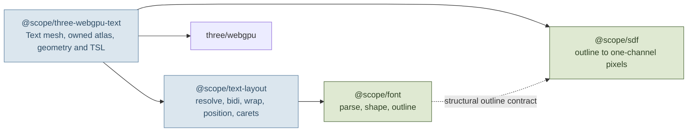
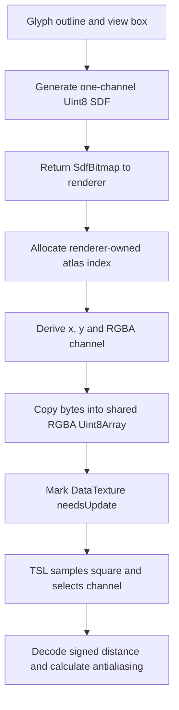
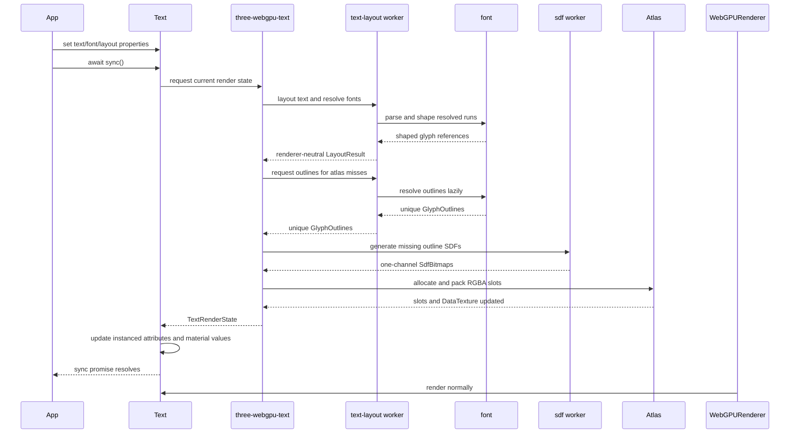

# Roadmap — WebGPU Text (working title)

> Direction, not commitment — Now is committed; Next is planned; Later is exploration.
> Only Now items may be promised. This document changes as we learn.
> Last reviewed: 2026-07-20 · Review cadence: after each completed OpenSpec change
> Scope: whole project

## Vision

Build a small, production-quality family of text-processing packages culminating in a renderer for Three.js `WebGPURenderer`. Consumers will be able to use font parsing/shaping, text layout, SDF generation, or the complete Three renderer independently. The project will preserve the mature Unicode, layout, selection, and signed-distance-field ideas proven by `troika-three-text`, while replacing its WebGL-era renderer, callback API, global build system, and JavaScript-only implementation.

The result is deliberately greenfield: strict TypeScript source, native ESM packages, explicit data contracts between layers, promise-based synchronization, TSL node materials, and no compatibility commitment to `troika-three-text`, `WebGLRenderer`, CommonJS, or UMD.

**Current objective:** render representative multilingual text correctly through `WebGPURenderer` using a WebGL-free runtime — measured by deterministic layout fixtures, browser-rendered visual fixtures, clean strict TypeScript compilation, and a minimal consumer example.

## Where we are starting

The original Troika repository is preserved locally in the ignored `old/` directory, including its own Git history. It is a reference implementation, not a source directory or build dependency. A fresh Git repository now owns the project root.

The useful part of Troika is not its WebGL shader integration; it is the pipeline that turns font files and Unicode text into stable glyph layout data. The existing package contains approximately 4,400 lines of source across font parsing, fallback resolution, shaping, layout, SDF generation, geometry, materials, and public APIs. There are no package-specific automated tests in the preserved checkout, so “proven” means battle-tested behavior rather than a reusable test suite. We must capture that behavior as fixtures before changing algorithms.

The detailed module audit, package ownership rules, contracts, examples, and migration map live in [ARCHITECTURE.md](ARCHITECTURE.md). The key finding is that the old file boundaries are not the future package boundaries: `FontParser` mixes parsing with shaping, `SDFGenerator` mixes an external encoder with WebGL/canvas orchestration, and `TextBuilder` couples almost every layer.

### Current Troika structure

```mermaid
flowchart LR
    User[Mutable Text properties] --> Sync[Text.sync callback API]
    Sync --> Builder[TextBuilder]
    Builder --> Worker[Worker modules]
    Worker --> Resolver[FontResolver]
    Resolver --> Parser[FontParser and Typr]
    Worker --> Typesetter[Typesetter and bidi-js]
    Parser --> Typesetter
    Typesetter --> Layout[Glyph positions, bounds, colors, carets]

    Layout --> SDF[SDFGenerator]
    SDF --> Cpu[CPU fallback workers]
    SDF --> WebGLGen[WebGL SDF generator]
    Cpu --> WebGLCanvas[WebGL canvas atlas]
    WebGLGen --> WebGLCanvas
    WebGLCanvas --> Texture[Three Texture]

    Layout --> Geometry[Instanced GlyphsGeometry]
    Texture --> Material[GLSL TextDerivedMaterial]
    Geometry --> Material
    Material --> Rewrite[onBeforeCompile shader rewriting]
    Rewrite --> WebGLRenderer[Three WebGLRenderer]

    classDef keep fill:#dfe9d2,stroke:#4f6b3c,color:#304326
    classDef replace fill:#f8d9d2,stroke:#a04434,color:#702f25
    class Resolver,Parser,Typesetter,Layout keep
    class WebGLGen,WebGLCanvas,Material,Rewrite,WebGLRenderer replace
```



The green nodes contain the behavior we want to preserve. The red nodes encode the renderer assumptions we are intentionally leaving behind.

### Source disposition

| Existing area | Target package | Greenfield treatment |
|---|---|---|
| `FontParser` parsing, metrics, shaping and outlines | `@scope/font` | Preserve its contracts and fixtures, but replace the Typr-derived parser and partial shaper with a HarfBuzzjs-backed font engine |
| `FontResolver` | future `@scope/text-layout` selection policy plus application adapters | Preserve pure fallback ideas while leaving byte acquisition to the application; any URL/cache helper remains optional and outside the core path |
| `Typesetter` | `@scope/text-layout` | Split shaping orchestration, line layout, bidi placement, result assembly, and interaction data |
| Selection and caret utilities | `@scope/text-layout` | Port as pure helpers over renderer-neutral layout results |
| CPU behavior behind `SDFGenerator` | `@scope/sdf` | Port the MIT-licensed CPU encoder with its copyright and permission notice; expose pure outline-to-typed-array generation and remove canvas/WebGL paths |
| Atlas allocation and byte packing | `@scope/three-webgpu-text` | Renderer owns slots, RGBA packing, growth, dirty tracking, cache/eviction policy, `DataTexture` upload, and disposal |
| `TextBuilder` | Decomposed across layout, SDF, and renderer | Do not port intact; it currently mixes global configuration, workers, atlas state, Three textures, SDF requests, and quad construction |
| `GlyphsGeometry`, `Text`, and render-quad logic | `@scope/three-webgpu-text` | Port or redesign around explicit layout/SDF contracts and promise synchronization |
| `TextDerivedMaterial` | `@scope/three-webgpu-text` | Do not port GLSL rewriting; re-express supported behavior in TSL |
| `BatchedText` | Deferred renderer work | Revisit only after ordinary text benchmarks demonstrate a need |
| Worker module behavior | Package-specific subpath adapters | Use normal ESM workers around pure layout and SDF operations; do not create a worker package |
| Rollup, Lerna, UMD and generated factory builds | Drop | The new workspace is ESM-only and independently built |

## Target structure

The project will begin as one repository containing four independently publishable packages. This is justified by real standalone capabilities and dependency isolation, not by internal folder aesthetics: font-only consumers avoid bidi, SDF, and Three; layout-only consumers avoid SDF and Three; SDF-only consumers avoid fonts and Three.

```text
.
├── packages/
│   ├── font/
│   ├── text-layout/
│   ├── sdf/
│   └── three-webgpu-text/
├── examples/
│   ├── layout-only/
│   ├── sdf-only/
│   └── three-webgpu-basic/
├── test-fixtures/
│   ├── fonts/
│   ├── shaping/
│   ├── layout/
│   ├── sdf/
│   └── visual/
├── openspec/
├── ARCHITECTURE.md
└── ROADMAP.md
```

The packages can version together initially. We will not create separate packages for shared types, workers, atlas backends, or internal utilities unless they become independently useful public capabilities.

### Package dependency architecture



The dependency direction is a project rule: lower layers never import renderer layers, and only `three-webgpu-text` imports Three.js.

### Future runtime architecture

```mermaid
flowchart LR
    User[Text constructor, caller-owned font handles and mutable properties] --> Sync[await text.sync]
    Sync --> Renderer[three-webgpu-text orchestration]
    Renderer --> LayoutWorker[text-layout ESM worker adapter]
    LayoutWorker --> Resolver[Caller-supplied font registry and fallback resolution]
    Resolver --> Font[HarfBuzz-backed font engine]
    Font --> Layout[Wrapping, bidi, placement and carets]
    Layout --> Result[Typed LayoutResult with glyph references]

    Result --> Misses[Renderer finds atlas misses]
    Misses --> LayoutWorker
    LayoutWorker --> Font
    Font --> Outlines[Lazy glyph outlines]
    Outlines --> SdfWorker[sdf ESM worker adapter]
    SdfWorker --> CpuSdf[Pure CPU outline-to-pixels encoder]
    CpuSdf --> Atlas[Renderer-owned RGBA Uint8Array atlas]
    Atlas --> DataTexture[Three DataTexture]

    Result --> Geometry[Instanced GlyphGeometry]
    Geometry --> TSL[TSL TextMaterial]
    DataTexture --> TSL
    TSL --> WebGPU[Three WebGPURenderer]

    Dispose[dispose owned resources] --> LayoutWorker
    Dispose --> SdfWorker
    Dispose --> DataTexture

    classDef cpu fill:#dfe9d2,stroke:#4f6b3c,color:#304326
    classDef gpu fill:#dbe6ee,stroke:#5f83a3,color:#2f4d66
    class LayoutWorker,Resolver,Font,Layout,Misses,Outlines,SdfWorker,CpuSdf,Atlas cpu
    class Geometry,DataTexture,TSL,WebGPU gpu
```



The CPU/GPU boundary and package boundaries are explicit: font and layout produce renderer-neutral data; SDF produces bytes; Three owns GPU resource upload; TSL owns vertex placement and fragment coverage. No module creates or accesses a WebGL context.

### Atlas model

Troika packs four glyph SDFs into the RGBA channels of each atlas square. We will preserve that representation, but the implementation belongs entirely to `@scope/three-webgpu-text`; `@scope/sdf` returns only one-channel `SdfBitmap` values:



Atlas growth allocates a larger typed array and copies existing rows. The first release will upload the full dirty texture after changes; partial GPU updates are an optimization to consider only after profiling.

### Synchronization lifecycle



Concurrent calls to `sync()` will coalesce behind the latest requested state. A stale worker result must never overwrite a newer text state.

## Public API direction

Each package must expose a useful direct API. Representative lower-level usage is documented in [ARCHITECTURE.md](ARCHITECTURE.md); the composed renderer API should remain small and unsurprising:

```ts
import { Text } from '@scope/three-webgpu-text'

const text = new Text({
  text: 'Hello',
  font,
  fontSize: 0.1,
  color: 0xffffff
})

await text.sync()
scene.add(text)

text.text = 'Updated'
await text.sync()

text.dispose()
```

`Text` will extend Three’s `Mesh` from `three/webgpu`. Its default material will be an unlit node material. Layout results and selection helpers belong to `@scope/text-layout`, not the renderer package. Internal worker machinery and GPU atlas state remain private unless a real integration requires them.

## Column rules

- **Now** — problem validated, solution shaped, actively worked or next up. Committed.
- **Next** — problem chosen and understood; solution still in discovery. Planned, not promised.
- **Later** — problem worth solving, no solution chosen. Options, not a queue.

## Now

### Establish a trustworthy greenfield foundation
- **Problem:** The useful implementation is embedded in another project’s monorepo, old build system, JavaScript sources, and renderer-specific assumptions.
- **Outcome & done-when:** The repository is an independently buildable strict-TypeScript ESM workspace with four package shells, enforced dependency direction, provenance notices, a narrow Three peer range only in the renderer, no committed dependency on `old/`, and reproducible build/typecheck/test commands.
- **Status:** complete — commit `0b79f07` establishes the independent strict-TypeScript ESM workspace, package boundaries, checks, provenance, and production font core without a committed or runtime dependency on `old/`.
- **Appetite:** worth about 2–3 focused days.
- **Links:** OpenSpec change `reset-repository-and-document-roadmap` · [architecture](ARCHITECTURE.md)

### Validate the font-engine boundary with HarfBuzzjs
- **Problem:** The old font wrapper combines Typr parsing with a project-owned subset of GSUB, GPOS, Arabic joining, kerning, and outline extraction. Porting it would make this project responsible for a partial shaping engine, while adopting WASM introduces format, startup, memory, and lifecycle questions that must be measured.
- **Outcome & done-when:** A bounded spike loads representative fonts, shapes Latin, Arabic, Indic, Khmer, and explicit mixed-direction runs, preserves JavaScript UTF-16 clusters, validates the direct numeric-outline path, and records WASM size, startup, memory, worker lifetime, and TTF/OTF/WOFF/WOFF2 behavior. Contracts are confirmed or revised from evidence, including explicit rejection of unsupported assumptions.
- **Status:** complete — shaping, facts, clusters, TTF/OTF, and ESM workers are validated; the published 1.4.0 wrapper lacks direct numeric callbacks, WOFF/WOFF2 input, and deterministic object disposal, with bounded policies recorded for each.
- **Appetite:** worth about 2 focused days; use the published wrapper first and optimize or fork it only when a measured requirement demands it.
- **Links:** OpenSpec change `validate-harfbuzz-font-engine` · [validation report](docs/validation/harfbuzz-font-engine.md) · [font-engine decision](ARCHITECTURE.md#use-harfbuzzjs-as-the-font-and-shaping-engine)

### Prove the WebGPU text rendering seam
- **Problem:** The highest-risk assumption is that the existing glyph representation can be rendered faithfully through TSL without GLSL rewriting.
- **Outcome & done-when:** A hard-coded SDF atlas and glyph instance render crisp fill text through `WebGPURenderer`, with correct transparency, clipping, curve/orientation transforms, and repeated texture updates.
- **Status:** complete — Three.js 0.185.1 rendered the fixed RGBA SDF fixture through TSL on an actual Metal-backed WebGPU adapter; semantic pixels, clipping/transforms, in-place texture and instance updates, backend rejection, and repeated disposal all passed. Promotion is limited to the proven kernel; multi-cell atlas evidence remains a bounded first follow-up.
- **Appetite:** worth about 1–2 focused days; stop and reshape if the material seam is not viable.
- **Links:** OpenSpec change `prove-webgpu-rendering-seam` · [validation report](docs/validation/webgpu-rendering-seam.md) · [renderer decision](ARCHITECTURE.md#use-the-proven-tslwebgpu-rendering-kernel)

### Preserve text behavior behind executable fixtures
- **Problem:** The original layout algorithms are mature but lack a package-level regression suite, while HarfBuzz will intentionally improve some shaping results rather than reproduce Troika exactly.
- **Outcome & done-when:** Deterministic fixtures cover Latin kerning/ligatures, Arabic, Indic, Khmer, mixed bidi, wrapping/alignment, fallback fonts, style ranges, caret positions, glyph bounds, and accepted font formats. Troika fixtures preserve layout intent; HarfBuzz results become the shaping baseline where the old partial shaper differs.
- **Status:** complete — nineteen synthetic policy cases cover line construction, wrapping, alignment, bidi placement, run boundaries, bounds, carets, and selections; eleven public-font runs prove the HarfBuzz seam; every stable case has classified Troika provenance. This is validation evidence, not an implemented itemizer or layout engine.
- **Appetite:** worth about 1 focused week.
- **Links:** OpenSpec change `capture-layout-policy-fixtures` · [validation report](docs/validation/layout-policy.md) · [layout responsibility](ARCHITECTURE.md#scopetext-layout)

### Implement the resolved text-layout core
- **Problem:** Accepted layout behavior was executable only as fixture data, leaving no production operation that consumers could call independently of font selection and rendering.
- **Outcome & done-when:** A pure ESM API validates fully resolved shaped runs and produces deterministic lines, visual glyph placement, bounds, carets, and selection rectangles with exact fixture conformance and no dependency on `old/` or higher layers.
- **Status:** complete — `layoutResolvedText()` and `getSelectionRects()` conform to all nineteen synthetic cases and the public-font seam. This status covers only the resolved core; automatic itemization/fallback, complete Unicode line breaking, reshaping at breaks, workers, provider policy, and bidi caret affinity remain unimplemented.
- **Appetite:** worth about 1 focused week.
- **Links:** OpenSpec change `implement-text-layout-core` · [package README](packages/layout/README.md) · [validation report](docs/validation/layout-policy.md)

### Deliver the first ordinary-text package
- **Problem:** The renderer spike and ported layout engine are only useful when integrated behind a small lifecycle-safe public API.
- **Outcome & done-when:** Consumers can construct, synchronize, update, render, select within, and dispose ordinary multilingual text; browser visual fixtures cover the supported appearance features; a minimal example uses only public exports.
- **Status:** shaped — batching and PBR material variants are outside this slice.
- **Appetite:** worth about 1 focused week, flexing optional visual features to preserve the box.
- **Links:** future OpenSpec change not yet proposed

## Next

### Lit text and shadow integration
- **Problem:** An unlit material is insufficient for text that must participate naturally in physically lit 3D scenes.
- **Hypothesis:** dedicated text-aware standard/physical node material variants will provide predictable lighting and shadow behavior without recreating arbitrary material derivation.
- **Confidence:** medium
- **Assumes:** Three’s node-material position, normal, mask, and shadow hooks can express curved glyph geometry without private renderer APIs — partially validated by official APIs, not yet by a spike.
- **Open questions:** Which lighting models are genuinely needed? Should outline passes cast shadows? How should normal mapping interact with planar glyphs?

### Efficient rendering of many independent text objects
- **Problem:** One mesh and material state per label may become CPU- or draw-call-bound in dense interfaces and scenes.
- **Hypothesis:** a purpose-built batched text container, informed by Troika’s `BatchedText` data layout but designed for WebGPU storage/data nodes, will reduce draw calls without complicating ordinary `Text`.
- **Confidence:** medium
- **Assumes:** a real consumer or benchmark demonstrates that ordinary instanced glyph rendering is insufficient — unvalidated.
- **Open questions:** Is Three’s `BatchedMesh` enough? Are storage buffers preferable to float data textures? Which properties must vary per member?

## Later

- Move SDF generation to WebGPU compute — why it matters: complex fonts or large first-use glyph sets may expose CPU generation latency; revisit only with profiling evidence.
- Improve atlas residency and eviction — why it matters: long-lived applications may accumulate unused glyphs; revisit when memory measurements show a practical ceiling.
- Extend font-format and advanced-font coverage — why it matters: WOFF/WOFF2 decoding and color glyphs require additional contracts; variable TrueType axes are already validated. Revisit decoder costs after the ordinary TTF/OTF outline/SDF path is stable.
- Publish optional framework integrations — why it matters: easier adoption in React Three Fiber or other ecosystems; revisit after the core API is stable.

## Not doing

- Supporting `WebGLRenderer` — the project exists specifically to provide a clean `WebGPURenderer` implementation.
- Supporting CommonJS or UMD — native ESM is the only distribution format.
- Preserving `troika-three-text` API compatibility — compatibility would force old callbacks, material derivation, and global configuration into the new design.
- Accepting arbitrary classic Three materials — v1 uses a dedicated unlit node material; explicit material variants can be added when demanded.
- Porting `BatchedText` in v1 — it is an optimization without current evidence.
- Building a WebGPU compute SDF generator in v1 — the CPU-worker path is simpler and sufficient to validate the product.
- Creating packages for shared types, workers, internal utilities, or atlas backends — package boundaries require an independently useful public capability.

## Open questions

- Should we adopt the recommended project name **WebGPU Text**, repository `webgpu-text`, and packages `@webgpu-text/font`, `@webgpu-text/layout`, `@webgpu-text/sdf`, and `@webgpu-text/three`? The exact package names are currently unused, but npm scope ownership still needs confirmation.
- Which exact Three revision should define the initial narrow peer range?
- Which visual properties are essential for v1 beyond fill, per-glyph color, clipping, orientation, and curve?
- Which automated runner can reproduce the validated Chromium WebGPU launch? The current authoritative observation is local Chrome for Testing 149 on macOS/Apple Metal.

## Decisions made

- **Font backend:** use HarfBuzzjs behind project-owned TypeScript contracts for font lifetime, shaping, metrics, coverage, and lazy numeric outlines. Keep Typr and Troika as attributed reference material and fixture sources, not production runtime code.
- **Shaping baseline:** accept HarfBuzz as authoritative for font-specific shaping. Preserve Troika’s renderer-neutral paragraph layout, wrapping, bidi orchestration, fallback, caret, and selection behavior where it remains applicable.
- **Font acquisition:** applications obtain font bytes by their own network, filesystem, bundler, or storage policy and pass bytes/handles into the package pipeline. Core packages never accept font URLs or call `fetch`; a future convenience helper may wrap acquisition without becoming the main API.
- **WASM performance:** do not describe the published HarfBuzzjs wrapper as zero-allocation. Reuse persistent font objects and shaping buffers, measure the hot path, and introduce a thinner adapter or fork only with profiling evidence.
- **Outline access:** `LayoutResult` contains stable font/glyph references. Callers or renderer orchestration resolve outlines lazily from caller-owned font handles/registries on atlas misses; a future session helper may automate that without owning font acquisition.
- **Published wrapper boundary:** vendor the exact validated `harfbuzzjs@1.4.0` runtime and expose only a narrow internal bridge to its packaged drawing and cleanup functions. Never use its SVG round-trip or add a second parser; replace the bridge when upstream exposes equivalent public APIs.
- **Font formats:** v1 accepts normalized TTF and CFF/OTF bytes. Detect and explicitly reject WOFF/WOFF2 until a separate decoder evaluation justifies their API and bundle cost.
- **Cleanup:** `FontHandle.dispose()` deterministically destroys its owned HarfBuzz objects; worker termination remains the deterministic whole-engine boundary for the singleton WASM runtime.
- **Worker model:** use ordinary ESM workers with serializable public contracts, not Troika’s generated worker-factory mechanism.
- **SDF provenance:** port the MIT-licensed CPU implementation from `webgl-sdf-generator`, retain its copyright and permission notice, record derivation in `NOTICE.md`, and exclude its WebGL/canvas paths.
- **Atlas ownership:** `@scope/sdf` returns only `SdfBitmap`; `@scope/three-webgpu-text` owns the complete atlas implementation and GPU lifecycle.
- **Renderer kernel:** promote one instanced unit quad, typed bounds/flat-slot/color attributes, renderer-owned RGBA `DataTexture`, and an unlit TSL material for cell/channel addressing, SDF coverage, opacity, clipping, orientation, and curvature. Do not port shader rewriting.
- **Renderer validation:** pin Three.js 0.185.1 for the first implementation and rerun the private actual-WebGPU experiment before widening or changing the revision. WebGL fallback is never passing evidence.
- **Renderer ownership:** production text objects own their geometry/material and atlas references; the atlas owner owns texture/cache disposal; the application owns the shared Three renderer and canvas.

## Changelog

- 2026-07-21: Implemented the pure resolved-run layout core with exact synthetic conformance, public-font seam coverage, validated ESM/type packaging, and explicit caller ownership of font-byte acquisition. Automatic itemization/fallback, complete Unicode line breaking, reshaping, workers, and bidi affinity remain follow-ups.
- 2026-07-21: Validated the renderer-neutral layout-policy boundary with nineteen deterministic synthetic fixtures, eleven public-font runs, complete preserve/change classification, and an `old/`-independent handoff. Automatic itemization and production layout remain the next separate change.
- 2026-07-20: Implemented standalone `@webgpu-text/font` with owned TTF/OTF input, font facts and coverage, explicit-run HarfBuzz shaping, operation-scoped variations, cached numeric outlines, deterministic disposal, package-install validation, and attributed vendored runtime/fixtures. The next bounded slice is layout-policy fixture capture.
- 2026-07-20: Completed the actual-WebGPU rendering seam spike on Three.js 0.185.1 and Chrome for Testing 149. Validated instanced RGBA SDF rendering, semantic antialiasing/color/transform observations, post-render texture and attribute uploads, fallback rejection, and repeated disposal; bounded promotion to the renderer kernel and deferred multi-cell atlas evidence to its first production follow-up.
- 2026-07-20: Completed the HarfBuzzjs validation spike. Confirmed exact cross-runtime shaping, UTF-16 clusters, variable-font facts, TTF/OTF support, and ESM workers; rejected direct WOFF/WOFF2 input, direct numeric outlines through published 1.4.0, and deterministic in-process disposal; selected normalized TTF/OTF input and worker termination as v1 boundaries.
- 2026-07-20: Replaced the planned Typr-derived production backend with HarfBuzzjs; added a font-engine validation spike covering complex shaping, UTF-16 clusters, lazy numeric outlines, font formats, WASM lifecycle, and allocation behavior; retained Troika/Typr only as attributed references and fixture sources.
- 2026-07-20: Resolved lazy outline access and renderer-owned atlas design; initially selected an attributed Typr-derived compatibility backend (superseded by the HarfBuzzjs decision above) and an attributed CPU-only port of `webgl-sdf-generator`; added `@webgpu-text/*` as the recommended naming scheme.
- 2026-07-20: Reframed the target as four independently consumable packages—font, text layout, SDF, and Three WebGPU rendering—after auditing the actual module responsibilities and identifying `TextBuilder` as the principal coupling point.
- 2026-07-20: Created. Committed to a WebGPU-only, strict-TypeScript, ESM-only package; prioritized the rendering seam before the behavioral port; explicitly deferred batching, lit materials, and compute SDF generation.
