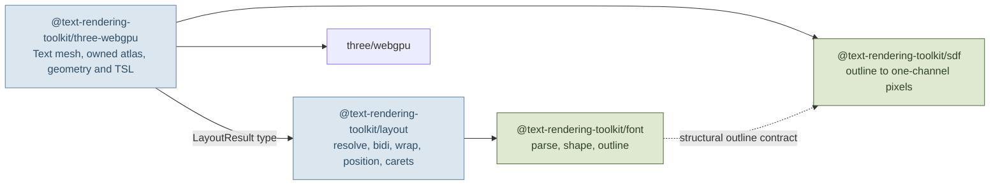
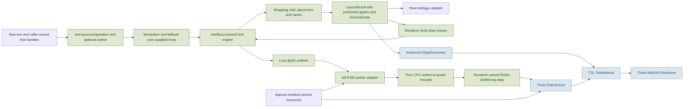
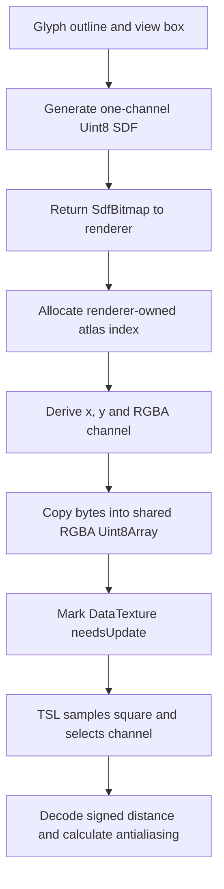
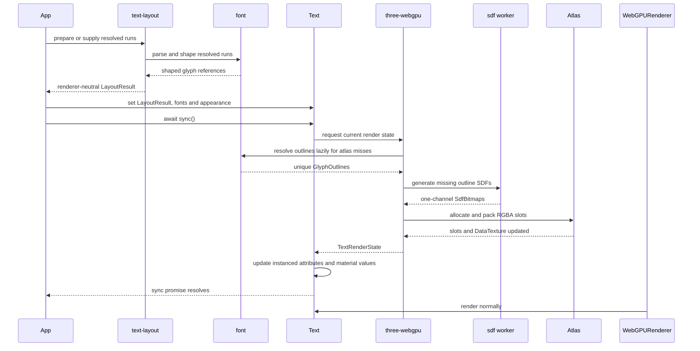

# Roadmap — Text Rendering Toolkit (working title)

> Direction, not commitment — Now is committed; Next is planned; Later is exploration.
> Only Now items may be promised. This document changes as we learn.
> Last reviewed: 2026-07-22 · Review cadence: after each completed OpenSpec change
> Scope: whole project

## Vision

Build a small, production-quality family of text-processing packages culminating in a renderer for Three.js `WebGPURenderer`. Consumers will be able to use font parsing/shaping, text layout, SDF generation, or the complete Three renderer independently. The project will preserve the mature Unicode, layout, selection, and signed-distance-field ideas proven by `troika-three-text`, while replacing its WebGL-era renderer, callback API, global build system, and JavaScript-only implementation.

The result is deliberately greenfield: strict TypeScript source, native ESM packages, explicit data contracts between layers, promise-based synchronization, TSL node materials, and no compatibility commitment to `troika-three-text`, `WebGLRenderer`, CommonJS, or UMD.

**Current objective achieved:** representative multilingual text now renders through `WebGPURenderer` using a WebGL-free runtime, backed by deterministic layout/SDF tests, a real-font actual-WebGPU fixture, strict TypeScript checks, and a public-only consumer example. `LayoutResult` is the completed renderer-neutral handoff, so Three performs no shaping, line layout, caret, or selection policy. The Three package now ships both its default unlit material and an opt-in construction-fixed planar standard material with glyph-shaped cast and received shadows. `@text-rendering-toolkit/layout` now turns ordinary raw text into the same handoff through reusable serializable preparation, explicit caller-font fallback, and HarfBuzz shaping. Multiple independent `Text` objects can borrow one explicit `TextResources`, reusing same-handle glyph/SDF work and one growable atlas without coupling preparation to Three. COLR v0 palette-zero glyphs now flow lazily from caller-owned font bytes through ordered layer outlines and per-instance RGBA without changing preparation or layout identity. The four packages also assemble into one audited local release candidate whose tarballs pass an isolated external consumer check; public release work is intentionally paused while the packages are consumed locally.

`@text-rendering-toolkit/layout` also owns a completed renderer-neutral decoration boundary: it derives immutable solid/dotted/wavy underline and solid strikethrough segments from independent UTF-16 spans after layout, with stable per-span automatic font metrics, numeric overrides, independent paint, deterministic phase, clipping, and optional bounds-only skip ink. The same output is consumed by package tests, a typed-array adapter, and the non-Three SVG documentation inspector, which refines automatic skipping against its already-owned outlines without reshaping text.

`@text-rendering-toolkit/three-webgpu` now also paints ordinary SDF glyphs with one independent-color outer outline and one offset, SDF-softened visual shadow in either material variant. Both effects reuse the existing atlas slot and update atomically through `Text.sync()`. Construction-fixed em-based `sdfPadding` controls physical paint room independently from `sdfSize` resolution; excessive paint rejects without mutating the accepted frame. COLR v0 layers remain deliberately unchanged rather than exposing their internal layer seams, and shadow softness is distance-field falloff rather than Gaussian browser blur.

## Where we are starting

The original Troika repository is preserved locally in the ignored `old/` directory, including its own Git history. It is a reference implementation, not a source directory or build dependency. A fresh Git repository now owns the project root.

The useful part of Troika is not its WebGL shader integration; it is the pipeline that turns font files and Unicode text into stable glyph layout data. The existing package contains approximately 4,400 lines of source across font parsing, fallback resolution, shaping, layout, SDF generation, geometry, materials, and public APIs. There are no package-specific automated tests in the preserved checkout, so “proven” means battle-tested behavior rather than a reusable test suite. We must capture that behavior as fixtures before changing algorithms.

The detailed module audit, package ownership rules, contracts, examples, and migration map live in [ARCHITECTURE.md](ARCHITECTURE.md). The key finding is that the old file boundaries are not the future package boundaries: `FontParser` mixes parsing with shaping, `SDFGenerator` mixes an external encoder with WebGL/canvas orchestration, and `TextBuilder` couples almost every layer.

### Current Troika structure

```mermaid
flowchart LR
    User[Mutable Text properties] --> Sync[Text.sync callback API]
    Sync --> Builder[TextBuilder]
    Builder --> Worker[Worker modules]
    Worker --> Resolver[FontResolver]
    Resolver --> Parser[FontParser and Typr]
    Worker --> Typesetter[Typesetter and bidi-js]
    Parser --> Typesetter
    Typesetter --> Layout[Glyph positions, bounds, colors, carets]

    Layout --> SDF[SDFGenerator]
    SDF --> Cpu[CPU fallback workers]
    SDF --> WebGLGen[WebGL SDF generator]
    Cpu --> WebGLCanvas[WebGL canvas atlas]
    WebGLGen --> WebGLCanvas
    WebGLCanvas --> Texture[Three Texture]

    Layout --> Geometry[Instanced GlyphsGeometry]
    Texture --> Material[GLSL TextDerivedMaterial]
    Geometry --> Material
    Material --> Rewrite[onBeforeCompile shader rewriting]
    Rewrite --> WebGLRenderer[Three WebGLRenderer]

    classDef keep fill:#dfe9d2,stroke:#4f6b3c,color:#304326
    classDef replace fill:#f8d9d2,stroke:#a04434,color:#702f25
    class Resolver,Parser,Typesetter,Layout keep
    class WebGLGen,WebGLCanvas,Material,Rewrite,WebGLRenderer replace
```



The green nodes contain the behavior we want to preserve. The red nodes encode the renderer assumptions we are intentionally leaving behind.

### Source disposition

| Existing area | Target package | Greenfield treatment |
|---|---|---|
| `FontParser` parsing, metrics, shaping and outlines | `@text-rendering-toolkit/font` | Preserve its contracts and fixtures, but replace the Typr-derived parser and partial shaper with a HarfBuzzjs-backed font engine |
| `FontResolver` | future `@text-rendering-toolkit/layout` selection policy plus application adapters | Preserve pure fallback ideas while leaving byte acquisition to the application; any URL/cache helper remains optional and never the primary path |
| `Typesetter` | `@text-rendering-toolkit/layout` | Split shaping orchestration, line layout, bidi placement, result assembly, and interaction data |
| Selection and caret utilities | `@text-rendering-toolkit/layout` | Port as pure helpers over renderer-neutral layout results |
| CPU behavior behind `SDFGenerator` | `@text-rendering-toolkit/sdf` | Port the MIT-licensed CPU encoder with its copyright and permission notice; expose pure outline-to-typed-array generation and remove canvas/WebGL paths |
| Atlas allocation and byte packing | `@text-rendering-toolkit/three-webgpu` | Renderer owns slots, RGBA packing, growth, dirty tracking, cache/eviction policy, `DataTexture` upload, and disposal |
| `TextBuilder` | Decomposed across layout, SDF, and renderer | Do not port intact; it currently mixes global configuration, workers, atlas state, Three textures, SDF requests, and quad construction |
| `GlyphsGeometry`, `Text`, and render-quad logic | `@text-rendering-toolkit/three-webgpu` | Port or redesign around explicit layout/SDF contracts and promise synchronization |
| `TextDerivedMaterial` | `@text-rendering-toolkit/three-webgpu` | Do not port GLSL rewriting; re-express supported behavior in TSL |
| `BatchedText` | Deferred renderer work | Revisit only after ordinary text benchmarks demonstrate a need |
| Worker module behavior | Package-specific subpath adapters | Use normal ESM workers around pure layout and SDF operations; do not create a worker package |
| Rollup, Lerna, UMD and generated factory builds | Drop | The new workspace is ESM-only and independently built |

## Target structure

The project will begin as one repository containing four independently publishable packages. This is justified by real standalone capabilities and dependency isolation, not by internal folder aesthetics: font-only consumers avoid bidi, SDF, and Three; layout-only consumers avoid SDF and Three; SDF-only consumers avoid fonts and Three.

```text
.
├── packages/
│   ├── font/
│   ├── text-layout/
│   ├── sdf/
│   └── three-webgpu/
├── examples/
│   ├── layout-only/
│   ├── sdf-only/
│   └── three-webgpu-basic/
├── test-fixtures/
│   ├── fonts/
│   ├── shaping/
│   ├── layout/
│   ├── sdf/
│   └── visual/
├── openspec/
├── ARCHITECTURE.md
└── ROADMAP.md
```

The packages can version together initially. We will not create separate packages for shared types, workers, atlas backends, or internal utilities unless they become independently useful public capabilities.

### Package dependency architecture



The dependency direction is a project rule: lower layers never import renderer layers, and only `three-webgpu` imports Three.js.

### Future runtime architecture



The CPU/GPU boundary and package boundaries are explicit: font and layout produce renderer-neutral data; SDF produces bytes; Three owns GPU resource upload; TSL owns vertex placement and fragment coverage. No module creates or accesses a WebGL context.

### Atlas model

Troika packs four glyph SDFs into the RGBA channels of each atlas square. We will preserve that representation, but the implementation belongs entirely to `@text-rendering-toolkit/three-webgpu`; `@text-rendering-toolkit/sdf` returns only one-channel `SdfBitmap` values:



Atlas growth allocates a larger typed array and remaps existing logical slots to
their positions in the wider grid. The current implementation uploads the full
dirty texture after changes; partial GPU updates are an optimization to consider
only after profiling.

### Synchronization lifecycle



Concurrent calls to `sync()` will coalesce behind the latest requested state. A stale worker result must never overwrite a newer text state.

## Public API direction

Each package must expose a useful direct API. Representative lower-level usage is documented in [ARCHITECTURE.md](ARCHITECTURE.md); the composed renderer API should remain small and unsurprising:

```ts
import { Text, TextResources } from '@text-rendering-toolkit/three-webgpu'

const resources = new TextResources()

const text = new Text({
  layout: layoutResolvedText(resolvedLayoutInput),
  fonts: new Map([['body', font]]),
  resources,
  color: 0xffffff
})

await text.sync()
scene.add(text)

text.layout = layoutResolvedText(nextResolvedLayoutInput)
await text.sync()

text.dispose()
resources.dispose()
```

`Text` extends Three’s `Mesh` from `three/webgpu`. Its default material is an
unlit node material. Its public boundary accepts a completed `LayoutResult` and
caller-owned lazy-outline handles; raw-text itemization, fallback, shaping,
layout, carets, and selection remain layout work. Resource state remains private
to the renderer package, while applications may explicitly share and own it.

## Column rules

- **Now** — problem validated, solution shaped, actively worked or next up. Committed.
- **Next** — problem chosen and understood; solution still in discovery. Planned, not promised.
- **Later** — problem worth solving, no solution chosen. Options, not a queue.

## Now

Three SDF outline and one-shadow implementation and verification are complete;
the active OpenSpec change has no implementation work left and is ready to
archive. The next proposal should select one bounded remaining item.

## Next

### Browser-grade line breaking
- **Problem:** Raw-text preparation deliberately uses a bounded line-break policy, so wrapping does not yet match the browser-grade behavior expected for multilingual prose, punctuation, long words, and break-sensitive scripts.
- **Hypothesis:** a Unicode line-break implementation plus reshaping at chosen boundaries can improve ordinary paragraph fidelity without changing the renderer-neutral `LayoutResult` handoff.
- **Status:** in progress — the bounded Unicode 13 slice is complete: schema-version-2 preparation owns immutable opportunities, the raw path greedily measures and reshapes exact line fragments, and the resolved expert path accepts optional explicit opportunities while preserving omission compatibility. Browser-grade completion still requires newer data, CSS/locale tailoring, dictionary segmentation, hyphenation, and broader parity evidence.
- **Confidence:** high
- **Assumes:** the current preparation/resolution split remains the right place to compute reusable Unicode analysis before font-dependent shaping.
- **Open questions:** Which Unicode line-breaking data or implementation should be adopted? Which browser fixtures define parity? Which scripts require reshaping around an accepted break?

## Later

- Improve bidi caret affinity and editing semantics — why it matters: visual text is the priority now; richer interaction data can follow when concrete multilingual editing cases require it.
- Move shaping or SDF work to ESM workers — why it matters: the current synchronous pipeline is simpler and deterministic; revisit only when end-to-end measurements show main-thread latency that the public promise boundaries cannot absorb.
- Efficient rendering of many independent text objects — why it matters: shared resources remove duplicate glyph work but do not reduce draw calls; revisit batching only after a dense-scene benchmark demonstrates a bottleneck.
- Extend appearance beyond browser-like text paint — why it matters: curvature and additional dedicated physical-material variants are specialized effects and remain lower priority than ordinary text fidelity.
- Move SDF generation to WebGPU compute — why it matters: complex fonts or large first-use glyph sets may expose CPU generation latency; revisit only with profiling evidence.
- Improve atlas residency and eviction — why it matters: long-lived applications may accumulate unused glyphs; revisit when memory measurements show a practical ceiling.
- Revisit SDF paint-capacity and padding ergonomics — why it matters: callers currently choose `sdfPadding` in em units and must reason about outline and shadow capacity themselves; explore a capacity query, explicit appearance budget, or clearer diagnostics in a separate API change.
- Extend font-container coverage — why it matters: WOFF/WOFF2 decoding requires additional contracts; variable TrueType axes are already validated. Revisit decoder costs after the ordinary TTF/OTF path is stable.
- Publish optional framework integrations — why it matters: easier adoption in React Three Fiber or other ecosystems; revisit after the core API is stable.
- Complete the first public release — why it matters: package identity,
  licensing, version, canonical metadata, npm access, and provenance are
  bounded and owner authorization has been granted.

## Not doing

- Supporting `WebGLRenderer` — the project exists specifically to provide a clean `WebGPURenderer` implementation.
- Supporting CommonJS or UMD — native ESM is the only distribution format.
- Preserving `troika-three-text` API compatibility — compatibility would force old callbacks, material derivation, and global configuration into the new design.
- Accepting arbitrary classic Three materials — v1 uses dedicated unlit and planar standard node materials; further variants require concrete demand.
- Porting `BatchedText` in v1 — it is an optimization without current evidence.
- Building a WebGPU compute SDF generator in v1 — the CPU-worker path is simpler and sufficient to validate the product.
- Creating packages for shared types, workers, internal utilities, or atlas backends — package boundaries require an independently useful public capability.

## Open questions

There are no remaining release-blocking product questions. The deferred API and
performance questions are tracked under **Later** above.

## Decisions made

- **Font backend:** use HarfBuzzjs behind project-owned TypeScript contracts for font lifetime, shaping, metrics, coverage, and lazy numeric outlines. Keep Typr and Troika as attributed reference material and fixture sources, not production runtime code.
- **Shaping baseline:** accept HarfBuzz as authoritative for font-specific shaping. Preserve Troika’s renderer-neutral paragraph layout, wrapping, bidi orchestration, fallback, caret, and selection behavior where it remains applicable.
- **Font acquisition:** applications obtain font bytes by their own network, filesystem, bundler, or storage policy and pass bytes/handles into the package pipeline; byte/handle input is always the primary supported path. Core packages do not currently accept font URLs or call `fetch`; a convenience helper may add that later — possibly even in core — but fetching must never become the main or only path.
- **WASM performance:** do not describe the published HarfBuzzjs wrapper as zero-allocation. Reuse persistent font objects and shaping buffers, measure the hot path, and introduce a thinner adapter or fork only with profiling evidence.
- **Outline access:** `LayoutResult` contains stable font/glyph references. Callers or renderer orchestration resolve outlines lazily from caller-owned font handles/registries on atlas misses; a future session helper may automate that without owning font acquisition.
- **Published wrapper boundary:** vendor the exact validated `harfbuzzjs@1.4.0` runtime and expose only a narrow internal bridge to its packaged drawing and cleanup functions. Never use its SVG round-trip or add a second parser; replace the bridge when upstream exposes equivalent public APIs.
- **Font formats:** v1 accepts normalized TTF and CFF/OTF bytes. Detect and explicitly reject WOFF/WOFF2 until a separate decoder evaluation justifies their API and bundle cost.
- **Cleanup:** `FontHandle.dispose()` deterministically destroys its owned HarfBuzz objects; worker termination remains the deterministic whole-engine boundary for the singleton WASM runtime.
- **Worker model:** use ordinary ESM workers with serializable public contracts, not Troika’s generated worker-factory mechanism.
- **SDF provenance:** the CPU implementation adapts `webgl-sdf-generator@1.1.1`, retains its copyright and full MIT notice, records exact npm provenance and local changes, and excludes SVG parsing, WebGL, canvas, framebuffer, and worker paths.
- **Atlas ownership:** `@text-rendering-toolkit/sdf` returns only `SdfBitmap`; `@text-rendering-toolkit/three-webgpu` owns the complete atlas implementation and GPU lifecycle.
- **Renderer kernel:** promote one instanced unit quad, typed bounds/flat-slot/color attributes, renderer-owned RGBA `DataTexture`, and an unlit TSL material for cell/channel addressing, SDF coverage, opacity, clipping, orientation, and curvature. Do not port shader rewriting.
- **Renderer validation:** pin Three.js 0.185.1 for the first implementation
  and rerun the retained adapter, package, and release-candidate checks before
  widening or changing the revision. WebGL fallback is not supported.
- **Release identity:** use **Text Rendering Toolkit**, repository
  `text-rendering-toolkit`, and packages `@text-rendering-toolkit/font`,
  `@text-rendering-toolkit/layout`, `@text-rendering-toolkit/sdf`, and
  `@text-rendering-toolkit/three-webgpu`.
- **Release policy:** license original project code under MIT, keep the public
  package family version-aligned, and publish from the canonical GitHub
  repository. Merging the Changesets version pull request authorizes publication;
  the release workflow then publishes with npm trusted publishing and provenance,
  using no long-lived token, and fails the release if that trust evidence is
  absent.
- **Renderer ownership:** production text objects own their geometry and material. `TextResources` owns texture/cache state; a text disposes default private resources but only borrows injected resources. Applications dispose a shared resource after all borrowers, and separately own the shared Three renderer and canvas.
- **Renderer-neutral handoff:** `LayoutResult` is the complete input to any renderer and carries `fontUnitScale` on each positioned glyph. Three accepts that result plus structural caller-owned lazy-outline handles and performs no layout or interaction policy.
- **Raw-text preparation:** promote the validated synchronous two-stage layout contract: immutable serializable bidi/script/style preparation first, then explicit grapheme-safe fallback and HarfBuzz shaping over caller-owned font handles. Keep `layoutResolvedText()` as the expert API and offer a one-call convenience composition; font fetching must never be required by this path.
- **Shared atlas lifetime:** each `Text` still creates private resources by default, while applications may inject one fixed-SDF-size `TextResources` into multiple texts for same-handle glyph/SDF reuse and one monotonic growing RGBA atlas. Sharing does not batch meshes or reduce draw calls; borrowers dispose before the owner, and v1 has no eviction.
- **First appearance surface:** the initial slice shipped flat unlit TSL fill, per-style color, opacity, and rectangular clipping on Three.js 0.185.1. Planar lighting, glyph-shaped scene shadows, one ordinary-glyph outer outline, and one ordinary-glyph visual shadow were added in later validated changes; curvature and arbitrary material derivation remain deferred.
- **Planar lit/shadow seam:** a standard node material can reuse instanced `positionNode`, RGBA `colorNode`, and antialiased `opacityNode`; add planar normals, a midpoint SDF `maskShadowNode`, and set `shadowSide` to the visible side for zero-thickness glyph quads. Do not add `castShadowNode`, transmitted shadows, duplicate shadow geometry, or private renderer hooks for the ordinary planar case.
- **Production planar lighting:** `TextOptions.lit` is a construction-only boolean. The standard variant uses fixed metalness `0` and roughness `0.9`, shares all production glyph nodes and lifecycle state, and leaves `castShadow`, `receiveShadow`, lights, shadow maps, renderer, and scene ownership to ordinary Three.js callers. Runtime material switching and a physical-material option hierarchy remain deferred.
- **First color-glyph direction:** COLR v0 + CPAL palette zero is shipped through a bounded lazy font operation and renderer-owned layer composition. `PreparedText`, `LayoutResult`, and SDF remain unchanged; caller font order is explicit; ordinary outlines remain the fallback; COLR v1, bitmap strikes, SVG, and implicit browser emoji preference stay deferred.
- **Browser-text decoration boundary:** layout owns visual fragmentation of styled UTF-16 underline/strikethrough ranges and emits immutable analytic solid/dotted/wavy segments with independent color, compact automatic metrics, numeric overrides, per-fragment phase, and optional bounds-only skip ink. Three separately owns ordinary-glyph outline and one shadow as appearance-only decodings of the same SDF/atlas slot, rejecting extent beyond padding before commit. COLR composed-silhouette paint remains deferred.
- **Production text decorations:** `FontFacts` exposes bounded default-instance underline/strikethrough facts and layout retains their scaled source-range context. `deriveTextDecorations()` is the single pure public operation; appearance remains outside `PreparedText`, automatic metrics resolve once per span so fallback fonts cannot shift one line, and layout skip ink uses positioned bounds only. MVAR remains deferred; renderers may refine automatic skipping from ink data they already own.
- **Production Three SDF paint:** `TextOutline` and `TextShadow` are nullable appearance records in layout units. Ordinary glyphs decode fill, one outer outline, and one offset softened shadow from the same SDF slot; appearance updates preserve resources and layout identity. `TextResources.sdfPadding` reserves fixed em-based physical room independently from `sdfSize` resolution, and unsupported extents reject atomically. COLR layers are ineligible until a composed-silhouette design exists; softness is SDF falloff, not Gaussian blur.

## Changelog

- 2026-07-22: Implemented Three SDF outline and one visual shadow. The public unlit and planar-lit `Text` paths now expose nullable independent-color appearance records, reuse one cached nonlinear SDF and stable atlas slot, update material controls and directional bounds atomically, clip the composed result, and reject excessive paint before geometry, material, layout, or shared resources mutate. Construction-fixed `sdfPadding` reserves em-based physical room separately from `sdfSize` resolution. Package, docs, packed-consumer, Latin/Arabic actual-WebGPU, and mixed COLR evidence pass; color layers remain unchanged and shadow softness remains non-Gaussian distance-field falloff. The completed card left **Next** and the change is ready to archive.
- 2026-07-22: Implemented renderer-neutral text decorations. `@text-rendering-toolkit/font` now exposes deterministic bounded underline/strikethrough metrics, `LayoutResult` retains only their scaled range/default context, and `deriveTextDecorations()` returns immutable solid/dotted/wavy underline or solid strikethrough segments with independent RGBA/current foreground, numeric overrides, clipping, phase preservation, and optional bounds-only skip ink. Automatic metrics stay stable across fallback Arabic and color-emoji runs within one span, while the non-Three SVG inspector demonstrates renderer-owned exact outline skipping around descenders. Multilingual/mixed-metric fixtures, packed/browser ESM paths, a typed-array consumer, and COLR coexistence cover the boundary without changing preparation, glyph, line, caret, or selection identity. The completed card left **Now**; Three SDF outline/shadow and remaining browser-grade line breaking stay independent **Next** items.
- 2026-07-22: Validated the browser-text decoration boundary. Selected two independent production changes: renderer-neutral layout segments for solid/dotted/wavy underline and strikethrough with independent color, and Three-only ordinary-glyph outline plus one shadow from an unchanged SDF/atlas slot. Actual Chrome 149 on Apple Metal reused one 64 × 64 texture across unlit/planar-lit borrowers and appearance updates, rejected excessive paint before mutation, and preserved COLR decoration coexistence while deferring composed-silhouette color-glyph paint. Completed shared-resource and COLR cards left **Now**; renderer-neutral decorations entered **Now**, with Three SDF paint in **Next**.
- 2026-07-22: Shipped public COLR v0 color glyphs. `@text-rendering-toolkit/font` now owns lazy bounded palette-zero COLR/CPAL resolution with immutable RGBA/current-foreground layers, and `@text-rendering-toolkit/three-webgpu` expands those layers after unchanged layout into shared ordinary SDF slots and RGBA instances. The accepted emoji corpus passes deterministic integration, clean packed consumption, docs build, and actual unlit/planar-lit WebGPU evidence with alpha, reuse, recovery, and lifecycle coverage; COLR v1, bitmap, SVG, and automatic emoji preference remain deferred.
- 2026-07-21: Validated the color-glyph boundary across reproducibly derived COLR v0, COLR v1, sbix, and SVG fixtures. Selected COLR v0 (46/50) for the first production increment, measured a working universal HarfBuzz color bridge at +31,884 WASM bytes, preferred a bounded COLR/CPAL reader, preserved `LayoutResult`, and rendered mixed monochrome/color text through actual Three WebGPU with shared reuse and semantic pixels. Color glyphs remain unshipped pending the scoped production follow-up.
- 2026-07-21: Integrated the bounded Unicode line-break opportunity slice. `PreparedText` schema version 2 now carries immutable UTF-16 opportunities from pinned `linebreak@1.1.0` Unicode 13 data; raw composition provisionally lays out, exactly measures adjacent candidates, memoizes fragment shapes per call, and reshapes final lines. The pure resolved core accepts optional explicit opportunities while omission retains legacy whitespace behavior. CJK, punctuation, emoji/ZWJ/RI, mandatory controls, mixed bidi, Arabic boundary reshaping, clean-package, browser-module, and bounded performance evidence are covered. Browser-grade line breaking remains in progress because CSS/locale tailoring, dictionary segmentation, hyphenation, newer Unicode data, and complete parity are excluded.
- 2026-07-21: Added explicit shared renderer resources. Independent lit and unlit `Text` objects can borrow one `TextResources`, reuse resource-local same-handle glyph/SDF work and stable slots, observe atlas growth without resynchronizing existing borrowers, and retain private convenience ownership by default. Actual Apple Metal WebGPU evidence grew a borrower through slot 43 with 0 changed pixels in the existing text. Public release work is paused; browser-grade line breaking is now the next priority, followed by color glyphs and browser-like decoration/paint.
- 2026-07-21: Validated the first local package-family release candidate. All four tarballs pass packed-manifest/content audits and an external clean-consumer TypeScript/runtime check covering HarfBuzz WASM, multilingual preparation/layout, CPU SDF, and Three.js synchronization without workspace links. Publication remains blocked on package identity/scope, project license, public version, canonical metadata, npm access, and provenance decisions.
- 2026-07-21: Implemented production renderer-neutral raw-text preparation in `@text-rendering-toolkit/layout`. Added reusable serializable `prepareText()`, explicit-font `layoutPreparedText()`, one-call `layoutText()`, pinned Unicode 13 bidi and Unicode 17 script dependencies, structured failures, lazy outlines, canonical multilingual conformance, clean-package validation, and browser ESM evidence while preserving caller font ownership and the existing resolved expert API.
- 2026-07-21: Reconciled the roadmap after archiving `validate-text-preparation-boundary`. All twelve OpenSpec changes are archived, no delivery change is active, and completed cards were cleared from **Now**. Production renderer-neutral raw-text preparation remains the leading **Next** candidate; no scope or priority pivot was inferred.
- 2026-07-21: Validated renderer-neutral raw-text preparation over fifteen canonical cases. Accepted a reusable serializable `PreparedText` boundary, explicit caller-font fallback, `bidi-js@1.0.3`, Unicode 17 script data, and unchanged public HarfBuzz/layout composition; recorded that shaping dominates measured execution and deferred complete breaking/reshaping, bidi affinity, workers, fetching, emoji/color fonts, and batching.
- 2026-07-21: Integrated construction-fixed planar standard-material text into the production Three package. Reused the existing renderer kernel, added constant normals and the proven visible-side SDF shadow mask, updated the public example and package consumer, and validated real Latin/Arabic lighting, glyph-shaped cast/receive shadows, a 14-to-15-glyph update, fallback rejection, and repeatable disposal on Apple Metal WebGPU.
- 2026-07-21: Established `LayoutResult` as the reusable renderer-neutral handoff. Added per-glyph `fontUnitScale`, changed Three to accept completed layout, removed layout/selection execution and font-facts coupling from the renderer, and revalidated unchanged real-font multi-cell output on actual Apple Metal WebGPU.
- 2026-07-21: Validated front-facing planar standard-material text and glyph-shaped cast/receive shadows on actual Apple Metal WebGPU. The public seam uses ordinary normals plus shared position/color/opacity nodes, a binary SDF shadow mask, and an explicit visible shadow side; production API and real-font integration remain the next bounded change.
- 2026-07-21: Implemented resolved-input `@text-rendering-toolkit/three-webgpu` with atomic promise synchronization, caller-owned structural font handles, lazy outline/SDF caching, per-object multi-cell RGBA atlas growth, instanced unlit TSL rendering, style colors, opacity, clipping, selections, disposal, clean package installation, a public-only example, and actual-WebGPU Latin/Arabic visual evidence on Three.js 0.185.1.
- 2026-07-21: Implemented dependency-free `@text-rendering-toolkit/sdf` with typed numeric outlines, deterministic CPU distance generation, exact synthetic golden conformance, public-font interoperability, independent package validation, and attributed `webgl-sdf-generator@1.1.1` provenance. Workers, caching, atlases, GPU generation, and renderer orchestration remain separate work.
- 2026-07-21: Implemented the pure resolved-run layout core with exact synthetic conformance, public-font seam coverage, validated ESM/type packaging, and explicit caller ownership of font-byte acquisition. Automatic itemization/fallback, complete Unicode line breaking, reshaping, workers, and bidi affinity remain follow-ups.
- 2026-07-21: Validated the renderer-neutral layout-policy boundary with nineteen deterministic synthetic fixtures, eleven public-font runs, complete preserve/change classification, and an `old/`-independent handoff. Automatic itemization and production layout remain the next separate change.
- 2026-07-20: Implemented standalone `@text-rendering-toolkit/font` with owned TTF/OTF input, font facts and coverage, explicit-run HarfBuzz shaping, operation-scoped variations, cached numeric outlines, deterministic disposal, package-install validation, and attributed vendored runtime/fixtures. The next bounded slice is layout-policy fixture capture.
- 2026-07-20: Completed the actual-WebGPU rendering seam spike on Three.js 0.185.1 and Chrome for Testing 149. Validated instanced RGBA SDF rendering, semantic antialiasing/color/transform observations, post-render texture and attribute uploads, fallback rejection, and repeated disposal; bounded promotion to the renderer kernel and deferred multi-cell atlas evidence to its first production follow-up.
- 2026-07-20: Completed the HarfBuzzjs validation spike. Confirmed exact cross-runtime shaping, UTF-16 clusters, variable-font facts, TTF/OTF support, and ESM workers; rejected direct WOFF/WOFF2 input, direct numeric outlines through published 1.4.0, and deterministic in-process disposal; selected normalized TTF/OTF input and worker termination as v1 boundaries.
- 2026-07-20: Replaced the planned Typr-derived production backend with HarfBuzzjs; added a font-engine validation spike covering complex shaping, UTF-16 clusters, lazy numeric outlines, font formats, WASM lifecycle, and allocation behavior; retained Troika/Typr only as attributed references and fixture sources.
- 2026-07-20: Resolved lazy outline access and renderer-owned atlas design; initially selected an attributed Typr-derived compatibility backend (superseded by the HarfBuzzjs decision above) and an attributed CPU-only port of `webgl-sdf-generator`; added `@text-rendering-toolkit/*` as the recommended naming scheme.
- 2026-07-20: Reframed the target as four independently consumable packages—font, text layout, SDF, and Three WebGPU rendering—after auditing the actual module responsibilities and identifying `TextBuilder` as the principal coupling point.
- 2026-07-20: Created. Committed to a WebGPU-only, strict-TypeScript, ESM-only package; prioritized the rendering seam before the behavioral port; explicitly deferred batching, lit materials, and compute SDF generation.
