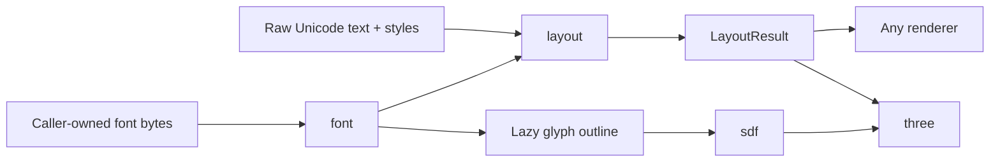

The system is a sequence of explicit handoffs rather than one all-or-nothing text object.



## Preparation can be reused

`prepareText()` understands the string, style ranges, paragraph direction, scripts, and layout
policy without opening a font. Its serializable result can be reused later. Fonts become necessary
when `layoutPreparedText()` selects fallback coverage, shapes glyphs, and produces positions.

```ts
const prepared = prepareText({ text, style, layout })
const result = layoutPreparedText(prepared, fonts)
```

For the common one-step path, `layoutText(input, fonts)` performs both operations.

## Rendering remains optional

`LayoutResult` contains glyph positions, line geometry, carets, selection data, bounds, and font
keys. It contains no Three.js object, DOM node, canvas, texture, or GPU resource. A 2D renderer, a
different 3D engine, a PDF exporter, or the supplied Three.js adapter can consume the same handoff.

The detailed contributor rationale remains in the repository's
[`ARCHITECTURE.md`](/repository/ARCHITECTURE.md), while planned and deferred work remains in
[`ROADMAP.md`](/repository/ROADMAP.md).
