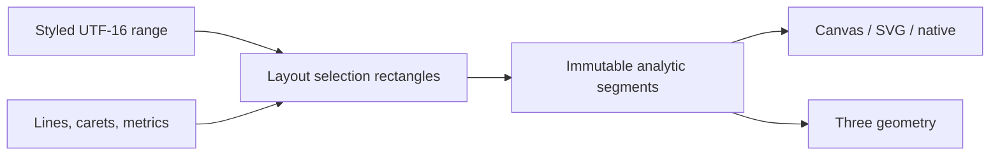
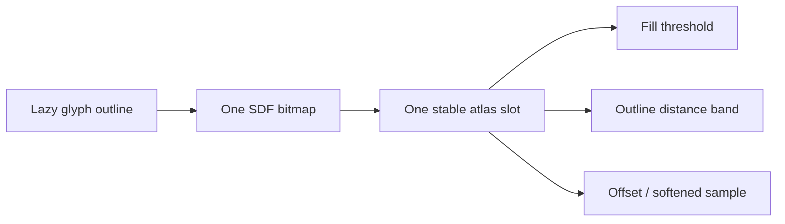

# Browser-text decoration boundary validation

## Decision

**Go with two independent production changes.** `@webgpu-text/layout` should
resolve styled UTF-16 decoration ranges into immutable analytic line segments.
`@webgpu-text/three` should add outline and one drop shadow by decoding the
existing glyph SDF again, without changing outline lookup, SDF generation, or
atlas identity.

The experiment validates the boundary and a narrow contract; it does not ship
either feature from a public package.

## What was proven

The private experiment used only public production-package APIs. It derived
line fragments through `getSelectionRects()`, tessellated them without Three,
generated real glyph SDFs through `@webgpu-text/sdf`, and rendered the accepted
paint model through Three.js 0.185.1 on actual WebGPU.

The deterministic corpus covers solid, dotted, and wavy underline plus solid
strikethrough; explicit RGBA and current-foreground colors; partial, adjacent,
wrapped, empty-line, trailing-space, mixed-size, mixed-font, Latin, Arabic,
mixed-bidi, combining-mark, and COLR v0 inputs. Decoration derivation did not
reshape text or change glyph, line, caret, or selection identity.

One actual browser run used Headless Chrome 149 on Apple Metal 3. It rendered:

- solid, dotted, and wavy underlines plus strikethrough;
- independent glyph and decoration colors, including current foreground;
- one shared 64 × 64 SDF texture borrowed by unlit and planar-lit materials;
- fill, outline, and one shadow from that unchanged texture;
- a public COLR v0 emoji beside renderer-neutral decorations; and
- an appearance update that kept the same texture UUID.

The first frame contained 105,360 fully transparent and 2,847
semi-transparent pixels plus distinct cyan, blue, orange, and purple regions.
Changing paint values changed those color populations while retaining the same
SDF texture. An excessive 8 px outline was rejected before uniform mutation,
the last accepted snapshot remained intact, and repeated disposal succeeded.

## Selected renderer-neutral contract

Names are illustrative and intentionally private to the experiment:

```ts
type DecorationKind = 'underline' | 'strikethrough'
type DecorationStyle = 'solid' | 'dotted' | 'wavy'
type DecorationColor = Rgba | 'foreground'

interface DecorationSpan {
  readonly start: number
  readonly end: number
  readonly kind: DecorationKind
  readonly style: DecorationStyle
  readonly color: DecorationColor
  readonly thickness?: number | 'auto'
  readonly offset?: number | 'auto'
  readonly skipInk?: 'none' | 'auto'
}

interface DecorationSegment {
  readonly sourceStart: number
  readonly sourceEnd: number
  readonly lineIndex: number
  readonly kind: DecorationKind
  readonly style: DecorationStyle
  readonly color: DecorationColor
  readonly xStart: number
  readonly xEnd: number
  readonly y: number
  readonly thickness: number
  readonly amplitude: number
  readonly wavelength: number
  readonly phase: number
  readonly skipInk: 'none' | 'auto'
}
```

The logical input stays independent from shaping style. Layout resolves every
range into visual fragments after wrapping and bidi placement, then emits
backend-neutral geometric values. A Canvas, SVG, native, or Three consumer can
draw those segments without re-running shaping, font selection, bidi, or line
layout.



### Metrics and pattern phase

Automatic placement should use a compact renderer-neutral set of font
decoration metrics: underline position and thickness, strikethrough position
and thickness. Layout may retain or resolve those values for the effective
line/font context; callers can always supply numeric thickness and offset
overrides. The experiment's height-based fallback is evidence scaffolding, not
a proposed browser metric oracle.

Pattern phase starts at zero for each visual line fragment. Ink cutouts keep
the original phase by advancing it by the removed horizontal distance. This
prevents dotted and wavy patterns from visibly restarting after a descender.
Clipping shortens visible geometry without redefining logical ranges.

### Skip ink

The first production contract should default to no skip-ink and offer
bounds-only automatic cutting as an explicit option. Bounds-only cuts are
cheap, lazy, and backend-neutral. Outline-aware cutting would require eager
outline work on a feature that is otherwise purely layout-driven, so it is
deferred until a fidelity fixture demonstrates that the extra work is needed.

## Selected shared-SDF paint contract

Ordinary glyph fill, outline, and one shadow should reuse one SDF and stable
atlas slot. Font object, glyph ID, canonical variations, and SDF size define
resource identity. Fill, outline, and shadow colors, outline width, shadow
offset, and shadow softness are appearance-only values.

The renderer must validate requested extent before committing an update:

```text
required padding = max(outline width,
                       abs(shadow offset x) + softness,
                       abs(shadow offset y) + softness)
                   + 1 antialias pixel
```

| SDF size | Existing padding | 6 px required extent | Decision |
| ---: | ---: | ---: | --- |
| 16 | 2 px | 6 px | reject |
| 32 | 4 px | 6 px | reject |
| 64 | 8 px | 6 px | accept |
| 128 | 16 px | 6 px | accept |

The same result held for real Noto Latin `g`, Noto Arabic `م`, and a ten-layer
COLR v0 emoji glyph at 32, 64, and 128 SDF sizes. Larger paint is not silently
clamped: synchronization reports required and available padding, preserves the
last committed state, and lets the caller choose larger `TextResources`.
Renderer bounds expand by outline width and directional shadow extent; the
existing local clip rectangle applies to the composed result.



## COLR v0 semantics

Renderer-neutral underline and strikethrough span both monochrome and color
glyphs without special handling. Outline and shadow for a composed COLR v0
glyph are different: applying paint independently to every layer can expose
internal seams, while a browser-like composed silhouette requires a separate
composition model. The first Three paint change should therefore support
ordinary SDF glyphs and explicitly defer COLR composed-silhouette outline and
shadow until a dedicated semantic fixture chooses the behavior.

## Ownership

| Concern | Owner | Reason |
| --- | --- | --- |
| logical decoration spans | application / layout input | follows source ranges and styling |
| visual line fragmentation | `@webgpu-text/layout` | depends on wrapping, bidi, carets, and line metrics |
| analytic decoration segments | `@webgpu-text/layout` | reusable by every renderer |
| segment tessellation | renderer | backend-specific triangles, paths, or draw calls |
| glyph outline and shadow | `@webgpu-text/three` | SDF decoding, atlas padding, clipping, and GPU bounds |
| outline/SDF resource identity | existing font/SDF/resource path | unchanged by appearance |

## Rejected alternatives

- Deriving decoration ranges inside Three would duplicate layout and make the
  feature unusable by other renderers.
- Putting decoration color into shaping styles would cause visual-only edits to
  invalidate reusable text preparation.
- Baking dotted or wavy patterns into the glyph atlas would couple a line-level
  feature to per-glyph pixels.
- Duplicating an SDF for each paint color would waste outline, CPU, atlas, and
  upload work without changing distance data.
- Making outlines eager for default skip-ink would penalize measurement and
  non-rendering consumers.
- Silently clamping paint that exceeds SDF padding would create size-dependent
  visual changes that are difficult to diagnose.

## Independent production follow-ups

### `implement-renderer-neutral-text-decorations`

Add independent styled ranges and immutable analytic segments to
`@webgpu-text/layout`. Acceptance requires solid, dotted, and wavy underline;
solid strikethrough; explicit color distinct from glyph fill; current
foreground; automatic compact metrics plus numeric overrides; stable phase;
optional bounds-only skip ink; UTF-16, wrapping, bidi, mixed-font, mixed-size,
and COLR coverage; and one non-Three consumer. Glyph, line, caret, selection,
and preparation identities must stay stable for appearance-only changes.

### `implement-three-sdf-outline-and-shadow`

Add ordinary-glyph outline and one drop shadow to `@webgpu-text/three` by
reusing the existing SDF and atlas slot in both unlit and planar-lit materials.
Acceptance requires independent RGBA controls, validated padding limits,
expanded bounds, existing clipping, no appearance-driven outline/SDF/atlas
duplication, shared-borrower stability, atomic rejection and recovery, repeated
disposal, packed-package checks, and actual-WebGPU evidence. COLR composed
silhouette paint remains explicitly unsupported in this increment.

Neither production change depends on the other.

## Reproduction and evidence

```sh
pnpm --filter @webgpu-text/browser-text-decoration-boundary-experiment observations:record
pnpm --filter @webgpu-text/browser-text-decoration-boundary-experiment test
pnpm --filter @webgpu-text/browser-text-decoration-boundary-experiment test:browser
pnpm --filter @webgpu-text/browser-text-decoration-boundary-experiment typecheck
```

Machine-readable evidence is in
`experiments/browser-text-decoration-boundary/artifacts/`: runtime inventory,
deterministic corpus observations, SDF paint plans, real-font measurements, the
candidate decision, and actual-WebGPU observations.
