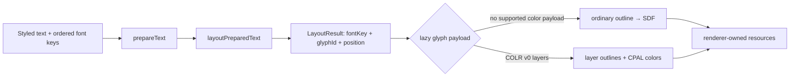

# Color-glyph boundary validation

## Decision

**Go with COLR v0 + CPAL as the first production color-glyph format.** Keep
`PreparedText` and `LayoutResult` unchanged. Resolve color layers lazily from
the final caller-owned font object, glyph ID, canonical variations, palette,
and foreground color. The font package should expose one bounded color-layer
capability; each renderer should own composition, atlas/SDF resources, and GPU
lifetime.

This report authorizes a later production proposal. It does **not** mark color
glyphs shipped, and the experiment is not a production dependency.

## What was proven

One pinned Noto Emoji SVG corpus was reproducibly compiled into four small
fonts so format comparisons do not accidentally compare different artwork or
Unicode coverage:

| Format | Fixture size | Relevant data | Result |
| --- | ---: | --- | --- |
| COLR v0 + CPAL | 17,200 bytes | ordered outline layers, 1 palette / 71 entries | **Selected; 46/50** |
| COLR v1 + CPAL | 17,776 bytes | paint graph, 1 palette / 68 entries | Rejected for the first increment; 42/50 |
| sbix | 32,712 bytes | one 109-ppem PNG strike | Rejected; 30/50 |
| SVG table | 61,196 bytes | five document ranges covering the corpus | Rejected; 30/50 |

All fixtures contain and shape the accepted single glyph, skin-tone modifier,
regional-indicator flag, and ZWJ sequences. Regenerating the corpus twice
produced identical SHA-256 hashes. Source artwork and the committed source
license are pinned to `googlefonts/noto-emoji` revision
`b960563a023fbd1337227bf2a8a2d5a91889a333`; generation is pinned to
`nanoemoji 0.15.0`. Both are attributed under Apache-2.0.

The production font runtime remains `harfbuzzjs@1.4.0`, embedding HarfBuzz
14.2.1. Its 390,365-byte WASM exports raw table access and outline drawing, but
not color layer, palette, paint, PNG, or SVG operations. A reproducible build
that re-enables all four upstream color families and exports eleven color
operations initialized successfully as Node and browser ESM, correctly
reported the fixture's layer and palette presence, and grew WASM by 31,884
bytes. That bridge is technically viable, but unnecessarily broad for COLR v0.
The selected path is therefore a bounded COLR v0/CPAL table reader over the
same caller-owned bytes; no second general-purpose parser is justified.

The existing public preparation and layout APIs correctly preserved UTF-16
ranges, explicit font choice, glyph IDs, positions, variations, line geometry,
carets, and selections without paint data. A private resolver expanded only
the selected COLR v0 glyphs after layout, then rendered their ordinary layer
outlines through the production SDF and Three WebGPU path. One actual WebGPU
frame contained normal Latin SDF glyphs and two repeated multicolor emoji:

- 4 positioned input glyphs became 22 render-layer instances;
- 14,409 chromatic pixels were observed;
- 113,688 pixels remained fully transparent;
- alpha stayed in the valid range;
- a shared second text caused no new outline calls; and
- malformed resolution left the prior accepted `Text` state intact.

The browser reference used the exact same downloadable COLR v0 font and
observed 18,742 chromatic pixels. It is an informational rendering comparison,
not an oracle for project shaping or layout.

## Why the other formats are not first

COLR v1 offers the strongest scalable visual vocabulary, including gradients,
transforms, compositing, and variation-aware paint. That capability is exactly
why partial support would be misleading: a correct first implementation needs
a maintained paint walker and renderer composition model, not a few accepted
node types quietly presented as general support. It remains a later format.

sbix is accessible and useful near a supplied strike size, but the validated
font has only one 109-ppem strike. It would introduce image decoding, strike
selection, scaling policy, and a size-dependent RGBA cache while providing
lower quality outside the source resolution.

SVG has excellent representational reach, but safely accepting untrusted SVG
requires sanitization and a rasterizer with defined handling for external
references, animation, scripts, filters, and resource lifetime. Routing it
through browser canvas would also make the supposedly renderer-neutral font
layer depend on the DOM. That is too much surface for the first increment.

No external decoder was evaluated because both bounded raw-table access and a
reproducible HarfBuzz bridge work. Adding OpenType.js, Fontkit, or an SVG/image
stack would duplicate the font representation or resource lifecycle without
solving a demonstrated blocker.

## Presentation and fallback

Font selection, shaping, and paint resolution remain separate:



The current fallback algorithm is deterministic and honors explicit caller
font order. A monochrome symbol font placed before the emoji font captures
U+2764; putting the color font first selects the color glyph. Variation
selectors are default-ignorable for coverage selection and do not silently
reorder caller fonts. Therefore explicit order is sufficient for the first
production increment, but it is not automatic browser-style emoji preference.
If a future convenience API promises browser-like `text`/`emoji` presentation,
it should add an explicit preparation preference instead of mutating caller
order implicitly.

Ordinary outline glyphs continue through the existing SDF path. Unsupported
color payloads also fall back to their ordinary outline when present. Missing
coverage remains the existing structured layout error.

## Production contract sketch

Names are illustrative and intentionally absent from current declarations:

```ts
interface ColorLayer {
  readonly glyphId: number
  readonly paletteIndex: number // 0xffff means current foreground
}

interface ColorLayerGlyph {
  readonly layers: readonly ColorLayer[]
  readonly palette: readonly {
    readonly red: number
    readonly green: number
    readonly blue: number
    readonly alpha: number
  }[]
}

interface ColorCapableFontHandle extends FontHandle {
  getColorLayers(glyphId: number, palette?: number): ColorLayerGlyph | null
}
```

The operation should be lazy and cache by font object, glyph ID, canonical
variations, and palette. A renderer additionally keys any pixel-affecting
resource by foreground color and its own SDF/raster settings. COLR v0 is
scalable, so layout font size changes geometry scale and need not duplicate the
underlying layer SDF. The foreground sentinel must use the style's effective
foreground rather than CPAL bytes.

`@text-rendering-toolkit/font` owns validation and COLR/CPAL interpretation. It must not
expose arbitrary tables or HarfBuzz pointers. `@text-rendering-toolkit/layout` owns no
color data and stays unchanged. `@text-rendering-toolkit/sdf` stays unchanged and receives
ordinary layer outlines. `@text-rendering-toolkit/three-webgpu` owns layer expansion/composition,
shared resource reuse, material color, failure atomicity, and GPU disposal.

## Deliberately unsupported

- COLR v1 paint graphs, gradients, transforms, clips, and compositing
- CBDT/CBLC and sbix bitmap decoding or strike selection
- SVG documents and browser-canvas rasterization
- system-font discovery or font fetching
- implicit browser-style emoji font reordering
- palette animation or cross-format universal payload unions
- color-glyph batching, eviction, stroke, shadow, or decoration behavior

## Production follow-up

Create one change to implement COLR v0 + CPAL end to end:

1. add a narrow lazy color-layer operation to the public font handle while
   retaining the same caller-owned bytes and HarfBuzz lifetime;
2. keep `PreparedText`, `LayoutResult`, and SDF declarations unchanged;
3. add renderer-owned layer composition and shared-resource identities to the
   Three package;
4. support CPAL palette 0 and the current-foreground sentinel first, with
   explicit errors for malformed tables;
5. prove ordinary fallback, styled foreground, repeated/shared reuse, atomic
   updates, disposal, packed-package boundaries, and actual WebGPU output; and
6. document that callers place their desired color font first until a separate
   presentation-policy change is justified.

Production acceptance requires the full accepted corpus, a mixed styled line,
two sizes, two foreground values when the sentinel is present, unchanged
measurement/caret/selection output, no experiment imports, and no regression in
the monochrome atlas path.

## Reproduction

```sh
pnpm --filter @text-rendering-toolkit/color-glyph-boundary-experiment fixtures:acquire
pnpm --filter @text-rendering-toolkit/color-glyph-boundary-experiment bridge:build
pnpm --filter @text-rendering-toolkit/color-glyph-boundary-experiment observations:record
pnpm --filter @text-rendering-toolkit/color-glyph-boundary-experiment test
pnpm --filter @text-rendering-toolkit/color-glyph-boundary-experiment test:browser
pnpm --filter @text-rendering-toolkit/color-glyph-boundary-experiment typecheck
```

The bridge build needs Git, Emscripten, and network access. Fixture generation
needs `uvx` and network access. The ordinary unit and browser suites consume
committed fixtures; the browser bridge test additionally consumes the locally
rebuilt ignored bridge output.

Machine-readable evidence is in
`experiments/color-glyph-boundary/artifacts/`: runtime and export inventory,
format probes, presentation/layout cases, bridge build and browser loading,
candidate scores, browser reference, and actual-WebGPU results.
