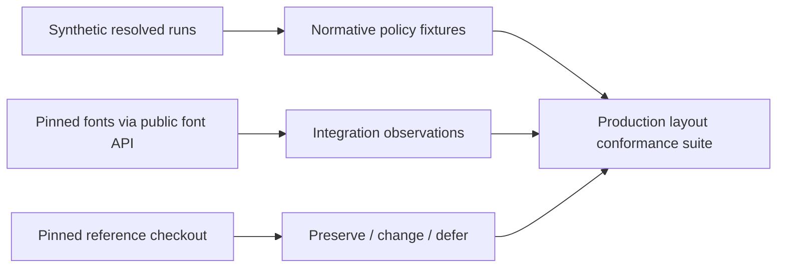

# Layout-policy validation

> Status: complete
> Reference date: 2026-07-21
> Scope: fixture evidence and implemented resolved-run layout core

## Verdict

The renderer-neutral resolved layout core is implemented. Nineteen synthetic
cases are exact production conformance tests, eleven pinned-font runs prove that
public HarfBuzz output translates through the resolved-run seam, and sixteen
normalized Troika observations record the legacy provenance. The production
surface remains pure: no automatic itemization/fallback, font fetching,
outline, SDF, atlas, worker, DOM, GPU, or Three.js code is included.

## Reference provenance

The local ignored Troika checkout is pinned at Git revision
`bca98dddeb3602b04d5452602e7da32df2fafe06`. It is an observation source, not a
workspace dependency. The relevant source files have these SHA-256 digests:

| Reference file | SHA-256 |
|---|---|
| `packages/troika-three-text/src/Typesetter.js` | `358e1f9eb372cda6aba6744972d466e8c6864fa6b2e66e72da7391cd44deff32` |
| `packages/troika-three-text/src/FontResolver.js` | `751d0f1045733fd306d89da0ce8fcc9539175df8b1ce0720592f09468d9fb3c1` |
| `packages/troika-three-text/src/selectionUtils.js` | `0cc2106dcfd7e0145771ee90d04d304a8fe2a0579610edceb578a7b42427bba2` |
| `packages/troika-three-text/src/TextBuilder.js` | `41d013f5e136fb695c701283d2b4aa91ae3d91dfa9aa56209b679338d47ddb13` |

Normal builds and tests consume only committed fixtures. Repeating the legacy
observation is optional and requires an explicitly supplied reference checkout.

## Boundary inventory

| Troika surface | Future owner | Treatment in validation |
|---|---|---|
| text, direction, language, font size, letter spacing, line height, width, wrapping, alignment, indentation, anchors | layout request/policy | Preserve as normalized fixture inputs |
| style, size, language, variation, and vertical-offset ranges | layout run boundaries | Replace start-keyed mutable maps with half-open UTF-16 spans and stable style keys |
| font URLs, weights/styles used for selection, Unicode fallback service, loaded font cache | application acquisition plus future provider/itemizer policy | Represent only resolved font keys/runs. Applications own byte acquisition; core libraries do not fetch. Defer provider/itemizer policy and any optional helper. |
| `forEachGlyph` glyph IDs, positions, advances, clusters, metrics | `@webgpu-text/font` plus resolved-run seam | Replace shaping with explicit public HarfBuzz runs; synthetic fixtures inject controlled equivalents |
| line construction, hard/soft breaks, baseline selection, visual bidi placement | layout policy | Preserve or deliberately revise per classified fixture |
| caret positions and selection rectangles | layout result plus pure helpers | Preserve intent with valid UTF-16 boundaries and derive selections from caret/line data |
| glyph paths and path bounds | lazy font outline access | Exclude paths; retain only positioned visible bounds and stable font/glyph identity |
| glyph colors | renderer/style consumer | Carry a style key, not renderer color bytes |
| SDF size, atlas index, texture, canvas, SDF view box, GPU updates | SDF/renderer | Exclude completely |
| chunked bounds | renderer culling optimization | Exclude; overall layout bounds cannot depend on grouping |
| workers, callbacks, timings, global configuration, URL normalization | adapters/diagnostics | Exclude from the contract and fixture oracle |

## Fixture matrix

Stable IDs never encode a font version or expected value. The committed corpus
uses the following cases:

| ID | Primary evidence |
|---|---|
| `line-empty-input` | deterministic zero-content line, caret, and bounds policy |
| `line-empty-and-breaks` | empty input, CR/LF normalization, consecutive/trailing empty lines |
| `line-trailing-whitespace` | content width versus trailing whitespace |
| `wrap-normal-soft` | normal soft wrapping at whitespace |
| `wrap-nowrap-overflow` | no-wrap overflow and unbreakable content |
| `wrap-break-word-indent` | hard overflow break plus indentation |
| `metrics-spacing-baseline` | letter spacing, explicit/normal line height, mixed metrics/sizes |
| `align-left` | left alignment baseline |
| `align-center` | centered line translation |
| `align-right` | right-aligned line translation |
| `align-justify` | distributable versus trailing whitespace |
| `anchor-numeric-keyword-percent` | horizontal and vertical anchor translation |
| `bidi-ltr-rtl-multiline` | logical ranges with mixed visual order across lines |
| `runs-style-size-language` | style/language/size/variation boundaries |
| `runs-fallback-grapheme` | grapheme-safe fallback font keys and mixed metrics |
| `bounds-overhang-empty-grouping` | block/visible distinction, overhang, empty policy, grouping independence |
| `carets-complex-clusters` | ordinary, ligature, combining, reordered, and supplementary boundaries |
| `selection-forward-reversed-empty` | normalized and empty selections |
| `selection-multiline-bidi` | multiline and mixed-direction rectangles |
| `font-integration-runs` | pinned real-font translations for every accepted shaping category |

The detailed accepted values live in `test-fixtures/layout/`. Every committed
case appears in the classification table below.

## Fixture format and production contract

`policy-fixtures.json` uses schema version 1. Each case contains a stable ID,
intent and tags; normalized policy input; explicit resolved shaped runs;
expected positioned glyphs, lines, bounds and caret stops; optional selection
queries; evidence provenance; and a classification with rationale. Source
ranges, clusters, style spans, carets, and selections are half-open UTF-16
ranges. Numeric serialization rejects non-finite values, converts negative zero
to zero, and rounds only at the JSON boundary to six decimal places.

The production TypeScript contract lives in `packages/layout/src/types.ts`. Its
input seam receives text policy plus already-resolved runs containing stable
font keys, effective layout-unit metrics, resolved bidi levels,
direction/script/language, variations, glyph IDs, UTF-16 clusters, advances,
offsets, flags, and synthetic or observed glyph bounds. Its
renderer-neutral result contains positioned glyph references, logical line
ranges and visual glyph ranges, block/visible bounds, and caret stops. Pure
selection geometry is derived from line and caret data on demand.

The contract explicitly excludes font handles, URLs, outlines, SVG paths, SDF
pixels, atlas data, renderer chunks, GPU resources, Three.js objects, worker
state, and timings. `layoutResolvedText()` performs no hidden font-unit scaling:
the caller scales shaped measurements and metrics exactly once before layout.
The package accepts no URL and performs no font-byte acquisition.

## Evidence model



- **Normative policy:** `policy-fixtures.json` uses controlled synthetic runs,
  so wrapping and placement changes are not disguised by font revisions.
- **Public font integration:** `font-integration.json` records explicit run
  plans shaped through `@webgpu-text/font`, including Latin, Arabic,
  Devanagari, Khmer, combining marks, supplementary text, fallback, variable
  axes, and mixed direction.
- **Legacy provenance:** `troika-observations.json` records only normalized
  renderer-neutral observations from the pinned ignored checkout.
- **Decision ledger:** `classification.json` is checked for exact one-to-one
  coverage with all stable cases.

## Classification

| Fixture | Decision | Reference source area | Rationale |
|---|---|---|---|
| `line-empty-input` | preserve | Typesetter line initialization | Keep one deterministic editable line for empty text. |
| `line-empty-and-breaks` | intentional-change | Typesetter newline normalization | Treat CR and CRLF as one hard break while retaining original UTF-16 indices. |
| `line-trailing-whitespace` | preserve | Typesetter line measurement | Keep trailing whitespace editable without inflating aligned content width. |
| `wrap-normal-soft` | preserve | Typesetter wrapping | Preserve ordinary whitespace soft wrapping. |
| `wrap-nowrap-overflow` | preserve | Typesetter wrapping | Preserve explicit no-wrap and unbreakable overflow policy. |
| `wrap-break-word-indent` | preserve | Typesetter wrapping and indentation | Preserve independent break-word and first-line indent behavior. |
| `metrics-spacing-baseline` | preserve | Typesetter font metrics | Preserve stable geometry from mixed metrics, sizes, spacing, and line height. |
| `align-left` | preserve | Typesetter alignment | Keep the baseline left-placement policy. |
| `align-center` | preserve | Typesetter alignment | Keep renderer-neutral centered placement. |
| `align-right` | preserve | Typesetter alignment | Keep renderer-neutral right placement. |
| `align-justify` | preserve | Typesetter alignment | Keep justification while excluding trailing whitespace from distribution. |
| `anchor-numeric-keyword-percent` | preserve | Typesetter anchors | Translate render, measurement, caret, and selection geometry together. |
| `bidi-ltr-rtl-multiline` | preserve | Typesetter bidi placement | Preserve per-line visual order with logical UTF-16 source identity. |
| `runs-style-size-language` | intentional-change | TextBuilder style ranges and Typesetter run splitting | Replace mutable start maps with validated half-open spans and stable style keys. |
| `runs-fallback-grapheme` | intentional-change | FontResolver fallback | Resolve fallback on grapheme-safe spans, not independent code points. |
| `bounds-overhang-empty-grouping` | intentional-change | Typesetter bounds | Keep block and visible bounds but remove renderer chunk grouping. |
| `carets-complex-clusters` | intentional-change | Typesetter caret interpolation | Retain useful ligature stops without splitting surrogate pairs or combining graphemes. |
| `selection-forward-reversed-empty` | preserve | selectionUtils range normalization | Preserve pure normalized forward, reversed, and empty selection geometry. |
| `selection-multiline-bidi` | preserve | selectionUtils rectangle merging | Preserve deterministic line- and direction-aware rectangles. |
| `font-integration-runs` | intentional-change | FontParser shaping seam | Make HarfBuzz public shaped runs authoritative while retaining UTF-16 mapping. |

No stable case is classified `defer`: deferrals are capabilities outside the
fixture seam, rather than ambiguous snapshots. Automatic paragraph itemization,
Common/Inherited script resolution, production grapheme fallback, Unicode line
breaking, provider and automatic fallback policy, workers, reshaping at line
boundaries, bidi caret affinity, and per-character vertical alignment remain
deferred. Font fetching is not deferred core behavior: byte acquisition is an
application concern.

## Reference capture and reproduction

The committed corpus is authoritative and does not require `old/`. To audit the
legacy provenance, supply a checkout at the recorded revision, confirm the four
hashes above, and compare only normalized inputs, lines, placement, bounds,
carets, and selections. Do not copy glyph paths, SDF/atlas state, renderer
chunks, workers, timings, or callback state into fixtures.

From the repository root:

```sh
node test-fixtures/layout/generate-policy-fixtures.mjs
pnpm --filter @webgpu-text/font build
node test-fixtures/layout/generate-font-integration.mjs
pnpm --filter @webgpu-text/layout build
pnpm --filter @webgpu-text/layout test
```

Regenerating the synthetic corpus must be byte-for-byte deterministic. Updating
the real-font observations is deliberate: the pinned font manifest and public
font results must be reviewed together.

## Handoff

`implement-text-layout-core` confirmed the resolved boundary and implemented
validation, line construction, visual placement, bounds, carets, and selection
helpers. Its conformance suite consumes `policy-fixtures.json` as the normative
policy oracle and treats `font-integration.json` as cross-package evidence, not
as a policy snapshot. Any future fixture change still requires an explicit
classification/rationale update; renderer-oriented fields remain forbidden.

The next layout change should be selected independently. Candidate scopes are
automatic Unicode bidi/script itemization and fallback over caller-supplied font
handles, or a more complete line-breaking/reshaping policy. Neither scope may
claim font fetching, workers, complete line breaking, reshaping, or bidi caret
affinity merely because the resolved core exercises their downstream seams.
