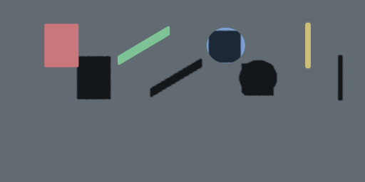

# Lit text and shadow seam validation

Status: **passing on the recorded Three.js and Chromium revisions**

Validated: 2026-07-21

Change: `prove-lit-text-shadow-seam`

## Result

A planar instanced SDF fixture responds to scene lighting, casts glyph-shaped
shadows onto a parallel receiver, and receives an external occluder shadow on
visible glyph coverage through Three.js 0.185.1 `WebGPURenderer`. The proof uses
only public `MeshStandardNodeMaterial`, `positionNode`, `colorNode`,
`opacityNode`, `maskShadowNode`, ordinary geometry normals, and object/light
shadow properties.



The final frame SHA-256 is
`bfd15d4050dda73bbbc542ed80dde05ba88ef7dc7a79bae426168823e708e6d2`.
Machine-readable environment, fixture integrity, material controls, semantic
measurements, and the same frame hash are recorded in
[`lit-text-shadow-seam.json`](../../experiments/webgpu-rendering-seam/artifacts/lit-text-shadow-seam.json).

## Proven material seam

- The visible pass reuses the existing instanced `positionNode`, RGBA atlas
  channel selection, derivative-antialiased `opacityNode`, and per-instance
  color. The standard material uses `metalness: 0` and `roughness: 0.9`.
- Four ordinary `(0, 0, 1)` vertex normals are sufficient for the validated
  front-facing planar geometry and object transforms.
- The shadow pass reuses `positionNode` automatically. It needs a binary
  `maskShadowNode` from the same atlas sample and clip coverage at the encoded
  SDF midpoint so transparent quad margins do not cast.
- A single-sided plane also needs `shadowSide` set to its visible side. Three's
  default opposite shadow side culls this zero-thickness front-facing geometry.
- `castShadowNode`, transmitted-shadow mode, duplicate shadow geometry, custom
  shader strings, private renderer imports, and WebGL APIs are unnecessary.
- Received shadows compose with visible SDF opacity: the occluded circle region
  darkened while an unshadowed glyph and transparent exterior remained stable.

## Semantic observations

All values below are luminance differences between controlled captures from the
same scene; larger positive values mean the shadow-enabled or illuminated state
was measurably different in the intended direction.

| Observation | Recorded value |
|---|---:|
| Directional-light gain inside the rectangle glyph | 104.407 |
| Rectangle projected-shadow darkening | 82.3702 |
| Circle projected-shadow darkening | 35.008712 |
| Circle transparent-corner darkening | 0 |
| Received-shadow darkening inside the circle | 117.2802 |
| Unshadowed rectangle change during receive-only capture | 0 |

The browser assertions additionally cover per-instance color separation,
bounded antialiased edge values, restoration of the no-shadow state, multiple
projected instances, repeatable create/render/transition/dispose lifecycles, and
missing-WebGPU rejection.

## Reproduction

```sh
pnpm install --frozen-lockfile
pnpm build
pnpm --dir experiments/webgpu-rendering-seam browser:install
pnpm --dir experiments/webgpu-rendering-seam exec vitest run --project unit
pnpm --dir experiments/webgpu-rendering-seam exec vitest run --project browser test/lit-shadow.browser.test.ts
```

The browser run requires `navigator.gpu`, a usable adapter, and the existing
Three backend diagnostic. Missing WebGPU and WebGL fallback are failures, not
passing evidence.

## Recorded environment

| Component | Value |
|---|---|
| Three.js | `0.185.1` |
| Browser | Chrome for Testing 149 user agent |
| Adapter | vendor `apple`, architecture `metal-3` |
| Canvas | 512 × 256, DPR 1 |
| Fixture | four project-created analytic RGBA SDF shapes |
| Atlas SHA-256 | `75958a3cea4f6dc6df4d15ebfcb822c5b2b113523ad65469dd9704aa4430c15a` |

## Limits and production handoff

This proves the material and shadow seam, not a shipped renderer feature. The
fixture is synthetic, planar, front-facing, single-sided, and fixed to one
standard lighting model. It does not validate real-font production integration,
curved or extruded normals, back-face lighting, physical-material extensions,
normal maps, environment maps, colored/transmitted shadows, strokes, outlines,
or a public material-selection API.

The evidence justifies a bounded follow-up for one dedicated planar standard
material variant in `@webgpu-text/three`. That proposal must choose the public
API and production lifecycle integration; this spike deliberately does not.
