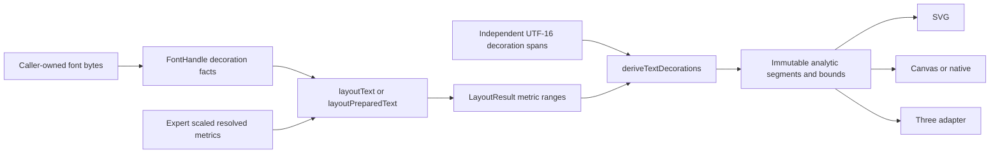

# Renderer-neutral text decorations

## Decision

Production text decoration belongs to `@webgpu-text/layout` as a pure post-layout operation. `@webgpu-text/font` exposes only four bounded default-instance facts, layout scales and retains the smallest source-range context, and `deriveTextDecorations()` returns immutable analytic segments. Renderers own only the final drawing approximation.

This promotes the accepted renderer-neutral half of the archived `validate-browser-text-decoration-boundary` experiment. Three SDF outline and shadow remain a separate change.

## Public flow

Decoration appearance is deliberately absent from `TextStyle` and `PreparedText`. Changing pattern, paint, numeric thickness/offset, clipping, or skip ink reuses preparation, shaping, line layout, carets, and selection geometry.

## Accepted contract

- Underline supports solid, dotted, and wavy analytic segments; strikethrough supports solid segments.
- Paint is an RGBA byte object or unresolved `"foreground"` and is independent from glyph fill.
- Automatic placement comes from scaled `post` underline and OS/2 strikeout facts. Missing tables or non-positive thicknesses use documented deterministic fallbacks; truncated present tables reject font loading.
- Expert resolved callers supply the same four positive/finite scaled values. `LayoutResult` retains only half-open metric ranges and one default value, never fonts or outlines.
- Each line, bidi interval, or adjacent span starts at phase zero. Automatic metrics resolve once from the first effective range of a decoration span, so fallback fonts cannot shift a continuous decoration. Horizontal clipping and skip-ink cuts advance phase by the removed distance.
- `skipInk: "auto"` subtracts positioned glyph bounds with thickness-derived clearance. Missing bounds do nothing; the helper never requests outlines. Renderers that already own ink data may refine that policy; the SVG inspector masks decoration segments against its lazily loaded outlines and COLR layers.
- Dotted `thickness` is the dot diameter and `wavelength` is dot-center spacing. Wavy segments expose amplitude, wavelength, thickness, and phase.

## Conformance evidence

| Boundary | Evidence |
| --- | --- |
| Font metrics | TTF, CFF/OpenType, variable, COLR v0, missing/non-positive, truncated, stable-facts, disposal, and packed-consumer tests in `packages/font/test` |
| Layout handoff | Resolved, prepared, serialized fixture, real-font, mixed-metric, caret, selection, and packed-consumer tests in `packages/layout/test` |
| Fragmentation | Partial/adjacent spans, spaces, wrapping, hard breaks, empty lines, combining clusters, bidi, Arabic, fallback fonts, numeric overrides, and clipping |
| Pattern and paint | Solid/dotted/wavy underline, solid strikethrough, RGBA/current foreground, automatic metrics, phase, bounds, repeatability, and immutability |
| Skip ink | Continuous default, positioned-bounds cuts, missing-bounds fallback, phase retention without layout outline calls, and renderer-owned exact SVG outline masking |
| Renderer independence | A typed-array consumer in the layout tests and the documentation app's direct SVG consumer use only public analytic output |
| Color coexistence | The accepted COLR v0 integration derives decorations without changing font-layer, layout, or Three resource identity |
| Distribution | Packed clean-consumer TypeScript/runtime checks and the browser ESM bundle import public font/layout exports only |

## Explicit limits

- MVAR variation-specific decoration adjustments are not applied; numeric span overrides are the correction path.
- Layout skip ink is bounds-only; exact outline or SDF refinement belongs to renderers that already own that ink data.
- No CSS parser, tessellator, DOM requirement, SDF, atlas, GPU resource, or Three object is exported by the layout package.
- Dotted/wavy strikethrough, overline, spelling semantics, and COLR composed-silhouette outline/shadow are outside this increment.

## Verification

The implementation is gated by focused font/layout tests, deterministic fixture regeneration, clean packed consumers, the browser-neutral ESM bundle, workspace format/typecheck/test/build, documentation build, unchanged SDF/Three manifests, and strict OpenSpec validation.
