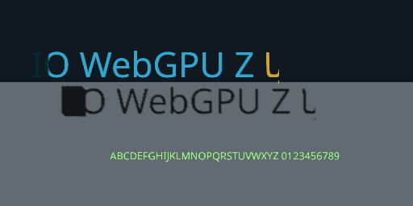

# Three WebGPU text core validation

Status: **passing on the recorded Three.js and Chromium revisions**

Validated: 2026-07-21

Change: `implement-three-webgpu-text-core`

Renderer-neutral handoff revalidated by:
`establish-renderer-neutral-text-handoff`

Planar lighting and shadows integrated by:
`integrate-planar-lit-text`

Shared renderer resources integrated by:
`establish-shared-text-renderer-resources`

## Result

The production `@webgpu-text/three` public API renders completed
renderer-neutral `LayoutResult` data for real-font Latin and Arabic text through
Three.js 0.185.1 on an actual Apple Metal-backed WebGPU adapter. Text shaping and
layout execute before the Three adapter receives the result. The fixture
exercised 14 initial and 15 updated glyph instances, multiple RGBA atlas cells,
lazy font outlines, CPU SDF generation, style colors, clipping, direct
layout-package selection data, and repeated disposal. Two independently
positioned text objects shared one explicit `TextResources`: the duplicate text
added no outline calls, a later borrower grew the atlas through slot 43, and the
already-rendered owner changed 0 semantic pixels without resynchronization. Its construction-fixed
planar standard material also responded to scene light, cast a glyph-shaped
shadow with a transparent `O` cutout, received an external shadow on visible
glyph coverage, preserved unaffected pixels after a synchronized update, and
used only public TSL/node-material hooks.



The final lit-and-shadowed frame SHA-256 is
`0c12f3e1289547647d634d15341d58e1cfda886498247e44ec47ff33491fefd1`.
Machine-readable environment and semantic counts are in
[`three-webgpu-text-core.json`](../../experiments/webgpu-rendering-seam/artifacts/three-webgpu-text-core.json).

## Reproduction

```sh
pnpm install --frozen-lockfile
pnpm build
pnpm --dir experiments/webgpu-rendering-seam browser:install
pnpm --dir experiments/webgpu-rendering-seam test:browser
```

The browser suite requires `navigator.gpu`, a usable adapter, and Three's pinned
WebGPU backend diagnostic. Missing WebGPU and WebGL fallback are failures, not
passing evidence.

## Recorded environment

| Component | Value |
|---|---|
| Three.js | `0.185.1` |
| Browser | Chrome for Testing `149.0.0.0` user agent |
| Adapter | vendor `apple`, architecture `metal-3` |
| Canvas | 512 × 256, DPR 1 |
| Initial semantic pixels | 10,102 occupied; 2,721 cyan; 743 yellow |
| Lighting gain | 87.53 luminance |
| Cast shadow / cutout | 17.40 / 0 luminance loss |
| Received / unshadowed glyph | 87.53 / 39.61 luminance loss |
| Instances | 14 initial; 15 after update |
| Shared cache reuse | 14 outline calls after first text; 14 after duplicate text |
| Borrower atlas growth | 36 instances; maximum slot 43; 44 total outline calls |
| Existing owner after growth | 0 changed semantic pixels without resynchronization |
| Fonts | Noto Sans variable TTF; Noto Sans Arabic variable TTF |

## Limits

This proves the layout-result renderer with private convenience resources or
an explicitly shared `TextResources`, its default unlit material, and its
opt-in front-facing planar standard material. The Three package
receives positioned glyphs and per-glyph font-unit scales, resolves outlines
lazily, and performs no shaping, line layout, caret, or selection policy. It
does not prove batching or draw-call reduction, color-glyph rendering, atlas
eviction, partial texture upload, workers, frame-rate improvement, curvature,
double-sided or curved lighting, configurable physical-material controls,
WebGPU compute SDF generation, or WebGL support.
