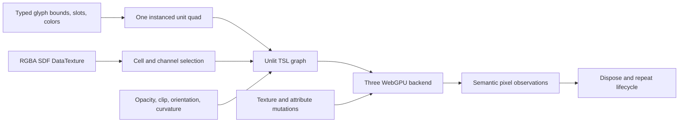

# WebGPU rendering seam validation

Status: **viable on the recorded Three.js and Chromium revisions**  
Validated: 2026-07-20  
Change: `prove-webgpu-rendering-seam`

## Decision

The renderer seam is viable enough to promote into a production `@text-rendering-toolkit/three-webgpu` design. Three.js 0.185.1 can render one instanced unit quad per glyph, address RGBA-packed SDF atlas slots, decode coverage through TSL, apply per-instance color and material opacity, clip, orient, curve, upload post-render texture and attribute mutations, and release owned resources on an actual WebGPU backend.

This is a renderer-boundary decision, not a finished renderer. The experiment intentionally does not load fonts, shape or lay out text, generate SDFs at runtime, allocate/grow an atlas, run workers, expose a public API, or support WebGL.

## Reproduction

From the repository root:

```sh
pnpm install --frozen-lockfile
pnpm --dir experiments/webgpu-rendering-seam browser:install
pnpm --dir experiments/webgpu-rendering-seam test:browser
```

For a visible browser run:

```sh
pnpm --dir experiments/webgpu-rendering-seam test:browser:headed
```

The full workspace validation is:

```sh
pnpm check
```

The browser command must fail when no usable WebGPU adapter exists. A WebGL fallback is explicitly rejected and is never passing evidence.

## Validated environment

The machine-readable record is [observation.json](../../experiments/webgpu-rendering-seam/artifacts/observation.json), and the captured canvas is [webgpu-rendering-seam.png](../../experiments/webgpu-rendering-seam/artifacts/webgpu-rendering-seam.png).

| Component | Recorded value |
|---|---|
| Three.js | `0.185.1` |
| Test runner/provider | Vitest `4.1.10`, Playwright provider `4.1.10` |
| Browser | Playwright Chrome for Testing `149.0.7827.55`; headless UA reports `149.0.0.0` |
| OS | macOS `15.5` (`24F74`), arm64 |
| WebGPU adapter information | vendor `apple`, architecture `metal-3`; public description/device fields empty |
| Canvas | 512 × 256 CSS/device pixels, DPR 1 |
| Launch | Chromium full channel, headless, `--enable-unsafe-webgpu` |
| Atlas integrity | SHA-256 `75958a3cea4f6dc6df4d15ebfcb822c5b2b113523ad65469dd9704aa4430c15a` |
| Reference frame integrity | SHA-256 `4b9d85091adc9b3ab3990a6d5a7bcc39cff0419b7f89172216110ddbb8585ef8` |

The default Playwright Chromium headless shell exposed `navigator.gpu` but returned no adapter on this machine. The full Chromium channel plus `--enable-unsafe-webgpu` produced a real Metal-backed WebGPU adapter. That launch distinction is part of the evidence, not an optional convenience.

## What was demonstrated



The automated observations verify:

- expected occupied regions and untouched background;
- separate rectangle, diagonal, circle, and narrow-stem shapes selected from RGBA channels;
- per-instance red, green, blue, and yellow color separation;
- a bounded derivative-antialiased edge transition rather than an exact cross-GPU screenshot;
- sub-one material opacity against a fixed background;
- rectangular clipping plus orientation and cylindrical-curvature changes;
- in-place atlas-channel mutation followed by `DataTexture.needsUpdate`;
- in-place instance bounds/color mutation followed by attribute `needsUpdate`;
- stability of untouched instances across updates;
- disposal followed by a completely fresh successful lifecycle; and
- rejection of missing WebGPU and any backend without `isWebGPUBackend === true`.

## Smallest production boundaries

The spike supports the following production split. These are internal boundaries first; they should become public only when a real lower-level consumer needs them.

| Boundary | Minimum responsibility |
|---|---|
| Renderer input | Renderer-neutral glyph bounds, flat atlas slot, normalized color, atlas bytes/dimensions/cell size, and material-wide appearance values. A flat slot maps to `cell = floor(slot / 4)` and `channel = slot % 4`. |
| Instanced geometry | Own one indexed unit quad plus typed `glyphBounds`, `glyphSlot`, and normalized `glyphColor` instance attributes. Update attributes in place and mark only changed buffers dirty. |
| TSL material | Own atlas coordinate/channel selection, SDF edge decoding, `fwidth` antialiasing, transparent coverage, unlit color, opacity, clip rectangle, orientation, and cylindrical placement. Do not rewrite shader strings. |
| Atlas update | The renderer owns RGBA packing and the `DataTexture`. `@text-rendering-toolkit/sdf` ends at one-channel `SdfBitmap`; texture mutation/replacement and `needsUpdate` stay renderer-private. |
| Backend validation | Browser validation requires `navigator.gpu`, a usable adapter, and the pinned backend diagnostic. Production rendering should not silently advertise WebGL as supported; the diagnostic remains isolated because its stability is not guaranteed. |
| Disposal | A production text object owns and disposes its geometry/material and releases atlas references. The renderer-level atlas owner disposes its texture/cache. The application—not each text object—owns the shared Three renderer and canvas. |

The experiment harness owns a renderer and DOM canvas only because it is a self-contained test. That ownership must not be copied into each production text object.

## Unstable and revision-specific surfaces

- `renderer.backend.isWebGPUBackend` is the least-private reliable identity signal found in Three.js 0.185.1. `renderer.backend` is exposed, but the boolean is an implementation diagnostic rather than a compatibility promise. Keep the assertion isolated and revalidate it on every Three upgrade.
- TSL function names and `MeshBasicNodeMaterial` slots (`positionNode`, `colorNode`, and `opacityNode`) are pinned-revision dependencies. They worked without shader rewriting, but an upgrade still requires the browser spike.
- The published Three TSL declarations form a very large fluent generic graph. TypeScript 7.0.2 consumed unbounded memory while expanding ordinary chained expressions. The experiment uses a narrow, explicitly typed facade over the runtime TSL operations; the production package should retain a similarly small adapter unless upstream declarations become tractable.
- `renderAsync()` emitted a deprecation warning on the pinned renderer; the harness now initializes once and uses `render()`.
- Available adapter metadata is intentionally sparse on this environment. Vendor and architecture are useful audit fields, but empty description/device strings are valid.

## Limitations and bounded follow-ups

- The committed atlas contains one 32 × 32 cell with four channels. The material implements general flat-slot-to-cell/channel addressing, but browser evidence currently exercises cell zero only. Add a small multi-cell fixture before atlas allocation/growth is promoted.
- The frame validates synthetic analytic SDFs, not real font outlines or the future CPU SDF encoder. End-to-end font/layout/SDF fixtures remain separate work.
- The experiment proves full-texture `needsUpdate`, not partial texture uploads, atlas growth, eviction, or cache policy.
- Resource lifecycle checks expose immediate reuse/disposal failures but are not a GPU memory benchmark.
- The screenshot is for human review. Automation gates on semantic regions so reasonable GPU rasterization differences do not become false failures.
- Lighting, shadows, outlines, strokes, blur, arbitrary classic materials, batching, raycasting, and WebGPU compute remain outside this decision.

## Failed assumptions

1. Default headless Chromium was not sufficient on the validation machine; it exposed the API but no adapter.
2. Three's complete fluent TSL TypeScript surface was not cheap enough to consume directly under TypeScript 7.0.2.
3. `renderAsync()` was not the forward-compatible render call on Three.js 0.185.1.

None of these failures invalidated the renderer seam. Each has a bounded response already present in the experiment: explicit launch configuration, a narrow TSL type facade, and init-once plus `render()`.

## Promotion guidance

Promote concepts, not the experiment package wholesale. The next renderer change should first extract a private multi-cell slot-addressing fixture and the three resource factories—geometry, material, and texture update—into `@text-rendering-toolkit/three-webgpu`. It should keep atlas allocation and high-level `Text` synchronization out until real `LayoutResult` and `SdfBitmap` contracts exist. The private experiment remains the pinned upgrade gate for Three.js and Chromium behavior.
