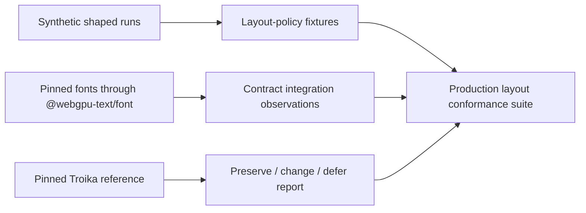

## Context

`@webgpu-text/font` now provides owned font handles, explicit-run HarfBuzz shaping, UTF-16 cluster ranges, normalized variations, and lazy outlines. The next production layer must turn resolved shaped runs into positioned glyphs, lines, bounds, and interaction geometry, but Troika's reference implementation does not expose that policy as an independent unit. Its `Typesetter.typeset()` entry point is a 538-line callback-driven function with high control-flow complexity that performs font resolution, shaping, wrapping, bidi reordering, alignment, styling, caret construction, bounds calculation, and renderer-oriented glyph-path assembly together.

The reference output also cannot be copied wholesale. HarfBuzz is now authoritative for glyph substitution and positioning, while Troika's partial shaper produces intentionally different glyph IDs, advances, offsets, and clusters for some scripts. The validation therefore needs to distinguish layout policy from shaping output and renderer data.

The current layout package is only a strict-TypeScript ESM shell. This change may add validation contracts, fixture readers, and tests to it, but it must not add a production `layoutText()` implementation or create dependencies on `old/` at build or test time.

## Goals / Non-Goals

**Goals:**

- Define a renderer-neutral draft contract for the resolved-run input seam and `LayoutResult` output that a later production engine can implement.
- Preserve layout policy through deterministic, reviewable fixtures whose primary cases do not depend on a real shaper or font binary.
- Cover line construction, visual placement, bidi behavior, styling/fallback boundaries, interaction geometry, and bounds with focused cases.
- Add bounded integration observations using the public font package and pinned fonts so the draft contract is compatible with real UTF-16 HarfBuzz clusters.
- Record the exact Troika reference revision and classify every captured behavior as preserved, intentionally changed, or deferred.
- Produce an implementation-ready handoff for a later `implement-text-layout-core` change.

**Non-Goals:**

- Implement automatic paragraph itemization, font fallback, wrapping, placement, or a public layout engine.
- Make Troika glyph IDs or shaping measurements authoritative.
- Port `Typesetter.js`, `FontResolver.js`, `TextBuilder.js`, or `selectionUtils.js` into production source.
- Fetch fonts, decode WOFF/WOFF2, create workers, retrieve outlines, generate SDFs, allocate an atlas, or import Three.js.
- Select a full Unicode line-breaking implementation or promise broader Unicode behavior than the accepted fixture matrix.
- Freeze the draft provider API before production itemization work supplies evidence.

## Decisions

### Use three evidence layers instead of one legacy snapshot

The validation will maintain three distinct layers:

Synthetic cases are the normative layout-policy oracle. Real-font cases prove that the seam accepts HarfBuzz output. Troika observations explain provenance and intent but do not automatically become expected production output.

**Alternative considered:** snapshot complete `getTextRenderInfo()` results from Troika. This would mix old shaping, glyph paths, atlas assumptions, and incidental typed-array layout into the new contract, making intentional HarfBuzz differences look like regressions.

### Inject resolved shaped runs into policy fixtures

Each primary fixture supplies already-resolved runs with:

- half-open UTF-16 source ranges;
- direction, script, language, style key, font key, and canonical variations;
- glyph IDs, cluster start/end ranges, advances, offsets, flags, and synthetic glyph bounds; and
- deterministic font metrics in integer or exactly representable fractional units.

The expected output contains positioned glyph references, line records, block and visible bounds, caret stops, and selection-query results. This seam allows wrapping, alignment, bidi placement, and interaction geometry to be tested without asking a shaper to reproduce arbitrary measurements.

**Alternative considered:** use real fonts in every fixture. That couples policy snapshots to font revisions, HarfBuzz revisions, and platform-sensitive floating-point details and makes small layout failures difficult to diagnose.

### Keep every source boundary in UTF-16

All text spans, clusters, caret offsets, style ranges, and selection queries use half-open JavaScript UTF-16 indices. Fixtures containing supplementary-plane characters and combining sequences must prove that boundaries never split surrogate pairs and that reordered glyphs retain logical source ranges.

This matches the font package and JavaScript editor APIs. Code-point or grapheme indices can be derived by consumers but will not be mixed into the core contract.

### Define a normalized renderer-neutral draft result

The draft `LayoutResult` contains only serializable objects and typed numeric data:

- source length and normalized input metadata;
- a stable table of font keys and variation coordinates;
- positioned glyphs identified by font key, glyph ID, source range, line index, origin, advances, offsets, and bounds;
- line logical ranges, visual glyph ranges, baselines, extents, and hard/soft-break metadata;
- block bounds and visible glyph bounds;
- caret stops keyed by valid UTF-16 boundaries; and
- enough line and caret data for pure selection helpers.

It excludes `FontHandle` instances, outlines, SVG paths, SDF bytes, atlas slots, GPU resources, Three.js objects, URLs, and worker state. Glyph outlines remain lazy through a later font registry/session boundary.

Selection rectangles are derived on demand by a pure helper from caret and line data rather than stored for every possible range. Caret stops remain part of the result because reconstructing them later would require discarded bidi and cluster-placement context.

### Keep anchors in layout policy

Horizontal and vertical anchors translate glyph positions, line geometry, carets, selections, and both bounds consistently. They therefore remain layout inputs rather than renderer transforms. A renderer may still transform the completed text object as a whole.

**Alternative considered:** move anchors to the renderer. This would force non-rendering consumers to duplicate translations and could make hit-testing disagree with rendering.

### Use focused fixtures and canonical numeric serialization

Each fixture tests one principal behavior and includes a short intent statement, tags, input, shaped runs, expected result, and evidence metadata. Numeric output is normalized by converting negative zero to zero, rejecting non-finite values, and rounding only at the JSON serialization boundary to a documented precision. Tests compare semantic arrays and records rather than opaque binary blobs.

The matrix will cover at least:

- CR/LF normalization and explicit empty lines;
- trailing whitespace and block-width rules;
- no-wrap, soft wrap, break-word overflow, and unbreakable runs;
- letter spacing, normal/explicit line height, indentation, and mixed font metrics;
- left, center, right, and justified alignment;
- numeric/keyword/percentage horizontal and vertical anchors;
- LTR, RTL, and mixed-direction visual placement across line breaks;
- style, size, and font/fallback run boundaries;
- ligatures, combining sequences, supplementary-plane text, and reordered clusters;
- caret stops, range selection rectangles, empty selections, and reversed ranges; and
- block, visible, line, and chunk-independent bounds.

Large combinatorial cases are avoided. Interactions get a fixture only where order of operations changes the result.

### Treat legacy capture as optional tooling, never a runtime dependency

The ignored `old/` checkout may be used during capture to observe Troika outputs. The validation records its Git revision, relevant source-file hashes, input fixtures, and normalized observations. Checked-in workspace tests consume only committed normalized fixtures and public package exports; they do not import or execute `old/`.

If a repeatable capture helper is retained, it lives outside production packages, accepts the reference checkout path explicitly, and is not required by `pnpm check`. The committed fixture corpus remains usable when `old/` is absent.

### Defer automatic itemization while validating its seam

The real-font matrix supplies explicit directional, script, language, style, and font runs and records the expected run plan for representative Latin, Arabic, Devanagari, Khmer, mixed-direction, combining, fallback, and supplementary-plane cases. It shapes those runs through the public `@webgpu-text/font` API and proves their output can populate the draft resolved-run contract.

Automatic bidi/script segmentation, Common/Inherited script resolution, grapheme-safe fallback, and the final `FontProvider` API belong to the subsequent production design. No bidi or Unicode database dependency is added merely to manufacture fixtures.

**Alternative considered:** implement a temporary itemizer in the validation change. That would either become accidental production code or create a second algorithm to discard immediately.

### Classify behavior explicitly

A checked-in validation report maps every fixture to one of:

- **preserve** — renderer-neutral behavior that remains part of the future contract;
- **intentional-change** — legacy behavior replaced by HarfBuzz semantics, safer Unicode boundaries, or a cleaner contract; or
- **defer** — valuable behavior excluded from the first production layout slice.

Every intentional change and deferral includes a rationale. Unclassified observations fail validation, preventing accidental decisions from hiding inside snapshots.

## Risks / Trade-offs

- **[Risk] Synthetic metrics miss interactions present in real fonts.** → Keep a smaller pinned-font integration matrix for clusters, offsets, variable axes, mixed scripts, and fallback boundaries.
- **[Risk] Fixtures preserve historical bugs.** → Require per-case classification and rationale; Troika is evidence, not an unquestioned oracle.
- **[Risk] The draft contract is mistaken for a stable published API.** → Mark validation-only types and reports as draft, and require the production proposal to confirm or revise them before shipping a layout function.
- **[Risk] Float snapshots become noisy.** → Use controlled synthetic values, canonicalize negative zero/non-finite values, and document serialization precision.
- **[Risk] Fixture scope grows into a full port.** → Do not implement layout algorithms in production source; constrain each fixture to an observable policy and stop when the agreed matrix is covered.
- **[Risk] The ignored reference checkout is unavailable to another contributor.** → Commit normalized fixtures, revision/hash provenance, and classification; keep reference capture optional.
- **[Risk] Explicit itemized runs leave a major future risk unresolved.** → Include representative run-plan fixtures and make automatic itemization the first explicit responsibility of the production layout proposal.

## Migration Plan

1. Record the reference revision and inventory Troika's renderer-neutral layout behaviors and renderer-specific output fields.
2. Add draft resolved-run/result contracts plus fixture schema validation without exporting a production layout function.
3. Build the synthetic fixture corpus and normalize expected outputs.
4. Capture and classify corresponding Troika observations where applicable.
5. Add pinned-font integration observations through `@webgpu-text/font`.
6. Publish the validation report and update architecture/roadmap handoff notes.
7. Use the accepted fixtures as the conformance input to a separate `implement-text-layout-core` proposal.

There is no deployment migration or consumer rollback because the package has not shipped a layout API. If the draft contract proves unsuitable, the change can be archived as validation evidence and revised without compatibility cost.

## Open Questions

- Which Unicode itemization and line-breaking dependencies, if any, should the production engine adopt after the fixture evidence is available?
- Should the production `FontProvider` resolve complete grapheme spans, candidate font stacks, or already-resolved font runs?
- Which deferred style capabilities, such as per-character vertical alignment, belong in the first production layout slice versus a follow-up?
