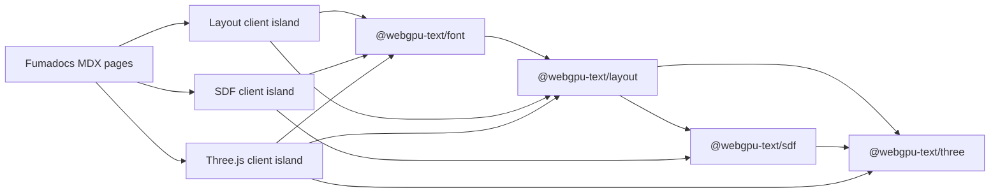
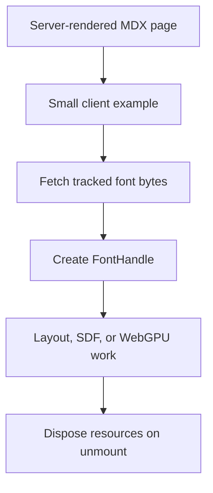

## Context

The repository contains four ESM-only TypeScript packages for font parsing and shaping, renderer-neutral layout, CPU SDF generation, and Three.js WebGPU rendering. Their READMEs describe public APIs, while `ARCHITECTURE.md`, `ROADMAP.md`, and validation documents serve contributors and record evidence. There is no reader-oriented documentation site or realistic browser consumer that exercises the complete package handoff.

The documentation application crosses the monorepo toolchain, browser-only font and GPU lifecycles, Next.js bundling, MDX content, and redistributable assets. The highest-risk integration is the generated HarfBuzz runtime resolving its adjacent WASM asset after the font package passes through the Next.js build.

## Goals / Non-Goals

**Goals:**

- Add a small, maintainable documentation app using the repository's pnpm, Turbo, Biome, TypeScript, and Vitest foundation.
- Give readers a progression from raw font bytes to prepared text, layout, SDF data, and optional Three.js WebGPU rendering.
- Prove the published-style package boundaries and HarfBuzz WASM behavior inside a current Next.js browser build.
- Keep browser and Three.js concerns isolated in narrowly scoped interactive components.
- Keep the content and application compatible with a future static deployment choice.

**Non-Goals:**

- Choosing or configuring production hosting.
- Adding search, documentation versioning, generated API reference pages, a live code editor, or Fumadocs Story.
- Building a custom design system or a reusable example framework package.
- Changing runtime package APIs, adding font fetching to them, or adding a WebGL path.
- Duplicating contributor roadmap, architecture, or validation documents as independently maintained MDX content.

## Decisions

### Place the application in `apps/docs`

The site is a deployable consumer of the packages rather than a reusable example, so it belongs in a new `apps/*` workspace. The root workspace, Turbo outputs, Biome includes, ignore rules, and convenience scripts will be extended to include it. Package builds remain upstream dependencies of the docs build because package exports point at their built ESM and declaration output.

The alternative was to put the site under `examples/`. That would blur the distinction between a focused source example and an application with navigation, authored content, and its own build lifecycle.

### Integrate Fumadocs manually

The app will use compatible, pinned Next.js, React, Fumadocs, Tailwind CSS, and MDX versions, configured manually in TypeScript wherever the consuming tool supports it. Manual integration keeps the scaffold aligned with the existing monorepo and avoids generator-added search, metadata, or AI integrations that are outside scope.

The application will use the App Router and a Fumadocs MDX collection rooted in `content/docs`. Fumadocs supplies the documentation shell and navigation; only a small visual layer will be added for project identity and example framing.

### Keep documentation pages server-oriented and demos as client islands

Authored MDX pages and their navigation remain server-renderable. Each interactive example is a small client component embedded by its page. The Three.js component adds an explicit client-only dynamic boundary so that `navigator`, canvas, and GPU initialization are never evaluated during server rendering.

A fully client-rendered documentation app was rejected because most documentation has no browser-state requirement and would make loading, indexing, and maintenance worse.

### Let each example own its font and renderer lifecycle

The application fetches font bytes from tracked public assets and supplies them to `@webgpu-text/font`. The font and layout examples never inspect `navigator.gpu`. The SDF example converts the public bitmap result to `ImageData` for an ordinary two-dimensional canvas. Only the Three.js example owns a renderer, scene, animation loop, resize observation, and GPU feature detection.

Each mounted example owns and disposes the resources it creates. Initialization must tolerate React development remounting, and asynchronous initialization must not attach resources after cancellation. A small shared `ExampleFrame` component may standardize loading, unsupported, error, and ready presentation, but shared lifecycle abstractions will only be introduced if two examples need identical behavior.

Embedding fetching inside a runtime package was rejected because callers may obtain fonts from HTTP, local files, caches, databases, or application bundles. Keeping bytes as the package boundary preserves that choice.

### Prove font and layout integration before expanding the examples

Implementation begins with the application shell and one multilingual layout example. The slice must work through the default Next.js development and production builds and confirm that the browser receives the HarfBuzz WASM asset. Only after that proof passes will the SDF and Three.js examples be added.

The default Next.js bundler will be tried first. If it cannot preserve the public WASM contract after a focused configuration attempt, the app may opt into Next.js' supported Webpack path and record the reason in the docs application README. The implementation must not work around bundling by reaching into workspace source or copying the package's private WASM file into application code.

### Use three examples to teach the package boundaries

The layout inspector uses editable multilingual text and presents segments, lines, glyph positions, and font selection in reader-friendly form. The SDF preview lazily obtains one selected glyph outline, generates its bitmap with the CPU package, and paints it to 2D canvas. The Three.js example uses the convenient raw-text path and renders a stable scene with a clear WebGPU-unavailable state.

This duplicates a small amount of application wiring intentionally. Extracting a shared demo package now would introduce an abstraction around only three examples and make their educational data flow harder to follow.

### Separate learning content from contributor evidence

The MDX collection owns the learning sequence: introduction, getting started, the text pipeline, package guides, and example explanations. Package READMEs remain concise npm landing pages. Existing architecture, roadmap, and validation files remain the source of truth for contributors and evidence; the site links to them where useful instead of copying their detailed claims.

### Preserve static compatibility without selecting deployment

Initial routes and examples will avoid server actions, runtime-only route handlers, authentication, or a server search endpoint. The app will not enable Next.js static export yet because base paths, search mode, and the actual host are unresolved. This keeps the choice reversible without forcing premature deployment configuration.

## Risks / Trade-offs

- **HarfBuzz WASM is not emitted or resolved correctly by the default Next.js build** → Prove the font-and-layout slice first in development and production; prefer documented bundler configuration, then use the supported Webpack mode if required, without private-source imports.
- **Browser-only libraries execute during server rendering** → Keep examples behind client boundaries and dynamically load the Three.js implementation with server rendering disabled.
- **React development remounting duplicates GPU work or leaks resources** → Use cancellation-aware initialization and explicit cleanup for fonts, text objects, animation frames, observers, listeners, and renderer resources.
- **Documentation diverges from package behavior** → Compile examples against workspace public exports and keep package/contributor source documents authoritative for their respective audiences.
- **Bundling demonstration fonts inflates the docs application** → Begin with the existing redistributable Latin and Arabic fixtures needed for meaningful fallback and shaping; do not add speculative font families.
- **Deferring search makes a larger site harder to navigate** → Keep the initial information architecture small and explicit; add static-compatible search only when the page count makes it useful.
- **Building packages before docs slows iteration** → Start with the existing Turbo dependency graph and add watch orchestration only if normal development proves cumbersome.

## Migration Plan

1. Add the workspace application shell and repository-tooling integration.
2. Add licensed font assets, the Fumadocs content source, and the minimal navigation structure.
3. Implement the multilingual font-and-layout example and validate HarfBuzz WASM in default Next.js development and production builds.
4. Resolve any bundler issue at the public asset boundary and document a Webpack fallback only if it is actually required.
5. Add the CPU SDF and Three.js WebGPU examples, including loading, error, unsupported, and disposal behavior.
6. Complete the initial learning content and run repository checks plus browser smoke validation.

Rollback is removal of `apps/docs` and the corresponding root workspace/tool configuration. No runtime package API or persisted data migration is involved.

## Open Questions

- The production host, base path, and static-export setting remain intentionally undecided.
- The public project name and visual identity can use the working `WebGPU Text` name until ownership and publication decisions are finalized.
