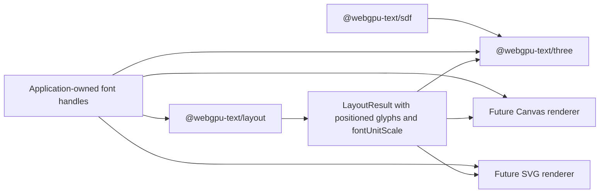

## Context

The package family already separates font shaping, resolved-run layout, CPU SDF generation, and Three/WebGPU rendering. The remaining handoff is weaker than that architecture intends: `Text` receives `ResolvedLayoutInput`, runs `layoutResolvedText()`, derives selections, and consults both the resolved runs and font facts to recover the scale for lazy outlines.

This makes a renderer adapter responsible for text policy and makes the original layout input—not `LayoutResult`—the effective cross-layer contract. It also means a future Canvas, SVG, or custom GPU renderer would have to decide independently which preparation stage to accept.

No published compatibility commitment exists, so this is the cheapest point to establish the final renderer-neutral boundary.

## Goals / Non-Goals

**Goals:**

- Make `LayoutResult` sufficient for a renderer to position and scale lazy font outlines.
- Make the Three package consume completed layout without executing layout or selection policy.
- Preserve caller ownership of font handles and lazy outline/SDF generation.
- Preserve atomic `Text.sync()` updates, renderer-owned atlas resources, and existing WebGPU evidence.
- Establish a contract that another renderer can consume without importing Three.js or reproducing text preparation.

**Non-Goals:**

- Implement raw-string itemization, bidi resolution, fallback, shaping orchestration, or `prepareText()`.
- Add a `PreparedText` session, cache, wrapper class, or new package.
- Integrate lit materials or shadows.
- Implement Canvas, SVG, or another renderer.
- Make outlines eager or embed them in `LayoutResult`.
- Preserve the current pre-release Three constructor or selection convenience methods.

## Decisions

### Use `LayoutResult` directly as the renderer handoff

`TextOptions` will replace `input: ResolvedLayoutInput` with `layout: LayoutResult`, and mutable updates will replace `text.input` with `text.layout`. `Text.sync()` will snapshot the supplied immutable result and commit atlas, geometry, material controls, and the same renderer-neutral layout atomically.

This uses an existing public value instead of introducing a `PreparedText` wrapper with only one implementation. The lower-level `layoutResolvedText()` API remains available for current resolved-run consumers, while a later `prepareText()` can return the same `LayoutResult` after owning raw-text orchestration.

Alternative considered: keep accepting `ResolvedLayoutInput` and let every renderer call layout. Rejected because it makes text policy part of each renderer and prevents layout output from being the reusable boundary.

### Carry `fontUnitScale` through resolved runs and positioned glyphs

Every `ResolvedShapedRun` will require a finite positive `fontUnitScale`, normally `fontSize / unitsPerEm`. Layout will copy it unchanged to each `PositionedGlyph`. A renderer multiplies a font-unit outline and padded SDF view box by that value without inspecting font metrics or finding the source run again.

The value belongs in the layout contract because it describes how a positioned glyph reference maps its source outline into the layout coordinate system. It remains renderer-neutral and is equally useful to vector, raster, 2D, and 3D consumers.

Alternative considered: add `unitsPerEm` and let each renderer recompute the scale. Rejected because it repeats a text-unit conversion in every renderer and retains unnecessary font-facts coupling.

### Keep outlines lazy and keep font handles outside the result

`LayoutResult` will continue to contain font keys, glyph IDs, variations, placement, and scale—not outlines or font objects. Renderers receive the caller-owned font registry separately and request `getOutline()` only for glyphs they actually need.

The Three package's structural `TextFont` contract will therefore contain only `getOutline()`. It will not require `facts.unitsPerEm`. The result remains data-oriented and can be inspected, cached, cloned, or transferred independently of GPU state, while font lifetime stays explicit.

Alternative considered: embed outlines in the result. Rejected because measurement and interaction consumers should not pay outline computation or memory costs.

### Keep interaction policy exclusively in the layout package

`Text.getSelectionRects()` and the pre-sync selection error path will be removed. Consumers call `getSelectionRects(layout, range)` directly. `Text` may expose its committed state for lifecycle inspection, but it will not calculate carets, selections, hit testing, or other text interactions.

Alternative considered: retain the convenience method as a thin delegation. Rejected because the project has no compatibility constraint and the method implies that selection is a renderer responsibility.

### Preserve the existing renderer lifecycle

The handoff changes where layout is computed, not how rendering resources are owned. `Text` will retain promise coalescing, latest-state commits, failure recovery, lazy per-object glyph caching, private RGBA atlas growth, appearance updates, and idempotent disposal. A failed font outline or SDF operation must leave the previous committed render state intact.

The actual-WebGPU fixture will construct layout through the public layout API before creating `Text`, then continue proving real-font atlas growth, updates, and disposal.

## Risks / Trade-offs

- **[Breaking pre-release API]** Existing examples and consumers must prepare layout before constructing `Text`. → Update all repository consumers in the same change; no compatibility overload or deprecated alias will be added.
- **[More visible two-step usage]** Resolved-run consumers call layout and rendering separately. → Treat this as the intentional composable API; a later raw-string `prepareText()` will reduce preparation to one renderer-neutral call.
- **[Scale duplication per glyph]** Repeating one number on each positioned glyph increases result size slightly. → Accept the small cost to make every glyph self-sufficient and avoid run lookup or renderer-specific font inspection.
- **[Mutable external result]** A caller could mutate objects after passing them to `Text`. → Continue the existing immutable-input contract, validate captured data at synchronization boundaries, and document that callers must replace rather than mutate prepared results.
- **[Future line-boundary reshaping]** A later raw-text preparer may need width-aware shaping before producing the final result. → Keep that orchestration above this contract; renderers continue receiving only the settled `LayoutResult`.

## Migration Plan

1. Add and validate `fontUnitScale` on resolved runs, fixtures, public-font adapters, and positioned glyph results.
2. Change `Text` and its tests to accept `LayoutResult`, use each glyph's scale, and remove layout/selection execution.
3. Update the example and actual-WebGPU fixture to call `layoutResolvedText()` before constructing or updating `Text`.
4. Update documentation and validation reports to identify `LayoutResult` as the renderer handoff.
5. Run package, clean-install, workspace, OpenSpec, and actual-WebGPU validation.

Because all packages are version `0.0.0` and private, rollback is a normal source revert; no compatibility or data migration is required.

## Open Questions

None for this change. Naming and behavior are intentionally narrow: use `layout`, carry `fontUnitScale`, and keep raw-string preparation and lighting separate.
