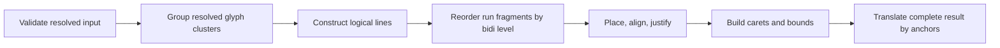

## Context

The archived `capture-layout-policy-fixtures` change left `@webgpu-text/layout` with draft serializable types, fixture validation helpers, nineteen synthetic policy cases, eleven public-font shaped-run observations, and a pure selection prototype. It intentionally did not implement layout. The font package already exposes explicit-run HarfBuzz shaping, but automatic paragraph itemization, fallback resolution, fetching, and provider lifetime still have no validated production contract.

The implementation must therefore make the proven middle seam useful without quietly turning it into a high-level text API. Input is resolved: callers supply font identity and metrics, directional/script/language/style runs, glyph clusters, advances, offsets, and optional bounds. Output stays renderer-neutral and serializable.

One draft ambiguity must be removed before production: synthetic fixture measurements are already effective layout-unit values, while public-font observations happen to use `fontSize === unitsPerEm`. Production will make the resolved seam explicit without changing accepted output geometry.

## Goals / Non-Goals

**Goals:**

- Expose a small pure synchronous production API for resolved-run layout.
- Match the accepted line, placement, bounds, caret, and selection fixture results.
- Define unambiguous units, UTF-16 range rules, paragraph direction, and per-run bidi levels.
- Reject invalid public input before layout and never mutate caller-owned values.
- Keep implementation deterministic, environment-neutral, dependency-light, and directly useful without a renderer.

**Non-Goals:**

- Automatic Unicode bidi/script itemization or Common/Inherited script resolution.
- Font stack selection, grapheme-safe fallback resolution, URL fetching, caching, or font-handle disposal.
- A complete UAX #14 line breaker; this slice implements the already accepted hard-break, whitespace, no-wrap, and break-word policy.
- Reshaping around chosen line breaks, vertical writing, tabs, hyphenation, text-on-path, per-character vertical alignment, or point hit testing.
- Workers, outlines, SDF generation, atlas allocation, Three.js, browser globals, or GPU resources.

## Decisions

### Expose `layoutResolvedText`, not a misleading high-level `layoutText`

The public operation will be:

```ts
layoutResolvedText(input: ResolvedLayoutInput): LayoutResult
getSelectionRects(result: LayoutResult, range: SelectionQuery): readonly SelectionRect[]
```

The name advertises that runs are already selected, itemized, and shaped. The operation is synchronous because it performs only deterministic CPU work over supplied data. `ResolvedLayoutInput`, `ResolvedShapedRun`, `LayoutResult`, and related records are immutable structural values; `InvalidLayoutInputError` is the one public input failure type.

**Alternative considered:** expose `layoutText(text, fontProvider)` now. That would force unvalidated provider, loading, itemization, and fallback decisions into the same change and make the line algorithm harder to isolate.

### Make resolved input fully layout-unit based

Each resolved run carries effective ascender, descender, and line-gap metrics. Glyph advances, offsets, and optional bounds are also already expressed in layout units. `fontSize` remains style metadata; maximum width, indentation, letter spacing, explicit line height, anchors, and every output coordinate use the same layout units. Variation coordinates remain unitless axis values.

The layer that selects a font and calls `FontHandle.shape()` scales HarfBuzz font-unit results once before constructing a resolved run. The layout core applies no hidden scaling and needs no font handle or font-wide metric registry. Runtime layout retains full finite JavaScript-number precision; fixture canonicalization remains a test/serialization concern and never rounds production results.

**Alternative considered:** pass font units and scale inside layout. The accepted mixed-size fixtures already carry effective values, and font size alone is insufficient to identify variation-specific effective metrics. Keeping scaling at the shaping-to-resolved boundary makes this pure core smaller and unambiguous.

### Require resolved bidi levels and reorder shaped fragments only

`ResolvedLayoutInput` carries paragraph level `0 | 1`; each resolved run carries a non-negative integer `bidiLevel` whose parity matches its shaping direction. After line breaks split runs into line-local fragments, the core applies the UAX #9 L2 level-reversal procedure to fragments. It does not reverse glyphs inside a fragment because HarfBuzz already returned direction-local glyph order. Glyphs and carets retain logical UTF-16 identity.

The fixture generator will add explicit levels and one focused multi-run case if the current mixed-direction evidence cannot detect a run-order regression. Automatic calculation of levels is a later itemization layer.

**Alternative considered:** infer visual order from `direction` alone. Direction cannot represent nested embeddings or isolates and would create an API that must be replaced as soon as real paragraph itemization arrives.

### Build a small logical cluster stream, then run ordered layout passes

The implementation uses ordinary arrays and a few private record types rather than a public class graph:



Hard breaks recognize CRLF as one break while preserving original UTF-16 offsets. Normal soft wrapping uses the last whitespace opportunity. `nowrap` permits overflow. `break-word` falls back only to boundaries shared by shaped clusters and grapheme segmentation. Trailing wrap whitespace remains in line logical ranges but not aligned content width. Line metrics use every participating resolved run.

`Intl.Segmenter` with `granularity: 'grapheme'` supplies grapheme boundaries for caret interpolation and break-word safety. The workspace already targets Node 22 and modern browsers where it is native; no fallback table or runtime dependency is added.

**Alternatives considered:** port the 538-line Troika `typeset()` function intact, or immediately adopt a Unicode line-breaking dependency. The first preserves callback-era coupling; the second expands behavior beyond the accepted evidence. Both can wait until a separately tested requirement exists.

### Keep caret and selection data simple for the proven slice

The core emits one canonical caret stop per accepted logical grapheme boundary per line. Multi-code-unit graphemes get only outside stops; a ligature spanning multiple graphemes receives deterministic interpolated stops across its advance. RTL stops may have descending x values while the array remains in logical source order. Selection normalizes and clips the requested range, creates per-line rectangles from adjacent logical stops, then merges overlapping or touching rectangles in deterministic line/visual order.

This preserves the accepted evidence without adding an affinity model that no current consumer requires. If editor integration demonstrates a need for dual visual carets at a bidi boundary, that will be an additive, fixture-driven contract change.

### Keep production code separate from fixture mechanics

`fixture.ts` remains validation/canonicalization support. Production logic lives in a minimal set of modules such as `layout.ts`, `input.ts`, and `interaction.ts`, reusing public types rather than importing JSON or test helpers. Tests load every synthetic input, invoke the public production entry point, and compare semantic results to the accepted expectation. Real-font tests translate only public `@webgpu-text/font` output.

No package besides `@webgpu-text/font` is added, and that existing workspace dependency is used only where actual shaping is requested by integration tests or future callers; the pure layout operation calls no font API.

## Risks / Trade-offs

- **[Risk] Resolved-run wrapping can choose a break that would alter contextual shaping.** → Document that this core does not reshape; the later itemization/orchestration layer must reshape line-edge-sensitive runs when evidence requires it.
- **[Risk] Whitespace-only soft breaks are incomplete for CJK, Thai, Khmer, and punctuation rules.** → Name the limitation in the public documentation and add a UAX #14 strategy only in a separately validated change.
- **[Risk] Native grapheme behavior follows the host ICU/Unicode version.** → Keep committed cases focused on stable grapheme rules and add a pinned segmenter only if cross-runtime conformance actually diverges.
- **[Risk] Bidi fragment splitting or L2 reordering can double-reverse RTL glyphs.** → Reorder fragments only, preserve HarfBuzz's glyph order inside each fragment, and add a regression fixture with more than one RTL glyph and multiple levels.
- **[Risk] Unit migration creates a large fixture diff.** → Generate it mechanically, assert accepted output objects are unchanged, and review only normalized input fields.
- **[Risk] A single canonical caret is insufficient for sophisticated bidi editors.** → Treat dual-affinity carets as an explicit follow-up rather than silently expanding the first public result contract.

## Migration Plan

1. Refine and document production types, effective layout units, bidi levels, and the public input error.
2. Mechanically migrate synthetic fixtures to per-run resolved metrics and prove expected results are unchanged.
3. Implement validation and the resolved-run layout passes behind the public API.
4. Promote selection derivation and run all synthetic fixtures through production.
5. Add public-font smoke coverage, package documentation, and clean-workspace boundary checks.
6. Update architecture and roadmap to describe the implemented resolved core while leaving itemization/provider work explicit.

No consumer migration or rollback is required because the package is private at version `0.0.0` and has no production layout operation today. Reverting the change restores validation-only exports.

## Open Questions

None block this slice. Unicode itemization, complete line breaking, font-provider ownership, reshaping at line edges, and dual-affinity bidi carets are deliberately separate future decisions.
