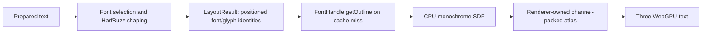
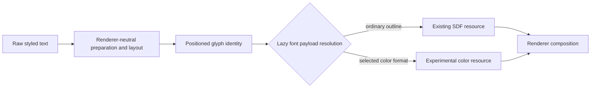

## Context

The production path currently has one deliberately narrow rendering assumption:

`LayoutResult` already contains the information a renderer needs to identify and place a shaped glyph: caller-defined `fontKey`, `glyphId`, variation coordinates, scale, position, style, source range, and bounds. It intentionally contains no outlines, SDF pixels, atlas state, or renderer objects. The Three package structurally depends only on `getOutline()` and resolves the monochrome payload lazily through caller-owned font handles.

Color fonts add alternate descriptions after shaping: COLR/CPAL layers or paint graphs, CBDT/CBLC and sbix bitmap strikes, and SVG documents. The [OpenType table directory](https://learn.microsoft.com/en-us/typography/opentype/spec/otff) and [HarfBuzz color API](https://harfbuzz.github.io/harfbuzz-hb-ot-color.html) cover these families. HarfBuzz shaping still produces positioned glyph IDs; its rendering guidance treats color data as a subsequent glyph-rendering concern.

The pinned `harfbuzzjs@1.4.0` runtime embeds HarfBuzz 14.2.1. Its bundled WASM includes `hb_face_reference_table` and monochrome `hb_font_draw_glyph`, but its export table does not currently expose the higher-level color-layer, palette, PNG, SVG, or paint callbacks. This does not prove those formats require another parser: raw table access and a narrowly rebuilt/exported HarfBuzz bridge remain candidates. The spike must measure those options before production contracts change.

## Goals / Non-Goals

**Goals:**

- Establish which color-font family provides the most useful first increment for ordinary emoji-rich text.
- Determine the smallest font-engine access path that preserves the existing single HarfBuzz representation and project ownership rules.
- Validate whether color resolution can remain lazy and downstream of the existing `LayoutResult` handoff.
- Characterize emoji presentation and fallback behavior that may require future font-selection policy.
- Prove the selected candidate beside monochrome SDF text in an actual Three.js WebGPU frame.
- Leave a concrete public-contract sketch and scoped production follow-up backed by reproducible evidence.

**Non-Goals:**

- Adding public color APIs to any package during the spike.
- Supporting every color format, every COLRv1 paint operation, or every browser fallback rule.
- Replacing HarfBuzz, adding a second general-purpose font parser, or exposing arbitrary OpenType table access publicly.
- Changing `PreparedText`, `LayoutResult`, SDF encoding, or the production atlas spec without evidence that requires it.
- Matching operating-system emoji fonts, fetching font bytes, supporting system-font discovery, or committing proprietary fixtures.
- Shipping WebGL, canvas, SVG, or DOM rendering as a production backend.

## Decisions

### Keep the work as one private decision spike

Add `experiments/color-glyph-boundary/` as a private strict-TypeScript ESM harness, reuse existing workspace tooling, place durable observations under `docs/validation/`, and share eligible fixtures under `test-fixtures/fonts/color-glyph-validation/`. The harness may import public package entry points and a narrowly isolated experimental HarfBuzz bridge, but production packages remain unchanged.

This is the smallest safe step because the main choice is still empirical. Starting in `packages/font` would turn an exploratory representation into a public promise; creating a new package would violate the rule that a package needs an independently useful settled capability.

### Compare format families, not every font implementation

The evidence matrix will include at least one attributable representative for:

| Candidate | What is being tested | Distinct concern |
|---|---|---|
| COLR v0 + CPAL | Ordered outline layers and palettes | Simplest vector-color seam and foreground-color sentinel |
| COLR v1 + CPAL | Paint graph, transforms, gradients, compositing | Modern scalable emoji fidelity and graph complexity |
| CBDT/CBLC or sbix | Size-specific embedded color images | Bitmap strike selection, origin, scaling, and RGBA storage |
| SVG table | Glyph-associated SVG document | Document decoding, security surface, and rasterization dependency |

The spike does not need full renderers for all four. It first records table presence, HarfBuzz accessibility, representative payload structure, fixture size, browser support observations, and licensing. It then implements one end-to-end private adapter for the highest-scoring candidate. If two candidates are close but exercise fundamentally different resource boundaries, a second minimal adapter is allowed only to resolve that specific tie.

Candidate scoring is based on ordinary emoji coverage, scalable quality, palette/current-foreground behavior, variation support, size and caching cost, current HarfBuzz access, strict ESM/browser fit, renderer complexity, and redistributable evidence. Implementation ease alone cannot select a format that fails the target emoji corpus.

Alternative considered: declare COLR v0 first because it is simplest. Rejected as a prior assumption; simple layers may not represent the emoji quality the user values. Alternative considered: implement a universal color-glyph union first. Rejected because it would encode unvalidated commonality and support speculative variants.

### Treat shaping identity and glyph paint as separate stages

The spike begins with this hypothesis:

The spike must attempt the representative emoji, variation-selector, modifier, regional-indicator, ZWJ, and mixed styled-text cases using the existing `PreparedText` and `LayoutResult` shapes. It records a contract change only if the final glyph identity and positioning are insufficient to resolve or render the correct payload. Font facts, paint payloads, palette data, bitmap bytes, and renderer-resource keys do not belong in layout merely because a renderer eventually needs them.

The font registry remains caller-owned and explicit. A future color-capable structural font surface may add a lazy color operation beside `getOutline()`, but the spike does not name or publish that method. A renderer may continue to fall back to the ordinary outline when a shaped glyph has no supported color payload.

Alternative considered: attach color payloads eagerly to every positioned glyph. Rejected because it makes reusable layout large, non-serializable, format-aware, and expensive even for non-rendering consumers. Alternative considered: make layout select color versus monochrome rendering. Rejected unless presentation tests prove that font selection cannot express the required policy.

### Inspect the current engine before adding parsing code

The harness records the exact vendored wrapper, embedded HarfBuzz revision, WASM export list, relevant build flags, and raw color tables for each fixture. Access options are evaluated in this order:

1. an already-exported HarfBuzz operation;
2. the existing `hb_face_reference_table` export with the smallest format-specific experimental reader;
3. a reproducible HarfBuzzjs WASM build exposing only the necessary upstream color or paint functions;
4. a focused external decoder only if the preceding options are demonstrably inadequate.

Any custom reader remains private and reads only the bounded structures required for the comparison. The spike must not grow into a general OpenType parser. A rebuilt bridge must record source revision, build command, flags, binary size, export delta, and license. The production recommendation must state whether upstreaming the bridge or carrying it locally is preferable.

Alternative considered: add OpenType.js or Fontkit immediately. Rejected because the current engine already owns shaping, glyph variations, and raw face data; a second font object, lifecycle, and bundle cost need stronger evidence. Alternative considered: parse every color table directly from `hb_face_reference_table`. Rejected unless a specific first format is simpler than exposing HarfBuzz's maintained upstream API.

### Test presentation and fallback separately from paint decoding

The corpus distinguishes:

- default text and default emoji presentation;
- U+FE0E and U+FE0F variation-selector forms;
- skin-tone modifiers;
- regional-indicator flags;
- multi-code-point ZWJ sequences;
- a text font before or after an emoji font in an explicit style's `fontKeys`;
- styled ranges that change font order, font size, or foreground color around emoji; and
- a glyph with color data, a glyph with only an ordinary outline, and a missing glyph.

For each case, observations separate three questions: which font was selected, which glyph IDs HarfBuzz shaped, and which paint payload the font exposes. This prevents a correct decoder from hiding an incorrect fallback decision. The spike compares explicit project behavior with a browser reference using the same downloadable font bytes, but does not treat platform-dependent system emoji selection as a portable oracle.

If explicit ordered fonts plus variation-selector shaping are sufficient, no layout-policy change is recommended. If a preceding text font captures default-emoji code points in monochrome when browser-like behavior requires a color font, the report must describe the smallest explicit presentation preference needed in a later layout change; it must not silently reorder caller fonts.

### Render only the winning payload boundary

After the evidence matrix selects a candidate, the experiment implements one private lazy resolver and renderer resource path that coexists with the current monochrome SDF path. The exact representation follows the selected format rather than a predeclared universal model:

- a layered format may reuse numeric outlines and add per-layer paint;
- a bitmap format may decode one selected strike to premultiplied RGBA plus layout-space origin and extent; or
- a paint graph may retain only the operations needed by the accepted fixture corpus and fail explicitly on unsupported nodes.

Resource identity includes font object identity, glyph ID, canonical variations, palette or foreground inputs when relevant, format-specific size inputs, and renderer settings that alter pixels. Repeated color glyphs using shared `TextResources` must reuse work, while a monochrome glyph continues through the existing SDF cache. The experiment owns all temporary textures and disposes them independently of caller fonts.

The WebGPU proof uses the pinned Three renderer and semantic pixel assertions rather than a screenshot-only demonstration. It verifies visible intrinsic colors, transparency outside glyph coverage, expected placement relative to adjacent monochrome text, stable reuse, bounded opacity, and cleanup. Lighting, shadows, stroke, decoration, batching, eviction, and production atlas optimization remain outside this spike.

Alternative considered: rasterize every format through browser canvas and upload the result. Rejected as the decision boundary because it introduces a DOM/browser dependency, obscures which font data the library can own, and cannot support a renderer-neutral backend story. Canvas may be used only as a labeled comparison oracle.

### End with a binary production recommendation

The durable report must select exactly one outcome:

1. **go** — name the first format, accepted access path, validated payload boundary, public package impacts, unsupported cases, and production acceptance tests;
2. **conditional go** — name one bounded prerequisite spike or upstream change with a measurable completion condition; or
3. **no-go** — explain why none of the candidates provides a maintainable first increment and what evidence would justify revisiting it.

For a go result, the report includes a small TypeScript contract sketch but no production declarations. It states explicitly whether `LayoutResult` remains unchanged, whether font selection needs a later policy change, which package resolves the payload, which renderer owns textures/atlases, and how monochrome fallback behaves. It then scopes one follow-up OpenSpec change rather than implementing it here.

## Risks / Trade-offs

- **[Large emoji fonts make committed fixtures expensive]** → Prefer small OFL subsets produced reproducibly from pinned sources when their licenses permit modification; otherwise acquire by pinned URL and SHA-256 for the experiment and keep the cache uncommitted.
- **[Subsetting can remove the tables or sequences under test]** → Validate every fixture's table inventory and shaped corpus after derivation, and preserve source, license, command, and hash metadata.
- **[The current stripped WASM omits convenient color APIs]** → Compare a minimal reproducible export bridge with a bounded table reader; do not infer that a second parser is required.
- **[COLRv1 can expand into a complete graphics engine]** → Record unsupported paint nodes and stop at the accepted corpus; choose conditional go or another first format rather than pretending partial support is complete.
- **[Bitmap formats can look good only near one strike size]** → Test at multiple text sizes and record the strike-selection and scaling trade-off.
- **[SVG decoding adds security and dependency surface]** → Treat SVG as untrusted data, never execute script or external references, and reject it as a first format if safe decoding requires an unjustified general renderer.
- **[Browser baselines vary by engine and platform]** → Use the same pinned web font, record browser/GPU versions, assert semantics instead of exact antialiasing, and keep system-font observations informational.
- **[Fallback policy and paint capability become conflated]** → Record selection, shaping, and paint resolution as separate stages and decisions.
- **[The experiment accidentally becomes production code]** → Keep it private, import it nowhere from `packages/`, and delete or deliberately reimplement only the accepted narrow parts in the follow-up change.

## Migration Plan

1. Create the private experiment and provenance schema using existing workspace tooling.
2. Acquire or derive the smallest licensed fixture matrix and verify hashes, tables, and representative glyph coverage.
3. Record the current HarfBuzz/WASM capability inventory and implement bounded candidate probes.
4. Run the presentation, shaping, fallback, and styled-text corpus through public preparation/layout APIs.
5. Score the candidates, select the strongest one, and implement its single private lazy WebGPU proof.
6. Commit machine-readable observations and the decision report, then update architecture and roadmap from those results.
7. Validate workspace checks and the OpenSpec change, and create the follow-up production proposal only after the spike is archived.

Rollback deletes the private experiment and any spike-only fixture data or dependencies. No public package, serialized value, or production runtime requires migration.

## Open Questions

This change is responsible for closing these questions rather than carrying them silently into production:

- Which one of COLR v0, COLR v1, embedded bitmap, or SVG provides the best first useful color-emoji increment?
- Can the selected data be reached through the current runtime, a minimal HarfBuzz export bridge, or a bounded reader without adding a second general parser?
- Does the current positioned-glyph handoff remain sufficient for every accepted color case?
- Is explicit caller font ordering enough for text/emoji presentation, or does a later preparation policy need an explicit color-presentation preference?
- What exact font payload and Three resource contracts should the production follow-up expose?
