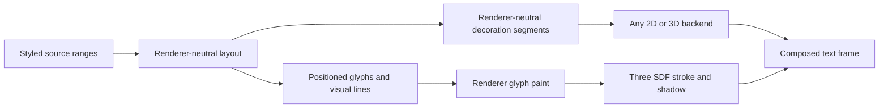

## Context

The current package family deliberately separates text preparation and layout from rendering. `LayoutResult` contains positioned glyphs, lines, carets, and source ranges; `@webgpu-text/three` consumes that handoff, resolves outlines lazily, and paints glyph fill from shared SDF resources. Styling that affects shaping is carried through `TextStyle`, while glyph color remains renderer appearance keyed by `styleKey`.

That split does not yet describe decorations. Underline and strikethrough depend on source ranges, visual line fragments, bidi placement, baselines, and font metrics, so making Three infer them would duplicate text policy. Stroke/outline and drop shadow instead change how an already positioned glyph is sampled and composed, so putting them into layout would couple every backend to SDF behavior. The current `FontFacts` surface also lacks OpenType underline position and thickness, and `LayoutResult` does not retain per-fragment decoration metrics. Those gaps must be measured before a public contract is selected.

The requested underline surface is editor-oriented rather than merely ornamental: solid, dotted, and wavy styles must work on arbitrary styled source ranges, and underline color must be independently selectable from glyph fill.

## Goals / Non-Goals

**Goals:**

- Determine the smallest renderer-neutral representation for underline and strikethrough across wrapping, bidi placement, mixed fonts, mixed sizes, spaces, and hard breaks.
- Validate solid, dotted, and wavy underlines with explicit independent color, deterministic pattern phase, thickness, and offset.
- Determine how automatic font metrics and skip-ink can be represented without making a renderer shape or relayout text.
- Prove whether the existing glyph SDF and shared atlas can support useful stroke/outline and one drop shadow without color-specific resource duplication.
- Establish bounds, clipping, synchronization, failure, and disposal behavior for the combined appearance surface.
- Leave one evidence-backed contract sketch and scoped production follow-ups.

**Non-Goals:**

- Adding public decoration or paint APIs during this validation change.
- Building a rich-text document model, editor interaction model, spellchecker, or syntax-highlighting engine.
- Matching every CSS text-decoration shorthand, multiple shadow lists, arbitrary dash patterns, animation, or arbitrary Three materials.
- Implementing arbitrary shader rewriting, WebGL support, curve-following text, batching, or WebGPU-compute SDF generation.
- Requiring font fetching, system-font discovery, or renderer ownership of caller font handles.

## Decisions

### Keep the work as one private boundary experiment

Add `experiments/browser-text-decoration-boundary/` as a private strict-TypeScript ESM harness. It will exercise public package entry points, keep candidate types private, place durable observations in `docs/validation/`, and reuse the existing Vitest, Three.js, browser, and actual-WebGPU infrastructure. Production packages remain unchanged.

This is the smallest safe increment because two public seams are still uncertain: the layout-to-decoration handoff and the SDF paint limits. Implementing either directly in a production package could freeze a representation that fails mixed-direction ranges, font metrics, thick outlines, or shadow bounds.

Alternative considered: implement underlines immediately because they can be drawn as rectangles. Rejected because rectangles do not settle styled range fragmentation, bidi geometry, font-derived placement, dotted or wavy phase, or skip-ink. Alternative considered: validate every CSS decoration feature. Rejected because the requested editor surface provides a bounded representative set.

### Separate line decoration geometry from glyph paint

The experiment begins with this ownership hypothesis:

Underline and strikethrough are validated as renderer-neutral visual segments because their extents follow logical source ranges after wrapping and bidi placement. Stroke/outline and drop shadow remain renderer appearance because they operate on glyph coverage and SDF sampling after layout. Neither family may change shaping, line breaking, caret positions, selection rectangles, or glyph identity.

Alternative considered: make the Three package derive every decoration from `LayoutResult`. Rejected unless evidence proves all necessary range and metric data already exists, because a non-Three renderer would otherwise repeat policy. Alternative considered: add stroke and shadow to layout styles. Rejected because those controls do not determine glyph positions and would contaminate reusable preparation with renderer-specific resource concerns.

### Validate decoration spans independently from shaping styles

The candidate input is a list of half-open UTF-16 decoration spans layered over a completed layout. Each span identifies underline or strikethrough, solid/dotted/wavy style, explicit RGBA or current-foreground color, automatic or numeric thickness, automatic or numeric offset, and skip-ink policy. Decoration color is normalized as its own value; it is never copied irreversibly from glyph fill. A current-foreground sentinel may remain the convenient default while an explicit color proves editor diagnostics such as red squiggles beneath otherwise neutral text.

The experiment compares two ways to supply automatic metrics:

1. retain compact font/run decoration metrics in the renderer-neutral layout handoff; or
2. resolve them in a pure post-layout helper from caller-owned font handles and positioned glyph identities.

The selected contract must keep Three free of font-table parsing and text policy, avoid eager outlines, preserve serializable preparation where possible, and cover a decorated span that crosses styles, fonts, visual bidi runs, soft wraps, and hard breaks. If neither option is sufficient, the report may recommend an explicit metrics override as a bounded escape hatch, but not as the only ordinary path.

Alternative considered: put decoration fields directly on the existing shaping `TextStyle`. Rejected as the starting assumption because changing an underline color should not force itemization or shaping, and the same prepared layout should be reusable with different editor diagnostics. The experiment may recommend a higher-level convenience composition after validating the independent boundary.

### Represent line decorations as analytic segments

The candidate renderer-neutral output is a small immutable segment record rather than generated triangles, Three objects, canvas paths, or SDF pixels. A segment carries source range, line index, horizontal extent, baseline-relative vertical position, thickness, style, color, and the minimum deterministic pattern parameters needed by backends.

- Solid uses a filled band.
- Dotted uses a thickness-derived dot diameter and repeat interval.
- Wavy uses a thickness-derived amplitude, wavelength, and phase.

The fixture corpus determines whether pattern phase resets per visual fragment or remains anchored to the unsplit decorated span. The representation must avoid partial dots or discontinuous waves caused solely by renderer tessellation and must clip predictably at range and line boundaries. A backend is free to tessellate or evaluate the pattern analytically; the shared contract describes appearance, not GPU primitives.

Skip-ink is evaluated as visible intervals cut from an otherwise continuous segment. The experiment compares glyph bounds with outline-aware intersections and records the cost and fidelity of each. If outline-aware automatic skip-ink requires eager work that conflicts with lazy outlines, the report must select a documented first-release policy rather than hide the cost.

Alternative considered: encode dotted and wavy underlines as tiny glyph-like SDF atlas entries. Rejected because the patterns are procedural, depend on fragment length and phase, and should not consume font glyph cache slots.

### Reuse one glyph SDF for fill, outline, and shadow when quality permits

The Three candidate samples the existing encoded glyph distance for fill and outline thresholds, keeping fill color, outline color, width, shadow color, offset, and softness as per-text or per-style appearance. Those values must not enter `TextResources` cache identity when the same pixels can be reused. Shadow may use a separate draw/instance or an additional material evaluation, but it must continue to address the same stable atlas slot.

The experiment measures the useful range of outline width and shadow softness at multiple font and SDF sizes. It records when the current padded view box clips paint, when 8-bit distance precision produces visible bands, and whether bounds can expand without regenerating the glyph. If a requested paint extent exceeds the encoded distance or padding, the candidate must reject, clamp explicitly, or select a larger resource configuration; silent clipping is not acceptable.

Alternative considered: generate separate enlarged or colored SDFs for each outline and shadow. Rejected as the default because it duplicates outline extraction, pixels, slots, and uploads for appearance that should usually be derived from one distance field. It remains a measured fallback only if shared sampling cannot meet the accepted quality threshold.

### Treat COLR layers and clipping as explicit compatibility cases

Renderer-neutral underlines and strikethrough must span ordinary and COLR v0 glyphs without changing color-layer layout identity. The spike separately records whether stroke and shadow apply to each color layer, the composed glyph silhouette, or only monochrome glyphs; it does not silently choose one semantic from implementation convenience.

Decoration and expanded glyph paint must obey the existing local clip rectangle. Render bounds must include visible decoration, outline, and shadow extents while block, line, caret, and selection geometry remain unchanged. Failed synchronization must retain the last committed frame, and shared resources must preserve stable slots and borrower lifetime.

### Use semantic fixtures and actual WebGPU evidence

Deterministic fixtures cover at least:

- independent underline and glyph colors, including current-foreground updates;
- solid, dotted, and wavy underlines plus solid strikethrough;
- partial styled ranges, adjacent ranges, spaces, trailing spaces, empty lines, hard breaks, and soft wraps;
- Latin, Arabic, mixed bidi text, combining marks, descenders, mixed fonts, mixed sizes, and COLR v0 emoji;
- automatic and numeric thickness/offset, pattern phase, skip-ink candidates, and clipping;
- fill-only, moderate and excessive outlines, offset/soft shadows, atlas reuse, appearance updates, failures, and disposal.

The actual-WebGPU proof uses semantic pixel and resource observations instead of screenshot approval alone. It verifies visible independent colors and patterns, transparent exteriors, placement, clipping, bounds, reuse, atomic updates, and cleanup in both unlit and planar-lit text where the candidate semantics apply.

## Risks / Trade-offs

- **[Accurate font decoration metrics are not exposed today]** → Compare a narrow HarfBuzz/OpenType metric addition with explicit overrides and record the smallest renderer-neutral contract.
- **[Bidi source ranges can produce several visual fragments]** → Derive and fixture-test segments from visual line/caret data rather than assuming one logical range maps to one rectangle.
- **[Skip-ink can destroy lazy-outline behavior]** → Measure bounds-only and outline-aware strategies separately; make the first policy explicit if high fidelity is too expensive.
- **[Procedural patterns vary between renderers]** → Put deterministic phase and dimensional parameters in the neutral segment contract and use tolerance-based visual evidence.
- **[Thick outlines or blurred shadows exceed SDF padding]** → Record supported limits and require explicit larger resource settings or rejection instead of silent clipping.
- **[Color glyph stroke semantics are ambiguous]** → Test and document alternatives; defer unsupported composition rather than claiming universal behavior.
- **[The experiment grows into production code]** → Keep it private and dependency-isolated, then reimplement only the accepted narrow seams in follow-up changes.

## Migration Plan

1. Create the private experiment and fixture schema using existing workspace tooling.
2. Record current layout, font-metric, SDF, atlas, material, bounds, and color-layer capabilities.
3. Implement candidate decoration-span fragmentation and analytic segment representations privately.
4. Implement the minimum private Three paint variants needed to measure shared-SDF outline and shadow behavior.
5. Run deterministic and actual-WebGPU evidence, then write one decision report with narrow public contract sketches.
6. Update architecture and roadmap from recorded results and scope separate production changes for neutral decorations and Three glyph paint.

Rollback deletes the private experiment and its generated observations. No public package or serialized production value requires migration.

## Open Questions

- Which source-range-to-visual-fragment representation is sufficient for mixed bidi and wrapped decorations?
- Should automatic underline position and thickness enter `LayoutResult`, a separate renderer-neutral decoration result, or a helper that uses caller-owned fonts?
- Should dotted and wavy pattern phase restart per visual line, per contiguous visual fragment, or remain anchored to the logical span?
- What first-release skip-ink policy preserves useful browser behavior without forcing eager outline resolution?
- What outline width and shadow softness are supportable from the current SDF encoding and padding?
- How should outline and shadow compose with COLR v0 layers?
- Can neutral line-decoration production and Three glyph-paint production proceed as two independent follow-up changes?
